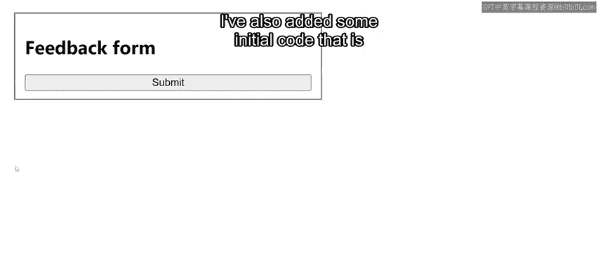
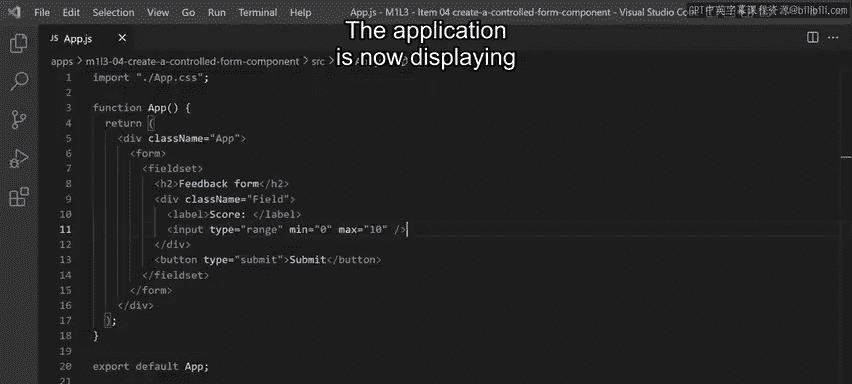
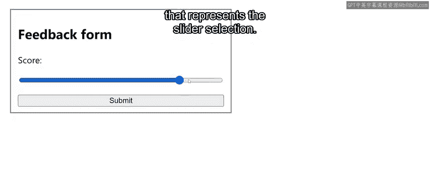
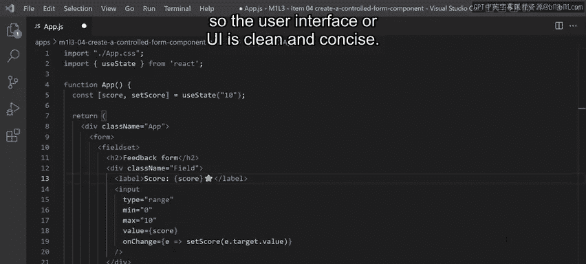
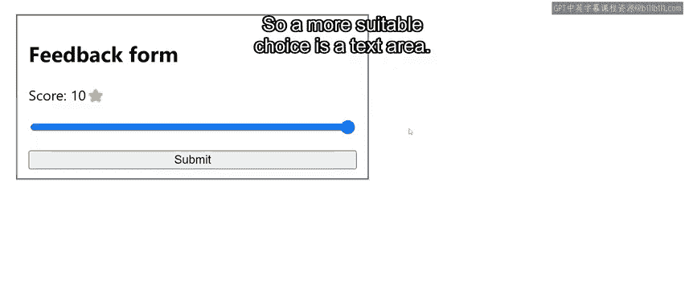
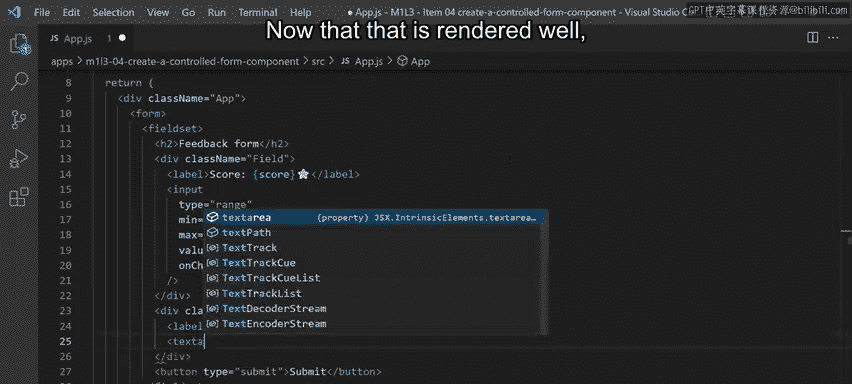
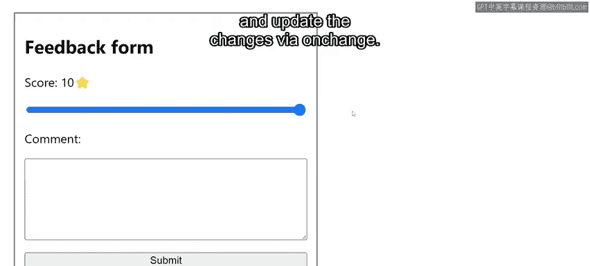
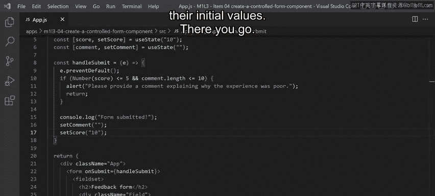
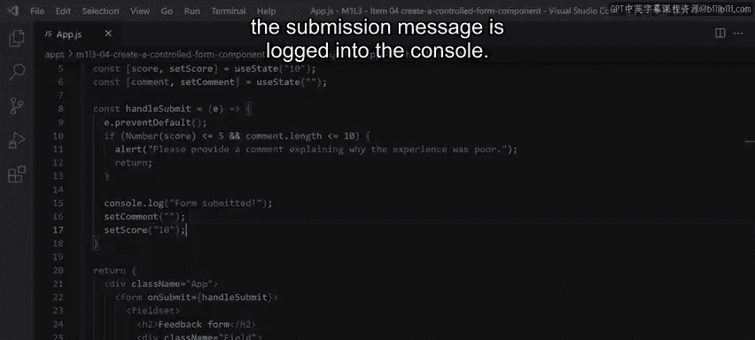
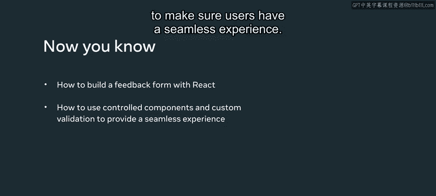

# 52：10_创建受控表单组件 📝

在本节课中，我们将学习如何使用 React 的受控组件来构建一个用户反馈表单。我们将实现一个包含评分滑块和评论区的表单，并为其添加自定义验证逻辑，确保用户提交的数据符合要求。

你是否曾通过电商网站购买商品，或在最喜爱的餐厅预订座位？如果是，你可能会在事后收到一封友好的电子邮件，其中包含一个链接，引导你到特定页面提供体验反馈。这就是反馈表单的一个例子。现在你已经熟悉了 React 中的受控组件，我将演示如何自己构建此功能。

你还将使用范围输入（range input）和自定义验证作为构建反馈表单的一部分。想象一下，城里最好的餐厅之一“小柠檬”希望向顾客发送反馈表单。让我们开始用 React 实现一个反馈表单。请注意，在此示例中，项目是使用 Create React App 创建的。我还添加了一些初始代码，即一个仅包含标题和提交按钮的表单。

## 表单需求与初始设置

本示例的需求是创建一个界面，允许用户提供 0 到 10 的评分，以及一个额外的评论框，让顾客告诉厨师几天前享用的美食有多么美味。

第一步是实现评分的控件。你可以用不同的方式实现，但针对这个用例，我选择使用范围输入（range input），因为它为用户提供了一个简单的滑块。

让我们创建一个新的 `div` 来包装这个组件。它将包含一个标签，我将其命名为“评分”，以及一个 `type` 为 `range` 的输入框。Range 输入提供了两个属性来定义范围：`min` 和 `max`。对于此示例，我将最小值设置为 0，最大值设置为 10。

现在，应用程序显示了一个用户友好的滑块来提供评分。

## 实现受控评分滑块

为了完善这个范围输入组件，我还需要做两件事：将输入框转变为受控组件，并直观地显示代表滑块选择的数值。

为此，我将定义一个新的状态变量 `score`，并将其初始化为 10，因为我知道厨师的食谱通常是无与伦比的。这样可以让用户在想的时候通过滑块将分数从 10 分向下调。

现在，在 range input 中，我必须使用 `value` 属性将状态连接起来，并使用 `onChange` 来接收更改并相应地更新状态。

由于我还希望将数字评分与此滑块一起显示，我将在“评分”标签中添加该信息以及一个星号，使界面简洁明了。

很好，反馈表单开始成形了。

## 添加评论区

现在，让我们实现表单的第二个元素：一个用于提供额外评论的小部件。虽然我可以在这里使用文本输入，但评论可能很长。因此，更合适的选择是文本区域（textarea）。

为此，我将声明另一个名为 `comment` 的状态变量，并将其初始化为空字符串。

对于界面，我将创建一个新的 `div`，其中包含一个标签和一个用于任何额外反馈的 `textarea` 组件。

现在它已经渲染好了，我需要将状态连接到 `value` 属性，并通过 `onChange` 更新更改。至此，反馈表单的界面就完成了。

## 实现自定义验证逻辑

我想实现的最后一件事是一些验证逻辑，以确保当评分小于或等于 5 时，必须提供评论，并且评论至少应有 10 个字符。这样厨师就能收到用户真实的反馈，用于改进食谱。

为此，我将在表单组件上使用 `onSubmit` 回调函数。首先，我将调用 `preventDefault` 来避免默认的 HTML 表单行为。

然后，我将编写一个 `if` 语句来检查评分是否小于或等于 5，并且评论字符数是否少于 10。如果是这种情况，我将显示一个警告框来通知用户相关要求，并从函数中返回。

否则，用户就可以提交了，我将记录一条消息以确认反馈提交成功。提交后重置表单值也是一个好习惯，因此我将把两个状态变量都设置为其初始值。

## 总结

至此，一切运行良好，提交消息已记录到控制台中。

在本节课中，我们一起学习了如何使用 React 的受控组件和自定义验证来构建一个反馈表单。我们实现了评分滑块和评论区，并添加了验证逻辑，确保在评分较低时用户必须提供详细的反馈。这确保了用户拥有流畅的体验，同时也能收集到对厨师有用的高质量反馈。