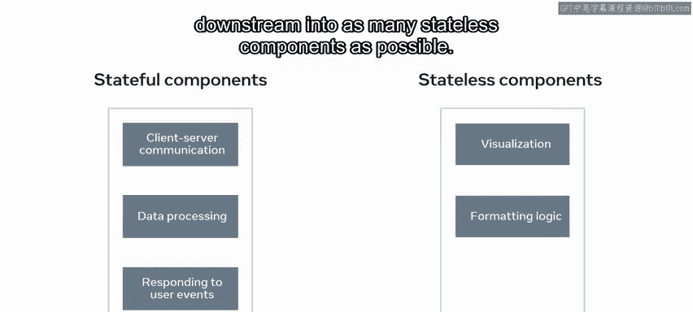

# 53：Props 与 State 详解 🧩

在本节课中，我们将要学习 React 中两个最核心的数据概念：Props 和 State。理解它们的区别、联系以及各自的适用场景，是构建高效、可维护 React 应用的基础。

---

想象一下，小乐餐厅取得了巨大成功，计划在其他地方开设分店。作为建设项目的一部分，建筑师绘制了蓝图，其中厨房和用餐区的尺寸在所有分店都是统一的。虽然蓝图已经确定，但具体的配置，如餐桌的大小、形状和数量，椅子的类型，厨房的餐具以及墙面颜色，仍将由每家分店的经理来决定。

在这个类比中，新分店的蓝图就是 React 组件，而每家分店的具体配置则代表了 React 中的 Props 和 State。

那么，什么是 Props 和 State 呢？Props 和 State 都是普通的 JavaScript 对象，React 使用它们来存储信息。随着本视频的深入，你将发现 Props 和 State 在 React 中的异同。

你还会学习如何判断某个属性属于 Props 还是 State，何时需要使用 State，以及如何根据 Props 和 State 来区分不同的 React 组件。

虽然 Props 和 State 都会影响渲染输出，但它们在一个重要方面有所不同：Props 像函数的参数一样传递给组件，而 State 则像函数内部声明的变量一样，由组件自身管理。

因此，尽管 Props 和 State 本质上是不同的，但它们在某些方面存在重叠。值得注意的是，在设计组件时，其主要职责是将原始数据转换为丰富的 HTML。在 React 生态系统中，Props 和 State 共同构成了 HTML 输出所依赖的原始数据。

Props 和 State 都是普通的 JS 对象，并且是确定性的。这意味着对于相同的 Props 和 State 组合，你的组件总是生成相同的输出。

另一个相似点是，Props 和 State 的变化都会触发渲染更新。

现在，如何判断某个属性应该放在 Props 还是 State 中呢？一个经验法则是：如果一个组件需要在某个时间点改变它的某个属性，那么这个属性就应该成为其 State 的一部分。否则，它应该只是该组件的一个 Prop。

让我们更详细地探讨一下。

**Props**，是 Properties 的缩写，是组件的配置。它们从组件树中的父组件接收而来，并且对于接收它们的组件来说是不可变的。一个组件不能改变自己的 Props，但它负责组装其子组件的 Props。

除了 Props，React 组件还有另一个内置对象，名为 **State**。这个对象是 React 用来确定何时应该重新渲染组件的一种方式。React 的机制是，对 State 对象中值的任何更改都会触发给定组件的重新渲染。

State 的生命周期始于组件挂载时的默认值，然后随着时间的推移，该值会发生修改，这些修改大多由用户事件产生。因此，State 是某个时间点的可序列化表示，或者说，是一个快照。组件在内部管理自己的 State，你也可以说 State 是私有的。

现在，在设计组件时，你可能会问的另一个问题是：它是否应该有任何 State？答案是：State 是可选的。由于 State 会增加复杂性并降低可预测性，因此没有 State 的组件更可取。尽管在交互式应用中无法避免拥有某种 State，但你应该避免让太多组件拥有 State。

最后，让我们探讨一下基于 Props 和 State 来区分 React 组件类型的主要方法之一。

组件可以分为**无状态组件**和**有状态组件**。

无状态组件只有 Props，没有 State。除了 `render` 函数外，没有太多其他逻辑，所有逻辑都围绕它们接收到的 Props 展开。这使得它们非常易于理解和测试。

另一方面，有状态组件同时拥有 Props 和 State。它们负责客户端与服务器的通信、处理数据以及响应用户事件。这类逻辑应该被封装在数量适中的有状态组件中，而所有的可视化和格式化逻辑则应向下游移动，放入尽可能多的无状态组件中。

---

本节课中，我们一起学习了 React 用于构建应用的两种数据类型：Props 和 State。我们了解了它们的定义、区别、如何选择使用，以及如何根据它们来划分组件类型。接下来，你将被介绍一种名为 Context 的额外信息管理方法。