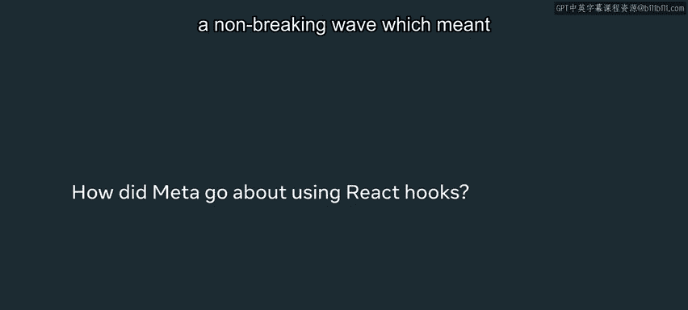

# 56：使用 React 钩子 🪝

在本节课中，我们将学习 React 钩子的引入背景、设计初衷及其为开发带来的变革。我们将了解钩子如何解决类组件时代的问题，以及它如何让代码更简洁、更易维护和复用。

---

## 钩子的诞生与社区反响

React 钩子最初是在一次 React 会议上向社区公布的。这个社区由众多 React 爱好者组成，他们热衷于尝试新事物，我们也信任他们能提供宝贵的反馈并测试我们的想法。

当时我度假归来，我的同事兴奋地告诉我有一个令人激动的新东西，并建议我们开始使用它。我最初的反应是觉得这很“傻”，不明白为什么需要它。但同事坚持说这将会很棒。于是我开始学习并使用钩子，现在我已经无法想象没有钩子该如何编写代码了。

## 初识钩子：从困惑到掌握

起初，钩子有时会让人觉得不太直观，或者感觉背后有很多“魔法”让人一时难以理解。然而，一旦你掌握了窍门，开始使用并理解它，你会发现钩子确实能让开发工作变得更轻松。

## 钩子带来的优势

钩子可以极大地简化你的应用程序并带来性能提升。它们能让你的代码更具可读性、更易于管理，同时也让代码更易于共享和复用。

在钩子引入之前，我们使用类组件。它们似乎能完成工作，但随着时间的推移，这些类组件变得越来越大、越来越复杂。我们无法将某些组件拆分成更模块化的部分。我们的目标是让代码更具可用性、更简单，并摆脱那些无法拆分的庞大组件。

## Meta 的内部实践与验证

在 Meta，当我们开发新技术时，我们会首先成为这些技术的使用者，以确保它们真正有效，并直接收集来自工程师的反馈。钩子也是如此，我们在内部大量使用了它们，并看到内部团队也开始真正欣赏钩子带来的改进。这充分证明了钩子在 React 应用开发过程中产生了重大影响，也推动了其更广泛的推广。

## 非破坏性引入与学习建议

钩子是以一种非破坏性的方式引入的。这意味着你并非必须使用它们，你可以继续使用旧的 React 组件编写风格，而之前编写的任何代码都不会被破坏。这是我们推出新功能时采用的方法之一：确保新事物不会破坏人们正在使用的旧事物。

对于初次学习和使用钩子的你，我的建议是坚持下去。起初它们可能看起来很难且令人困惑，但它们实际上会随着时间的推移改善你的代码。虽然使用旧的 React 代码编写方式可能很诱人，但你会发现，一旦学会了钩子，代码会变得更有意义，即使起初它看起来有点令人困惑和不直观。所以，请花时间学习它们，进行前期投资，你会发现从长远来看这是值得的。

---

## 核心概念与代码示例

钩子的核心是**函数式组件**中使用的特殊函数，它们让你能够“钩入” React 的状态和生命周期特性。

一个基础的钩子示例是 `useState`：

```javascript
import React, { useState } from 'react';

function Example() {
  // 声明一个名为 “count” 的 state 变量，初始值为 0
  const [count, setCount] = useState(0);

  return (
    <div>
      <p>你点击了 {count} 次</p>
      <button onClick={() => setCount(count + 1)}>
        点击我
      </button>
    </div>
  );
}
```

在这个例子中，`useState` 就是一个钩子。`count` 是当前的状态值，`setCount` 是一个用于更新该状态的函数。每次点击按钮，`count` 的值都会增加 1，并触发组件重新渲染。

---

## 总结

本节课我们一起学习了 React 钩子的引入背景和核心价值。我们了解到钩子是为了解决类组件的复杂性问题而诞生的，它通过非破坏性的方式引入，让函数式组件也能拥有状态和生命周期能力。尽管初学时有挑战，但掌握钩子能显著提升代码的可读性、可维护性和复用性。记住，对钩子的前期学习投资将在未来的开发工作中带来丰厚的回报。




