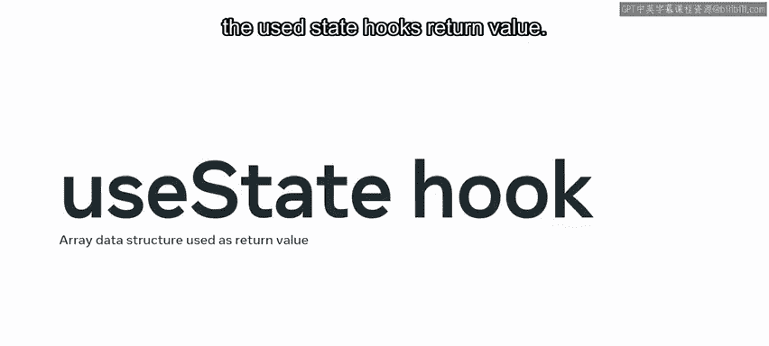
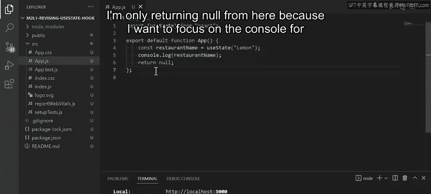
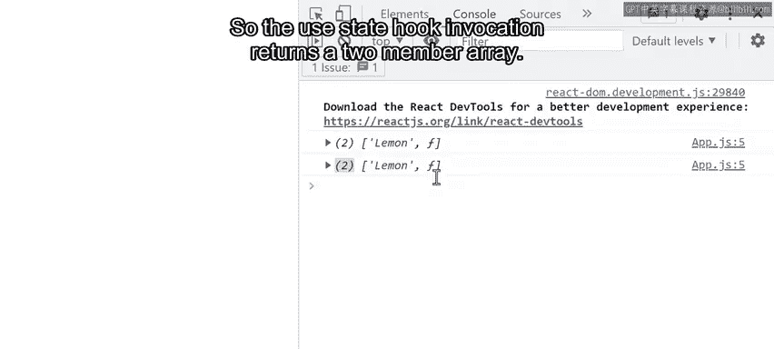
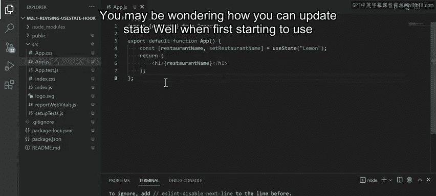
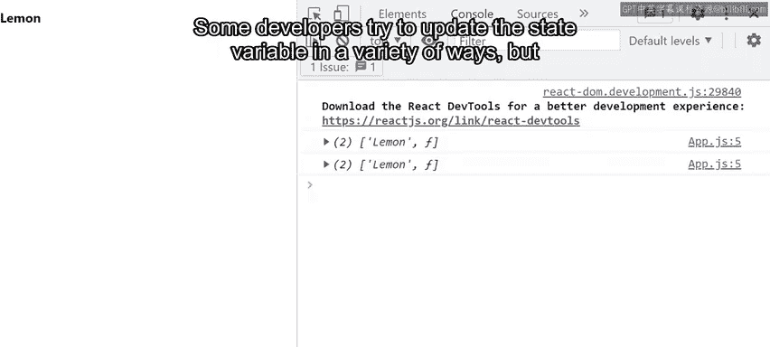
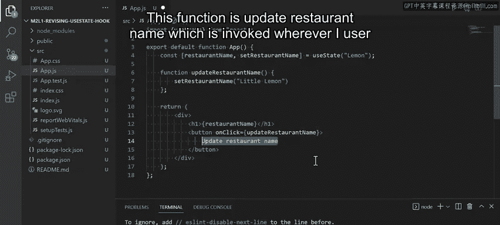
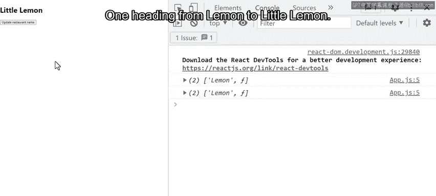
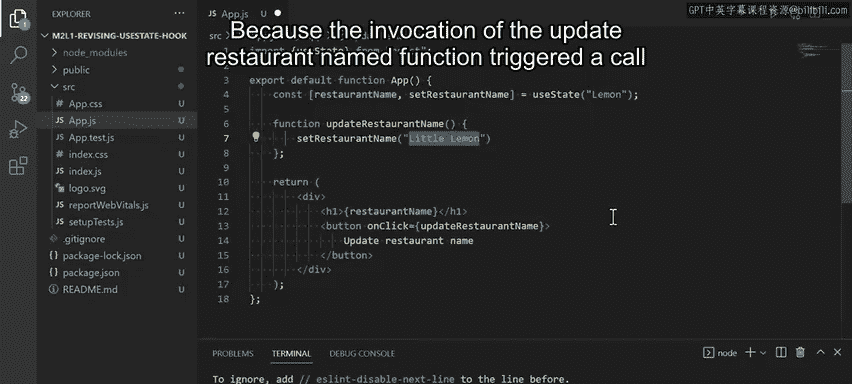

# 57：修改 useState 钩子 🛠️

在本节课中，我们将学习如何修改和使用 React 的 `useState` 钩子。我们将通过一个为 Little Lemon 餐厅构建的库存追踪应用实例，来复习 `useState` 钩子的调用方式、返回值以及如何用它来更新状态。

---

## 概述

`useState` 钩子用于在 React 组件中处理状态。状态指的是应用在特定时刻正在处理的所有数据。我们将通过一个追踪餐厅食材库存的例子，来深入理解其工作原理。

---

## 复习数组解构

在深入 `useState` 之前，我们先回顾一下数组解构的概念。数组解构是一种从数组中提取单个项目，并将这些项目保存为独立变量的方法。

以下是数组解构的一个实际例子。假设你正在编写一个应用，用于追踪 Little Lemon 餐厅后厨的当前食材储备。

你使用一个数组变量来存储所有蔬菜。在编码过程中，你需要将数组中的每一项提取到其独立的变量中。例如，第一项命名为 `v1`，第二项命名为 `v2`，依此类推。使用数组解构，你可以用一行代码轻松完成这个操作：

```javascript
const veggies = [‘tomato‘, ‘cucumber‘, ‘onion‘];
const [v1, v2, v3] = veggies;
```

关于数组解构的更多信息，你可以参考本课末尾的补充资源。

需要注意的是，使用数组解构时，你可以自由地为从数组中解构出的项目命名。然而，在解构对象时，你必须使用对象属性的确切名称作为解构变量的名称，这使得对象在命名解构变量方面严格得多。因此，React 选择使用数组数据结构作为 `useState` 钩子的返回值。

---



## useState 钩子如何工作

上一节我们介绍了数组解构，本节中我们来看看 `useState` 钩子实际是如何工作的。我将演示如何使用 `useState` 钩子来设置餐厅名称的初始值为 “Lemon”，然后仅使用 `useState` 的更新函数将其更新为 “Little Lemon”。

`useState` 钩子允许你在组件中处理状态。让我们从讨论调用 `useState` 钩子时会发生什么开始。

```javascript
import React, { useState } from ‘react‘;



function App() {
  const stateArray = useState(‘Lemon‘);
  console.log(stateArray);
  return null; // 暂时返回 null 以聚焦控制台输出
}
```



在控制台中，你会看到类似这样的输出：`[‘Lemon‘, function]`。控制台记录的值是一个数组，其中状态变量的值作为数组的第一项，而数组的第二项是用于更新状态的函数。

所以，`useState` 钩子的调用返回一个包含两个成员的数组。

```javascript
const [stateVariable, stateUpdatingFunction] = useState(initialState);
```

按照惯例，状态更新函数使用驼峰命名法命名。另一个惯例是在用于解构状态变量的变量名前加上 “set” 前缀。换句话说，正确处理状态意味着我最初的代码示例应该改进，以正确解构从 `useState` 调用返回的数组。

现在，解构出的 `restaurantName` 变量保存着状态，而解构出的 `setRestaurantName` 变量保存着状态更新函数。这就是使用 `useState` 钩子进行数组解构的一个例子。

---





## 如何更新状态

你可能会想知道如何更新状态。刚开始使用 `useState` 钩子时，一些开发者尝试用各种方式更新状态变量。但在使用 `useState` 时，只有一种正确的方式来更新状态，那就是通过状态更新函数。

换句话说，更新 `restaurantName` 变量状态的唯一方法，就是调用 `setRestaurantName` 函数。

在 React 应用中，状态变化通常由用户与应用交互的行为触发。这意味着状态变化通常由用户生成的事件触发，例如鼠标移动、按钮点击和按键按下。开发者的角色是以对正在编写的应用有意义的方式，响应特定类型的事件。

用户与 Web 应用交互的一种常见方式是通过按钮点击。因此，让我们看一个响应用户生成事件（即按钮点击）来改变状态的例子。

```javascript
function App() {
  const [restaurantName, setRestaurantName] = useState(‘Lemon‘);

  function updateRestaurantName() {
    setRestaurantName(‘Little Lemon‘);
  }

  return (
    <div>
      <h1>{restaurantName}</h1>
      <button onClick={updateRestaurantName}>
        更新餐厅名称
      </button>
    </div>
  );
}
```



在这段示例代码中，我添加了一个按钮，当点击时，会执行 `updateRestaurantName` 函数。这个函数在用户点击按钮时被调用。

现在，当我点击“更新餐厅名称”按钮时，H1 标题将从 “Lemon” 变为 “Little Lemon”，因为 `updateRestaurantName` 函数的调用触发了对 `setRestaurantName` 状态设置函数的调用。





---

## 总结

本节课中我们一起学习了 `useState` 钩子的核心用法。你现在应该能够回忆起 `useState` 钩子的用途以及它在实践中如何工作。我希望在未来的开发中，尤其是在处理组件中用于追踪状态的原始数据类型时，使用 `useState` 钩子对你来说将是一件轻松无压力的事情。