# 59：什么是副作用 🧪

在本节课中，我们将要学习 React 组件中的一个重要概念：副作用。我们将探讨纯函数与不纯函数的区别，理解副作用是什么，并初步了解如何使用 `useEffect` 钩子来处理副作用。

在开始学习另一个名为 `useEffect` 的钩子之前，我们先花点时间思考一下它的名字。`useEffect` 钩子的名称与“作用”或更精确地说“副作用”的概念密切相关。本节视频中，你将学习 React 组件内的副作用是什么，包括纯函数和不纯函数及其与副作用的关系，以及 `useEffect` 如何在函数组件中执行副作用。

## 什么是副作用？

副作用是使函数变得“不纯”的东西。

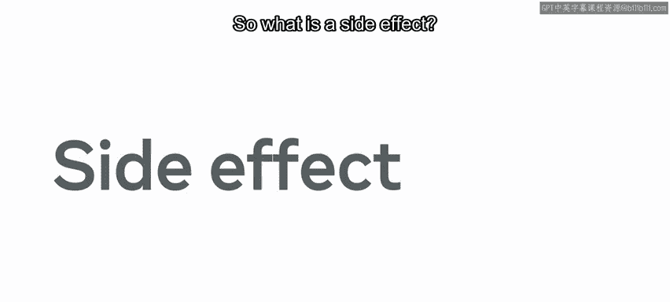

## 纯函数与不纯函数

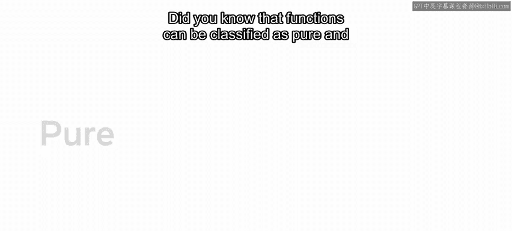

你知道函数可以分为纯函数和不纯函数吗？

简单来说，纯函数没有副作用，而不纯函数则有副作用。让我们进一步展开与副作用相关的纯函数和不纯函数的概念。

一个纯函数应该：
1.  接收特定的输入（即特定的参数）。
2.  无论被调用多少次，总是返回完全相同的输出。

为了说明这一点，让我们探索一个使用 Little Lemon 餐厅成立年份的函数。在这个例子中，`EstablishedYear` 组件接收一个 props 对象作为参数。它返回一个输出“Established year: ”后跟 `year` 属性值的标题。

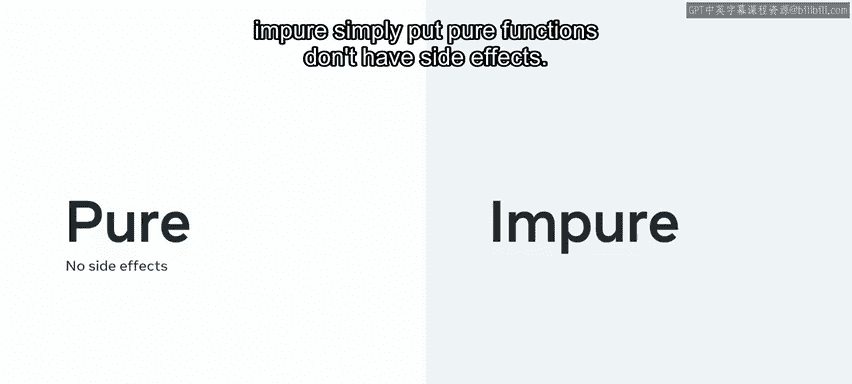

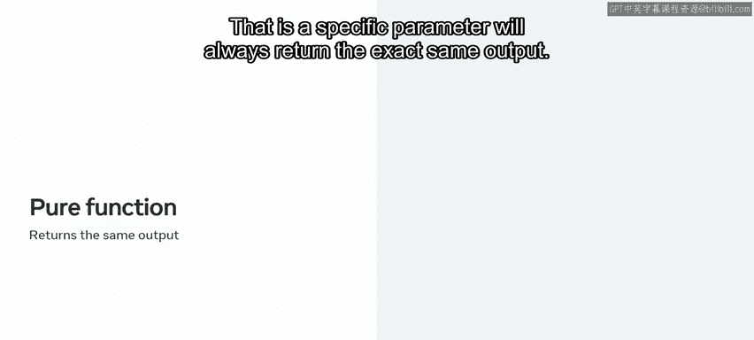

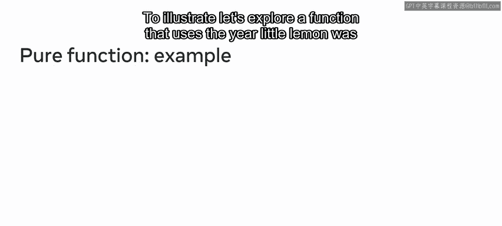

只要 `year` 属性的值是 2003，无论 `EstablishedYear` 函数被调用多少次，或者从 `App` 组件渲染多少次，输出都将保持不变。这是一个纯函数的例子。`EstablishedYear` 函数没有副作用。

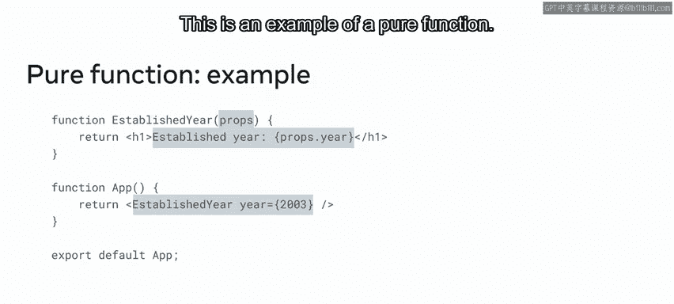

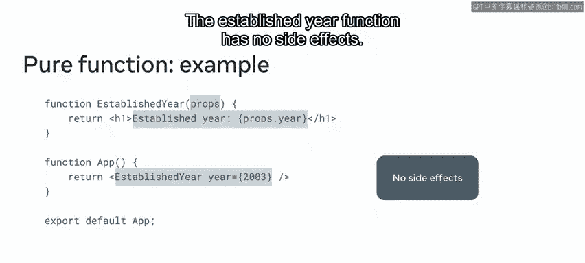

## 不纯函数与副作用

相比之下，不纯函数会执行副作用。这意味着它会做一些事情，例如调用 `console.log`、调用 `fetch` 或调用浏览器的地理位置功能。

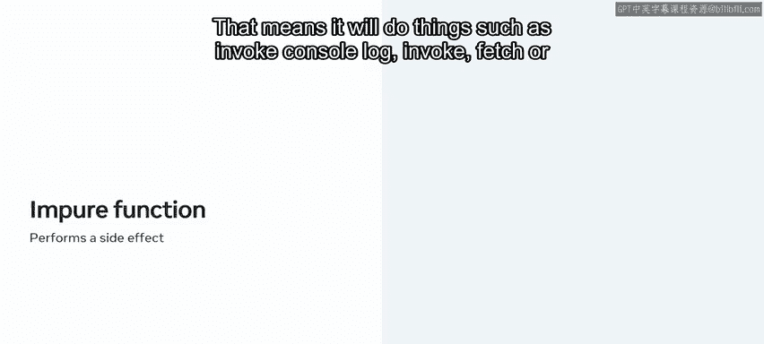

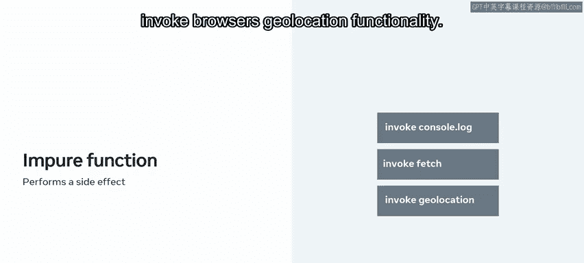

在这个上下文中，副作用可以被认为是函数外部或函数之外的东西。考虑为 Little Lemon 应用构建的购物车函数示例。

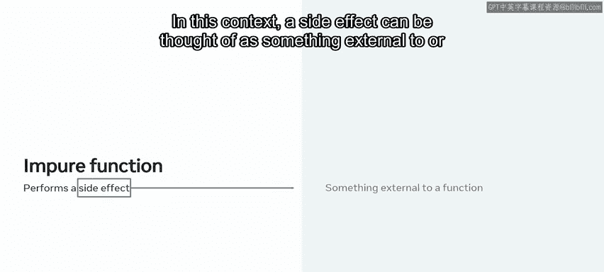

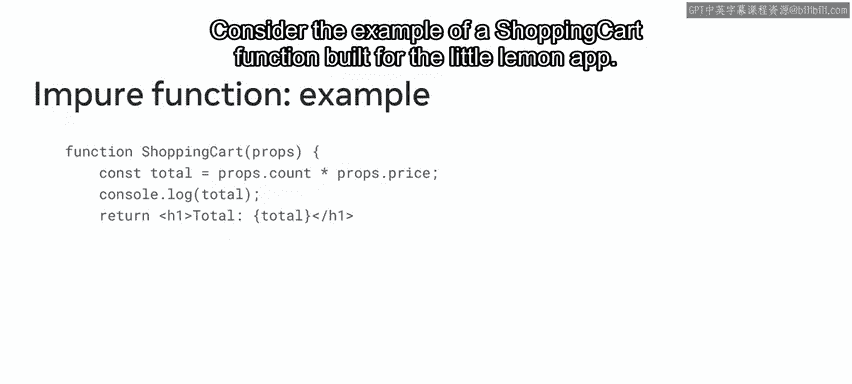

它之所以是一个不纯函数，是因为包含 `console.log` 的那行代码。`console.log` 调用使得函数不纯，因为它是对浏览器应用程序编程接口（API）的调用。现在，`ShoppingCart` 函数依赖于其自身之外、甚至 React 应用之外的东西才能正常工作。

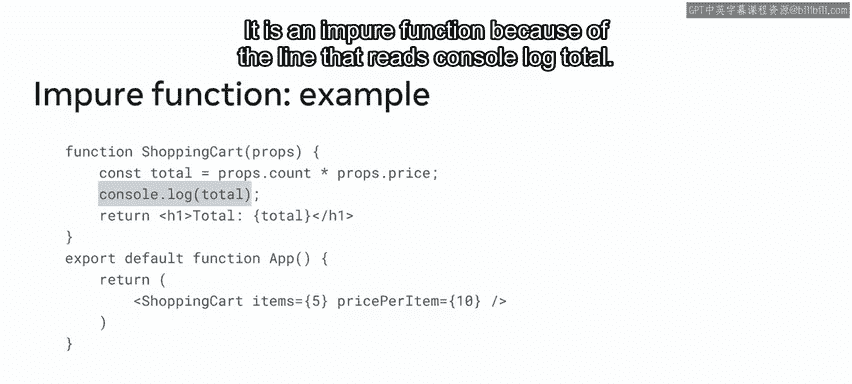

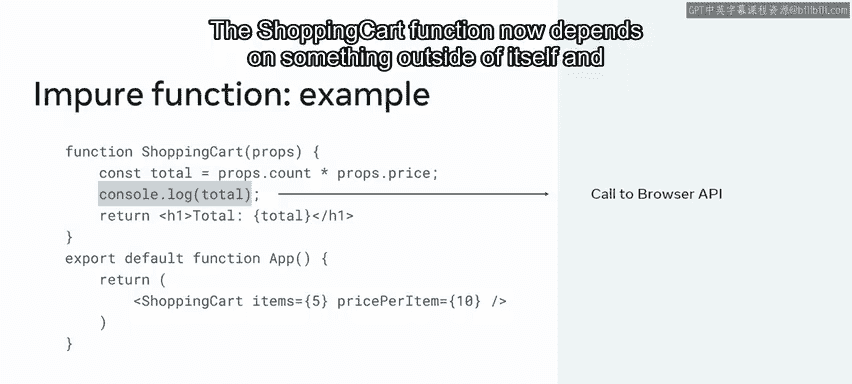

## 引入 useEffect 钩子

那么，在 React 中应该如何应对不纯函数的问题呢？关键在于将不纯的操作封装在它们自己特定的区域内。在 React 中，你需要使用 `useEffect` 钩子来实现这一点。

让我们用 `useEffect` 钩子更新 `ShoppingCart` 组件，以妥善处理由 `console.log` 引起的副作用。首先，你需要从 React 导入 `useEffect` 钩子。

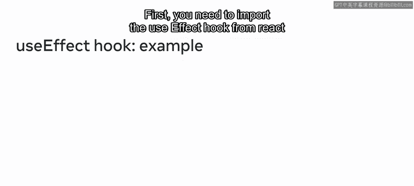

`useEffect` 钩子通过接收两个参数来工作。第一个是回调函数。第二个参数是一个数组。这个数组可以保持为空，这是完全有效的。

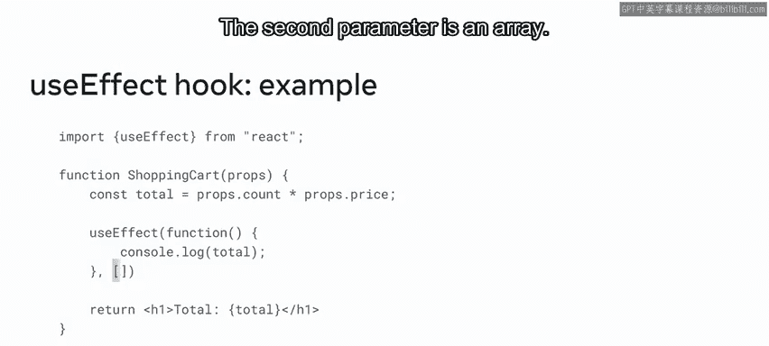

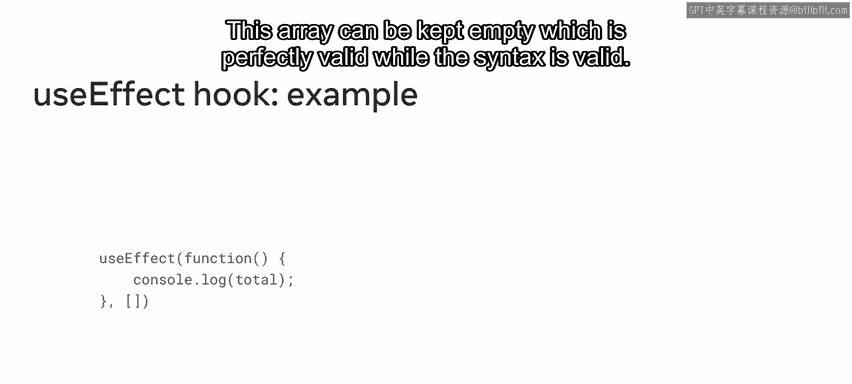

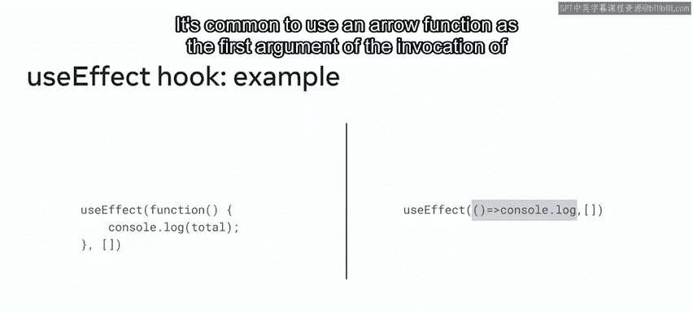

虽然这种语法是有效的，但通常使用箭头函数作为调用 `useEffect` 钩子的第一个参数。

请注意，`useEffect` 的用法被简化成了一行代码。它通常需要跨越多行代码，因为它通常需要做一些比仅仅在控制台记录组件变量值更有意义的事情。

## 总结

本节课中，我们一起学习了纯函数和不纯函数及其与副作用的关系，探讨了 React 组件内的副作用是什么，并简要介绍了如何使用 `useEffect` 来执行副作用。

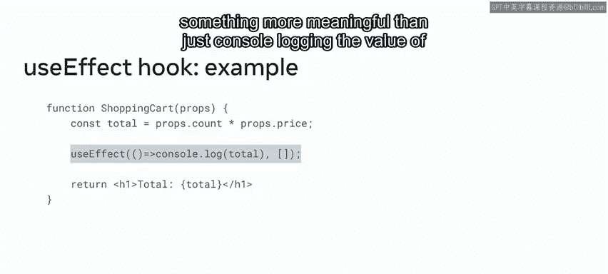

你可以期待应用这些知识，使用本节视频中介绍的 `useEffect` 钩子来执行副作用。