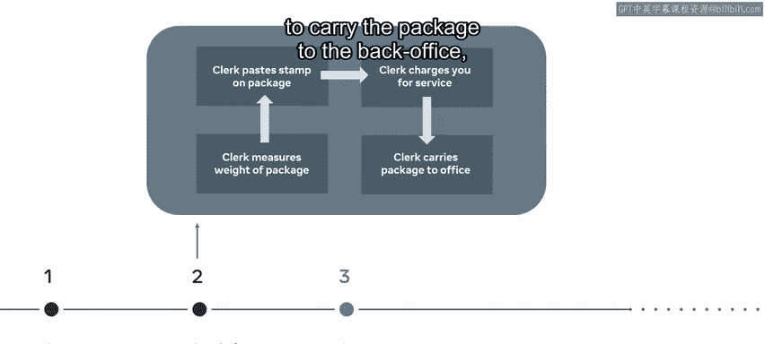
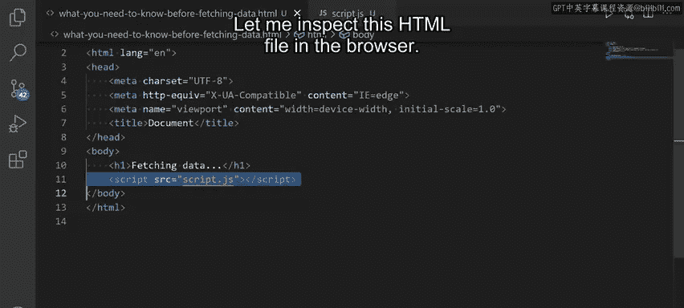
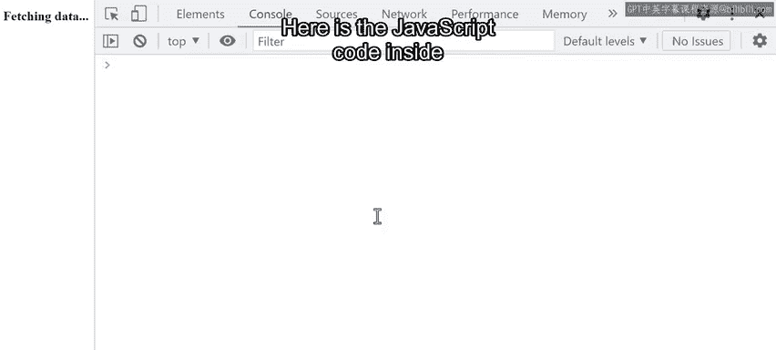
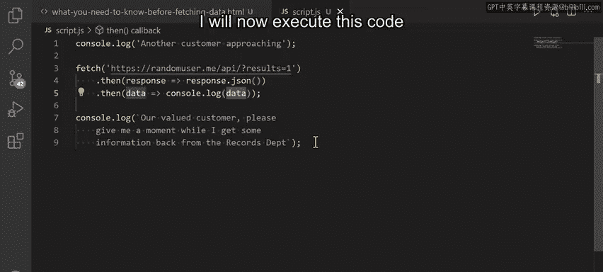
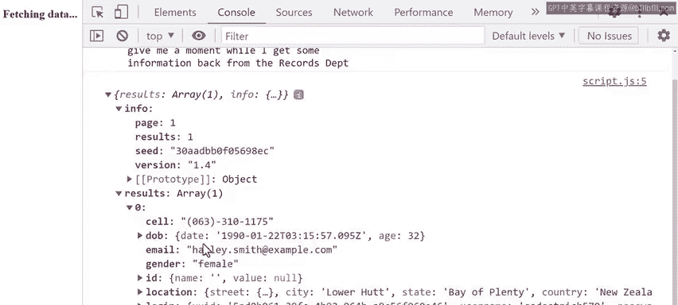

# 62：在获取数据之前需要知道什么 🧠

在本节课中，我们将要学习 `fetch` 函数的工作原理。`fetch` 是一个非常有用的工具，但在开始使用它之前，你需要理解一些重要的概念。首先，了解 JavaScript 如何委托任务将有助于你洞察 `fetch` 函数在此过程中的作用。我们将通过一个简单的 JavaScript 示例，来学习 `fetch` 如何从网络获取数据。

---

## JavaScript 的单线程与异步模型

上一节我们提到了 `fetch` 函数的作用，本节中我们来看看 JavaScript 执行任务的基本方式。JavaScript 是单线程的，这意味着它一次只能做一件事。这就像一个邮局里只有一个柜员。

想象一下，你带着一个包裹去邮局，而你是队列中的第一个人。柜台后的柜员就是 JavaScript。由于他一次只能处理一件事，他必须按顺序完成：获取你的信息、称重包裹、贴邮票、收费、将包裹送到后台办公室，最后找到正确的邮寄位置。

这种方法的问题是，前一个步骤未完成，下一个步骤就无法开始。这就是所谓的**单线程执行**。由于 JavaScript 本身不具备多任务处理能力，解决这个问题的方法如下：

以下是 JavaScript 委托任务的过程：
1.  JavaScript 获取你的信息。
2.  同时，它调用一个“职员”来测量包裹重量。
3.  JavaScript 调用另一个“职员”来贴邮票。
4.  JavaScript 调用另一个“职员”来收取服务费。
5.  再调用一个“职员”将包裹送到后台办公室。



这样，JavaScript 就能去服务下一位顾客了。

本质上，这种职责委托就是**异步 JavaScript**。在这个比喻中，浏览器是邮局，JavaScript 是邮局里的一个柜员，而所有其他“职员”可以被称为**浏览器 API** 或 **Web API**。

---

## 一个实际的代码示例



现在让我们探索一个 JavaScript 中职责委托如何工作的实际例子。我有一个本地的 HTML 文件，其中最重要的部分是 `script` 标签，它从一个名为 `script.js` 的文件中获取 JavaScript 代码。



假设 JavaScript（邮局工作人员）需要从计算机数据库中获取一些用户数据。以下是 `script.js` 文件中的 JavaScript 代码：

```javascript
console.log("another customer approaching");
fetch("https://randomuser.me/api/")
  .then(response => response.json())
  .then(data => console.log(data));
console.log("our valued customer");
```

由于 JavaScript 在任何给定时间只能做一件事，你期望这段代码的输出顺序是什么？让我们逐步分析代码在做什么。

在第一行，它执行 `console.log`，输出“another customer approaching”。然后，它联系 `fetch` API——这是一个外部的、独立于 JavaScript 的浏览器 API。JavaScript 不会等待 `fetch` API 返回信息，而是继续执行其后的代码，输出以“our valued customer”开头的文本。

与此同时，`fetch` API 向一个可用的第三方基于 Web 的 API（`randomuser.me` 网站）请求一些用户数据。`fetch` 函数被称为**外观函数**，这意味着它看起来像是 JavaScript 的一部分，但实际上它只是从 JavaScript 调用浏览器 API 的一种方式。换句话说，它是我访问 JavaScript 之外的浏览器功能的一种方式。

你可以把它想象成 JavaScript 邮局柜员，呼叫邮局的记录部门以获取一些客户数据。当另一个柜员带着信息回来并交给邮局柜员时，他们将获得一个 JSON 表示，并最终将该数据记录到控制台。

这意味着代码中控制台日志的顺序将如下：
1.  初始的 `console.log`，输出“another customer approaching”。
2.  第二个 `console.log`，输出“our valued customer”。
3.  最后一个 `console.log`，输出从 API 调用返回的数据。

执行此代码后，我们在浏览器控制台中首先看到“another customer approaching”，然后是“our valued customer”，最后是调用第三方 API 的结果。这正是所描述的行为。

这就是 JavaScript，尽管是单线程的，却可以执行异步操作的方式。



---



## 总结

本节课中我们一起学习了 `fetch` 函数如何从网络检索数据，并通过一个简单的 JavaScript 示例了解了整个过程。你应该在开始在 React 中获取数据之前熟悉这个概念，我们很快将会探讨。理解 JavaScript 的异步模型和 `fetch` 作为浏览器 API 接口的角色，是进行高效前端开发的基础。