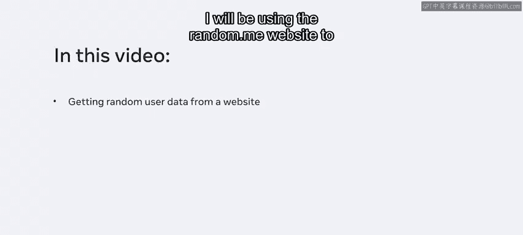
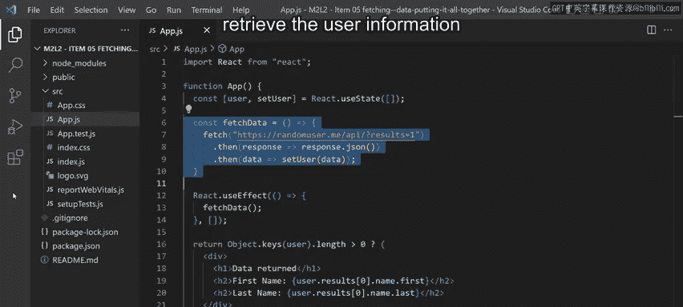
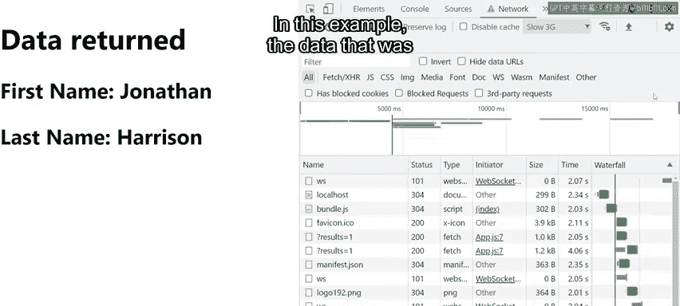
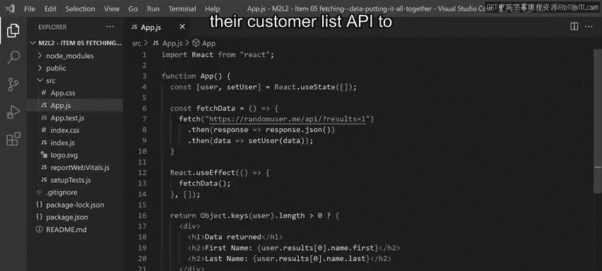

# 63：获取数据并汇总 📊

在本节课中，我们将学习如何在React应用中从外部API获取数据，并利用状态和副作用钩子来管理数据加载过程。我们将通过模拟“小柠檬餐厅”抽奖活动的场景，演示如何随机选取一位幸运顾客。

---

## 概述



“小柠檬餐厅”希望为其顾客举办一场抽奖活动，一位幸运顾客将获得餐厅的免费餐食。所有注册了“小柠檬”应用的顾客都将被纳入抽奖池，并随机选出一位获胜者。在本视频中，我将展示如何从一个网站获取随机用户数据。我将使用 `randomuser.me` 网站来获取用于演示的随机用户数据。

上一节我们介绍了React组件的基础结构，本节中我们来看看如何与外部API进行交互并动态更新UI。

## 代码实现与演示

我已经为此应用准备了一些代码，用于从网站获取用户数据。如果我执行这段代码，它最初会在H1标题中输出“数据加载中”的文本。同时，在后台，它将执行 `fetchData` 函数，从随机用户网站检索用户信息。

请注意，我打开了开发者工具并激活了网络选项卡。我将点击“节流”下拉菜单，人为地减慢我的连接速度。在下拉菜单中，我将选择“慢速3G”预设。这样我就可以在从网络获取数据之前，观察到标题中的“数据加载中”文本。

一旦数据成功获取，视图将更新为返回的数据：H1标题和已检索到的用户信息。在这个例子中，请求的数据是这位随机用户的名字和姓氏。



让我们更详细地逐步分析这段代码。

## 代码分步解析



首先，我有 `App` 函数组件，在它内部，遵循钩子的规则，我在组件的顶层调用了 `useState` 钩子。状态变量的初始值是一个空数组。

接下来，我定义了 `fetchData` 函数，它从 `randomuser.me` API 获取数据。然后，它从API获取JSON格式的响应，并用这个JSON数据更新状态变量。

你可能会注意到，我没有在 `fetchData` 函数内部使用钩子，因为这违反了钩子的规则。

之后，我调用了 `useEffect` 钩子，并从 `useEffect` 内部调用我之前定义的 `fetchData` 函数。

最后，我使用条件逻辑来决定返回什么。首先，我使用 `Object.keys` 代码片段将用户对象的所有键放入一个数组中。

由于 `Object.keys` 返回一个数组，我可以访问这个数组的 `length` 属性，并检查其长度是否大于0。如果是，则意味着状态数组的内容已经改变，因为你可能还记得，状态变量数组最初是空的。所以，如果数组不再为空，那么将返回带有H1标签和几个H2标签的 `div` 部分；否则，将返回下面显示“数据加载中”的H1标签。

## 数据加载与渲染流程

有时，`fetchData` 函数检索所请求的数据可能需要一点时间。因此，代码执行后最初会显示“数据加载中”的消息。一旦从 `fetchData` 调用中获取到数据，状态的这种变化会导致我的组件重新渲染。因此，返回语句中的三元运算符被重新求值，并返回我从调用Fetch API获得的所有数据。

这基本上就是你在React中从网络获取数据的方式。因此，“小柠檬餐厅”可以对其客户列表API应用相同的逻辑，来为他们的抽奖活动随机选择获胜者。

## 核心概念总结

在本视频中，你学习了如何使用状态和副作用钩子来获取数据。我们通过以下步骤实现：

1.  **初始化状态**：使用 `useState` 定义一个状态变量来存储数据。
    ```javascript
    const [userData, setUserData] = useState([]);
    ```

2.  **定义数据获取函数**：创建一个异步函数（如 `fetchData`）来调用API。
    ```javascript
    const fetchData = async () => {
      const response = await fetch('https://randomuser.me/api/');
      const data = await response.json();
      setUserData(data.results[0]);
    };
    ```

3.  **触发数据获取**：在 `useEffect` 钩子中调用数据获取函数，通常依赖项数组为空 `[]` 以在组件挂载时执行一次。
    ```javascript
    useEffect(() => {
      fetchData();
    }, []);
    ```

4.  **条件渲染**：根据状态（数据是否已加载）决定渲染加载指示器还是实际数据。
    ```javascript
    return (
      <div>
        {Object.keys(userData).length > 0 ? (
          // 渲染数据
        ) : (
          // 渲染加载中状态
        )}
      </div>
    );
    ```

---

## 总结




本节课中我们一起学习了在React应用中从外部API获取数据的完整流程。我们了解了如何结合使用 `useState` 和 `useEffect` 钩子来发起网络请求、管理加载状态，并根据数据是否可用来条件性地渲染UI。这种方法为构建动态、数据驱动的React应用奠定了基础，正如“小柠檬餐厅”抽奖功能示例所展示的那样。