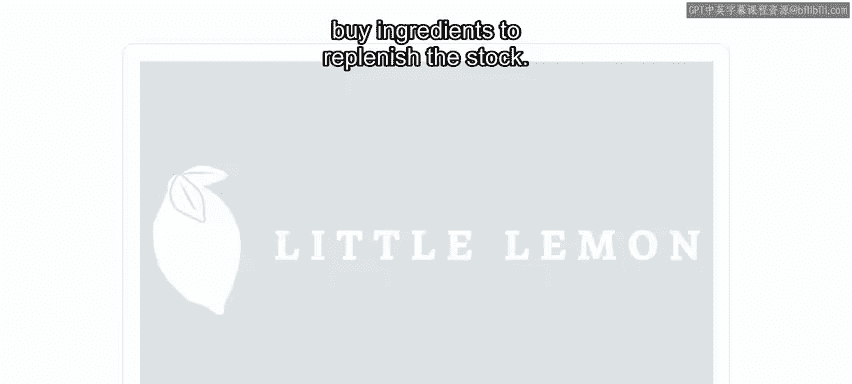
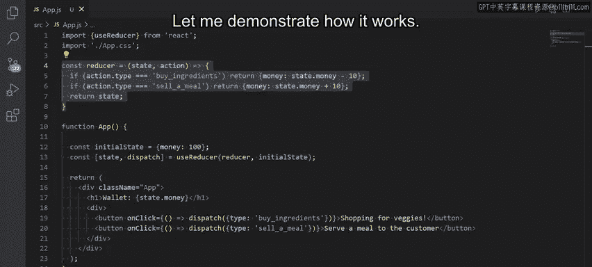
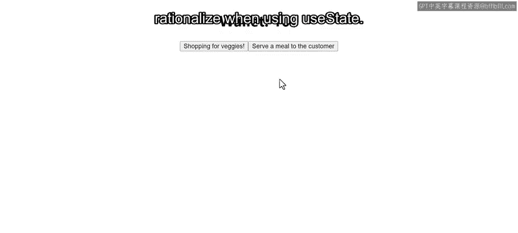
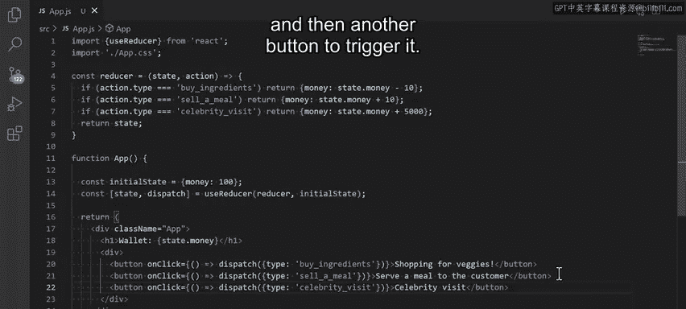
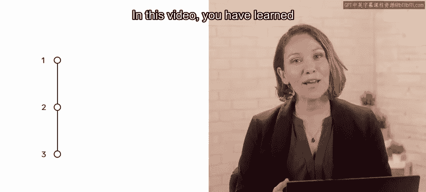

# 65：什么是 useReducer，它与 useState 有何不同 🧩

在本节课中，我们将要学习 `useReducer` Hook，了解它的工作原理，并探讨它与我们熟悉的 `useState` Hook 有何不同。我们将通过一个为“小柠檬”餐厅构建费用追踪应用的实例，来直观地理解 `useReducer` 如何管理更复杂的状态逻辑。

## 概述：useState 的局限性

到目前为止，你应该对 `useState` Hook 有了相当好的理解，并能将其实际应用于你的解决方案中。

然而，`useState` Hook 确实有其局限性。例如，当你涉及多个子值的复杂状态逻辑，或者下一个状态依赖于前一个状态时，使用 `useState` 可能会变得繁琐。

在这些情况下，`useReducer` Hook 可以提供一个更好的替代方案。

## 什么是 useReducer？ 🚀

你可以将 `useReducer` 视为一个功能更强大的 `useState`。

`useState` Hook 从一个初始状态开始，而 `useReducer` Hook 除了初始状态外，还会接收一个 **reducer 函数**。

这非常有益，因为 reducer 函数的第二个参数是一个 **action 对象**。这个对象有多个类型值，基于这些类型值中的每一个，你可以调用 `dispatch` 函数来执行特定的操作。

## 应用场景：小柠檬餐厅的费用追踪

现在，假设小柠檬餐厅越来越受欢迎，需求不断增长，因此，追踪支出成了一个难题。到目前为止，他们一直在手动计算收入和支出，包括向顾客销售餐点和购买食材补充库存。

小柠檬餐厅正在寻找一个使用 React 的解决方案，以便在他们的应用中追踪支出，减轻员工的负担。

因为使用 `useState` Hook 会使这个解决方案变得不必要的复杂，所以这是实现 `useReducer` Hook 的绝佳机会，以便简单地追踪购买食材的成本和向顾客销售成品餐点所产生的收入。

## 代码实现：深入 useReducer

现在，让我们通过一个代码示例来探索如何实现 `useReducer` Hook，以加深你的理解。

想象一下，我正在使用 React 和 `useReducer` 为之前讨论的小柠檬餐厅编写费用追踪应用程序。

通过这个应用，我可以追踪两个操作：在小柠檬餐厅购买食材准备餐点的成本，以及在餐厅向顾客销售成品餐点的收入。为了简单起见，我只添加了两个操作：`buy_ingredients`（购买食材）和 `sell_meal`（销售餐点）。

### Reducer 函数与 Action

reducer 函数接收先前的状态和一个 action，并返回新的状态。action 的 `type` 属性决定了 reducer 要执行的具体操作。

按照惯例，action 通常被传递为具有 `type` 属性的对象。它应该包含 reducer 计算下一个状态所需的最少必要信息。你可以在本课末尾的补充阅读中了解更多关于将状态逻辑提取到 reducer 的信息。

### Dispatch 方法

与 `useState` Hook 使用 `setState` 不同，你使用 `useReducer` Hook 的 `dispatch` 方法。它接受一个字面量对象，该对象有一个名为 `type` 的属性，其值设置为与 reducer 函数内部定义的行为相匹配的 `action.type`。

由于我已经在浏览器中运行这个应用，让我演示一下它是如何工作的：当我按下“购买蔬菜”按钮时，钱包金额减少 10；当我按下“为顾客提供餐点”按钮时，钱包金额增加 10。

## 扩展功能：添加更多 Action 类型

使用 `useReducer`，你可以根据需要定义更多类型。这样，你就可以轻松地在 React 应用中使用更复杂的逻辑，这些逻辑在使用 `useState` 时可能难以合理化。

为了在实践中探索这一点，让我们添加另一个 action 类型。我将其命名为 `celebrity_visit`（名人到访）。当有名人到访餐厅时，应触发此操作，这将为餐厅带来 5000 美元的收入。

为了实现这个功能，我在 reducer 函数中添加了另一个 action 类型，然后添加了另一个按钮来触发它。

我将保存更改并在浏览器中预览更新后的应用。看，一切都按预期工作。点击“名人到访”按钮会使钱包金额增加 5000。就这么简单。

现在，小柠檬餐厅将能够追踪他们的支出，从而清楚地了解他们从业务中赚取了多少利润。

## 总结与回顾

在本视频中，你学习了 `useReducer` Hook，了解了它与 `useState` Hook 的不同之处，以及为什么在某些情况下它可以成为一个有益且更高效的解决方案。

**核心概念回顾：**
*   **`useReducer`**：适用于管理包含多个子值或下一个状态依赖于前一个状态的复杂状态逻辑。
*   **Reducer 函数**：格式为 `(state, action) => newState`，根据 `action.type` 决定如何更新状态。
*   **Dispatch 方法**：用于触发状态更新，发送一个包含 `type` 的 action 对象给 reducer。
*   **与 `useState` 对比**：`useReducer` 通过集中化的 reducer 函数和分发的 action，让复杂状态变化的逻辑更清晰、更易于维护和测试。