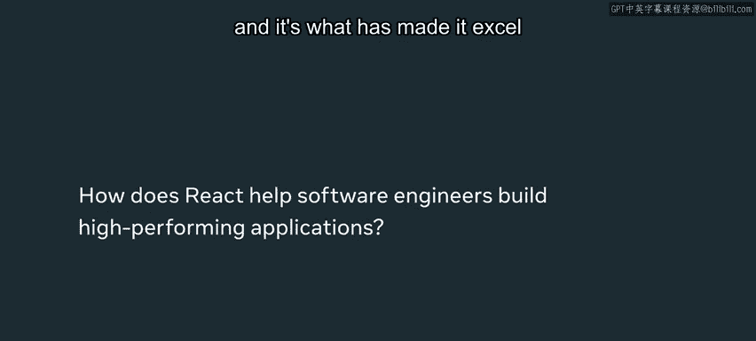

# 69：性能对软件开发的重要性 🚀

在本节课中，我们将探讨性能在软件开发中的关键作用。性能优化有时只需一行代码的改动，有时则可能需要重构整个应用。我们将了解为何性能至关重要，以及如何通过渐进式改进和特定设计模式来提升应用性能。

---

性能的有趣之处在于，有时仅仅一行代码的改动就能决定其成败。

当然，有时为了提升性能，可能需要重写整个应用程序并从头开始。

但有时，微小的改变也能带来巨大的差异。

我叫莫塔拉，是Meta西雅图办公室的一名软件工程师。

在Meta，我们努力思考用户的多样性和不同背景，以及他们可能使用何种技术来访问我们的产品。

因此，性能的好坏可能直接决定我们是赢得还是失去一位用户。如果应用程序性能不佳、响应迟钝或速度不够快，人们就不会使用它。

所以，在开发这些应用时，思考性能对我们来说至关重要。

---

我们的应用程序并非天生就具备高性能。我们总是努力寻找可以提升其性能的方法。

性能通常是我们通过增量构建和逐步改进来实现的。我们可能认为性能优化不那么重要，开发新功能或让界面更丰富多彩才更令人兴奋。

性能是一种无形的特性，你可能无法立即注意到它，也无法展示它并引以为豪。

但它实际上非常重要，是应用程序的基础组成部分。没有它，应用程序就无法真正运行。

---

React做得非常出色的一点，也是它得以脱颖而出并广受欢迎的原因，在于它在构建和渲染Web应用方面非常高效。

React的卓越之处在于它能够将变更**局部化**。例如，如果你只需要更改一小段文本，React可以确保只执行更改该文本所需的工作，而不是重新渲染整个页面。

对整个页面进行重新渲染对计算机来说可能成本非常高。

因此，我们会努力寻找性能瓶颈，然后深入探究，分析为什么某个组件如此缓慢，为什么它需要这么长时间。

我们可能会思考如何重构这个组件以使其更快，或者是否可以将部分计算任务委托给后端，从而避免让用户和前端承担这部分成本。

---

工程师、产品经理和设计师都会在开发过程中尽可能多地使用应用程序，以设身处地地体验用户在使用我们产品时的感受。

一旦我们通过检查性能、稳定性、可用性以及功能完整性等各项指标，对应用程序的准备程度有了足够信心，我们就会将其发布到Alpha阶段。

在这个阶段，只有少量用户尝试使用，以便我们收集反馈。

随着在反馈周期中信心不断增强，我们会逐步扩大用户范围，直到最终完全发布。

---

高性能和良好的可用性是应用程序需求中非常重要的一部分。

为了实现这一目标，工程师们长期以来开发出了一些特定的设计模式和成熟的方法，这些方法被证明非常有效，能够提升应用性能。

例如，使用**记忆化（Memoization）** 或将部分处理过程**委托给后端（Delegation to Backend）**。

我鼓励你去寻找这些模式，并探索如何将它们引入到你的应用程序中。

---

本节课中，我们一起学习了性能在软件开发中的核心重要性。我们了解到，性能优化可能源于微小的代码改动，也可能是系统性的工作。关键在于持续关注、寻找瓶颈，并应用经过验证的设计模式（如记忆化和后端委托）来逐步提升应用体验。记住，性能虽“无形”，却是决定产品成败的基础。