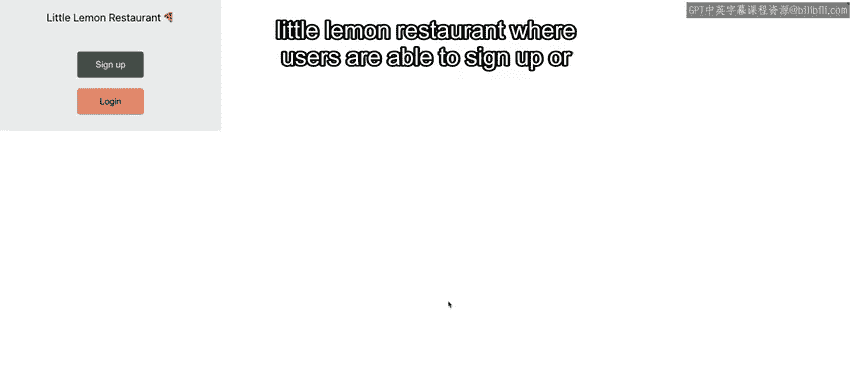
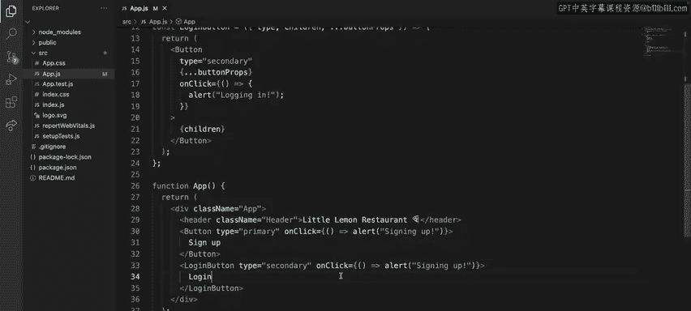
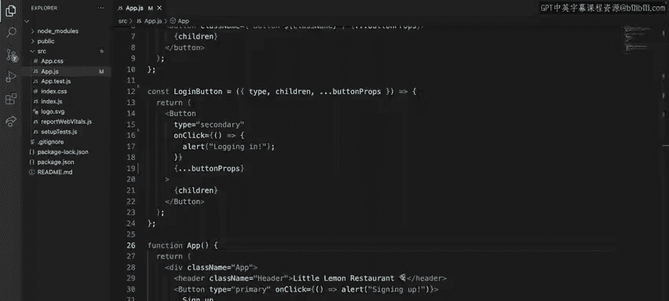

# 72：传播属性


在本节课中，我们将要学习 JavaScript 中的扩展运算符，并了解如何在 React 中利用它来高效地传递属性。扩展运算符极大地简化了对象复制、合并以及属性传递等常见操作。

## 扩展运算符简介

扩展运算符是 JavaScript 语言中一个非常出色的新增特性。它由三个点 `...` 表示。得益于扩展运算符，一些原本需要更多代码才能完成的操作，例如克隆对象或数组，现在变得非常简单。

## 在 JavaScript 对象中的应用

在深入探讨 React 之前，让我们先回顾一下扩展运算符在纯 JavaScript 中对对象的操作。扩展运算符可以应用于 JavaScript 中的不同数据类型，例如数组、对象甚至字符串。由于 React 的属性本质上就是对象，因此本节课将严格聚焦于对象类型。

复制和合并对象是使用此运算符可以执行的两个主要操作。

以下是复制对象的语法：使用花括号，并在要复制的对象前加上三个点。

```javascript
const newObject = { ...originalObject };
```

在这个例子中，`orderAmend` 代表了对客户所点披萨类型的最后一刻更改。

对于合并操作，首先需要展开原始对象的属性，然后提供要添加或替换原始属性的新属性。

```javascript
const mergedObject = { ...originalObject, newProperty: 'value' };
```

名为 `item` 的属性已被新的订单信息替换。

## 在 React 中使用扩展运算符

现在基础知识已经介绍完毕，让我们来探索 React 如何使用扩展运算符。

这个订单列表组件示例渲染了一个订单组件。每个订单组件期望接收四个属性：`id`、`username`、`item` 和 `price`。

第一个例子展示了通常的做法：在返回语句中显式传递所有属性。

然而，如果你已经将订单组件所需的属性放在一个对象中，这可以简化。在返回语句中，你只需要使用扩展运算符即可，这节省了时间，只需展开所有属性，而无需手动键入它们。

```javascript
function OrderList(props) {
  return <Order {...props} />;
}
```

这种模式允许你创建灵活的组件。但在使用此语法时，也需要注意一些注意事项。



## 注意事项与示例演示

让我们通过一个示例演示来更详细地探讨这一点。在这个应用程序中，我为 Little Lemon 餐厅创建了一个简单的欢迎屏幕，用户可以根据是否拥有账户进行注册或登录。


在顶部，我定义了一个包装了 DOM 原生按钮的按钮组件。该组件期望接收与其原生对应物相同的属性，并额外添加了一个 `type` 属性。这是一个自定义属性，根据提供的主题决定按钮的背景色。

这里有一个清晰的例子，展示了如何使用扩展运算符来分组属于原生按钮的所有属性，并显式提取我为该组件定义的、React 特有的自定义属性：`type` 和 `children`。

```javascript
function Button({ type, children, ...nativeProps }) {
  const theme = type === 'primary' ? 'blue' : 'gray';
  return (
    <button style={{ backgroundColor: theme }} {...nativeProps}>
      {children}
    </button>
  );
}
```

这种实现方式对开发者来说很清晰，因为他们可以提供原生按钮所期望的所有属性。

第二个例子是一个登录按钮组件，它渲染了我自己创建的自定义按钮组件。这个登录按钮通过固定按钮组件的一些属性（在本例中是 `type` 和 `onClick`）来进行一些预配置，同时仍然使用扩展运算符将原生按钮属性向下传递。

现在，App 组件渲染了两个按钮，并使用按钮组件进行注册，使用登录按钮组件进行登录。这里的按钮都被配置为将用户引导至注册页面，除非他们拥有账户，在这种情况下，登录按钮组件原始的 `onClick` 函数会将他们引导至登录页面。

我还为两个按钮都提供了一个 `onClick` 处理程序，用于在按下按钮时显示有关预期操作的警报。然而，请注意我错误地在登录按钮组件上提供了与注册相同的警报消息，从而覆盖了登录按钮已经定义的 `onClick` 处理程序。

那么，当我点击它时，警报的消息会是什么呢？我给你几秒钟时间思考一下。




如果你猜的是“正在登录”，那么你猜对了。原因是，尽管我在登录按钮组件中覆盖了 `onClick` 属性，但其实现方式阻止了这种覆盖的发生。




为什么会这样？这是因为扩展运算符的顺序。如果我改为在最后，即在 `onClick` 之后展开属性，行为就会不同，输出的将是“正在注册”。


## 总结

本节课中我们一起学习了扩展运算符。扩展运算符是一个强大的工具，它支持创建更灵活的组件，特别是在自动将属性转发给期望它们的其他组件时，以及为你的组件使用者提供一个良好的组件 API。

然而，请记住，根据扩展的顺序，行为可能会有所不同，因此在涉及组件设计时，你需要有意识地做出决定。在之前的登录按钮示例中，防止覆盖 `onClick` 属性可能是有意义的，但对于其他属性，这可能并非本意。

希望你现在对使用这些 React 工具所能获得的多种好处有了更清晰的认识。