# 73：React 中的跨切面关注点 🧩

在本节课中，我们将要学习 React 中的“跨切面关注点”概念。你将了解为什么组件有时不足以复用某些通用逻辑，并探索一种名为“高阶组件”的解决方案。

---

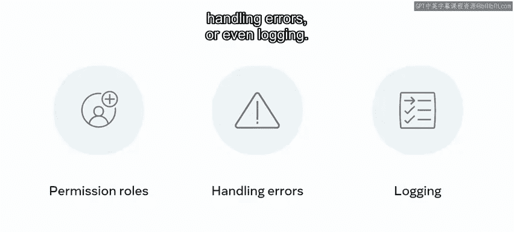

在构建 React 应用时，你会发现自己需要创建一些与应用程序业务逻辑无关，但在许多地方都需要的通用功能。

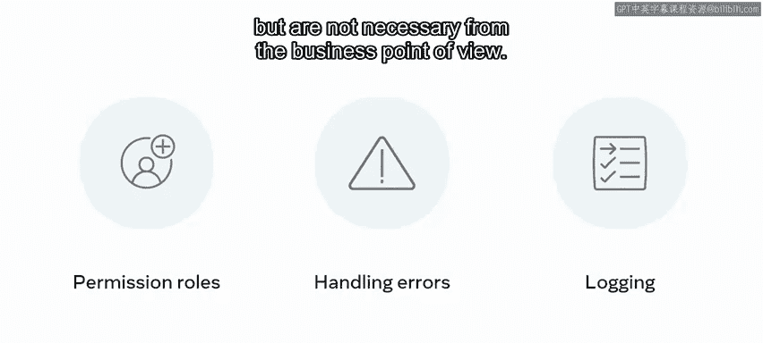

例如，管理不同的权限角色、处理错误，甚至日志记录。

这些功能是所有应用都需要的，但从业务角度来看并非必需。

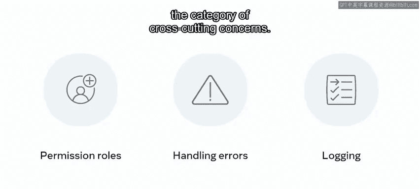

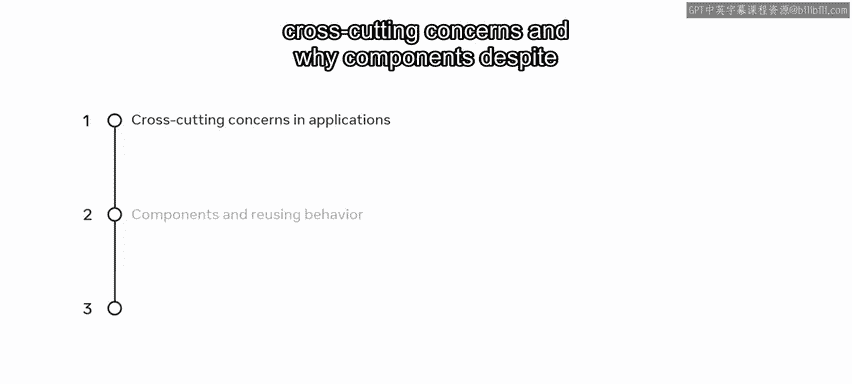

这类功能就属于“跨切面关注点”的范畴。在本视频中，你将学习什么是跨切面关注点，以及为什么组件虽然是 React 中代码复用的主要单元，但对于这类逻辑来说并不总是最佳选择。你还将了解为何需要引入新的模式来解决这个问题。

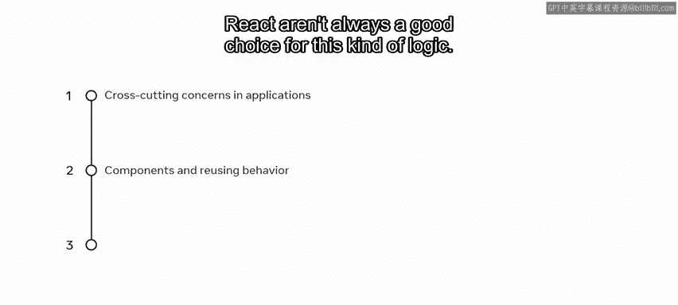

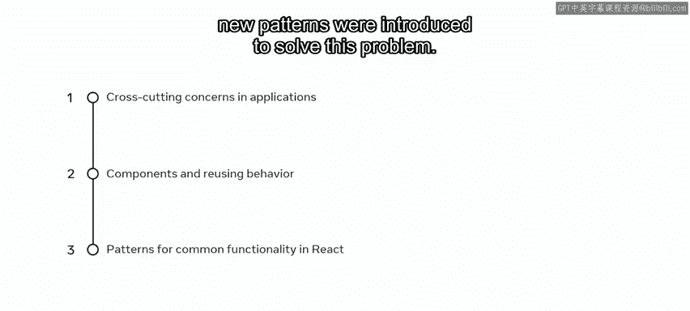

让我们开始吧。😊

## 一个具体的例子

想象一下，你的任务是构建“小柠檬餐厅”应用中显示实时订单列表的逻辑。

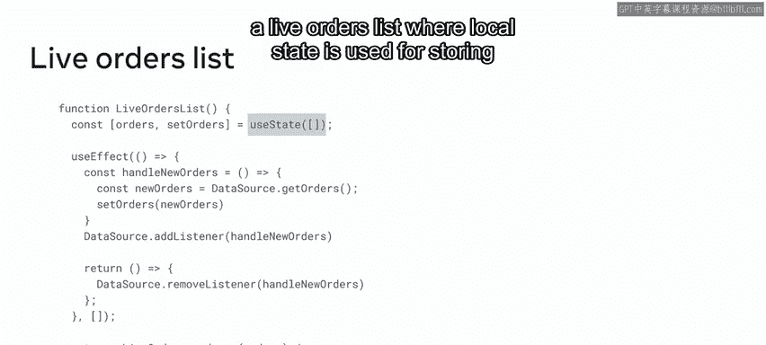

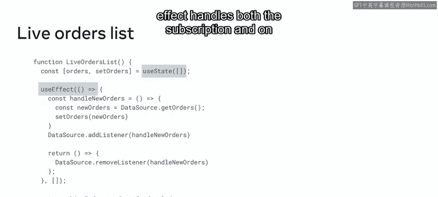

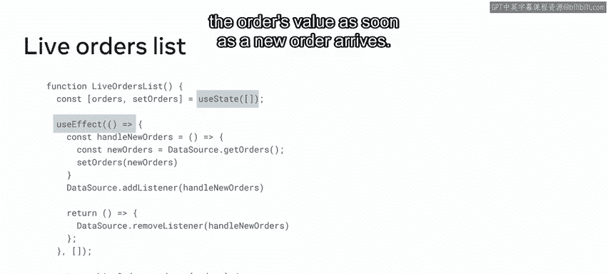

让我们探索如何实现它。以下是一个有效的实时订单列表实现，其中使用本地状态来存储当前的订单列表，`useEffect` 负责处理对实时数据的订阅和取消订阅，并在新订单到达时更新订单值。

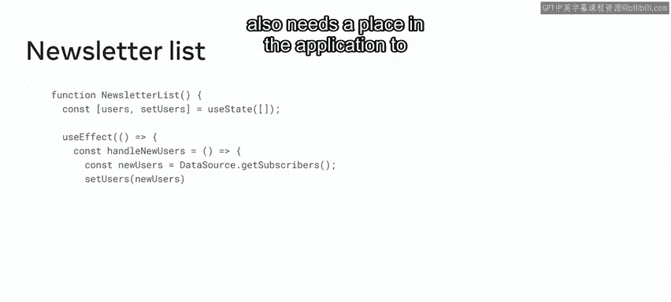

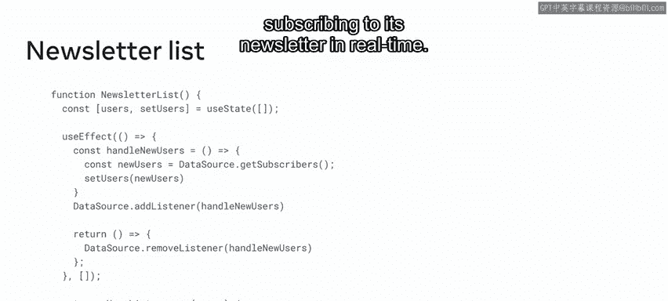

现在，假设“小柠檬”还需要在应用中有一个地方来实时跟踪订阅其新闻通讯的用户数量。

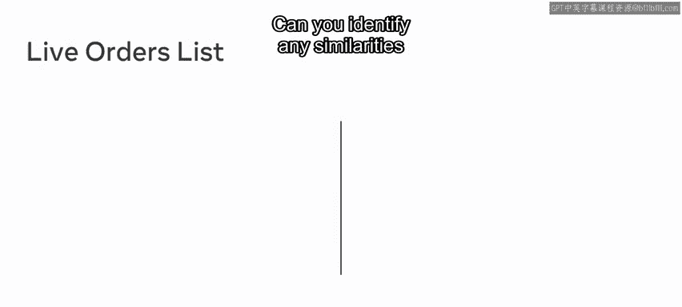

这可能是该功能的一个有效实现。

你能找出“实时订单列表”和“新闻通讯列表”之间的相似之处吗？

它们肯定不完全相同，因为它们调用了数据源上的不同方法并渲染了不同的输出。但经过检查，你会发现大部分实现是相同的：

*   它们都在组件挂载时向数据源添加一个变更监听器。
*   每当数据源发生变化时，它们都设置新的状态。
*   它们都在组件卸载时移除变更监听器。

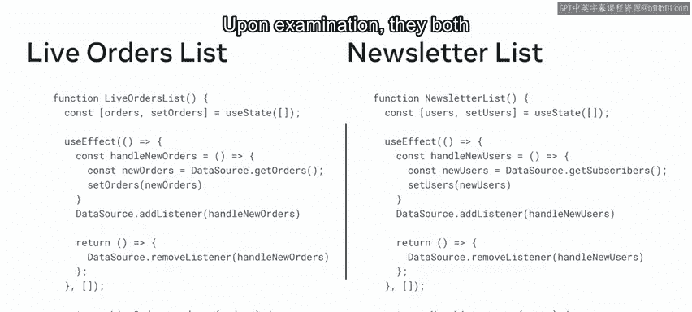

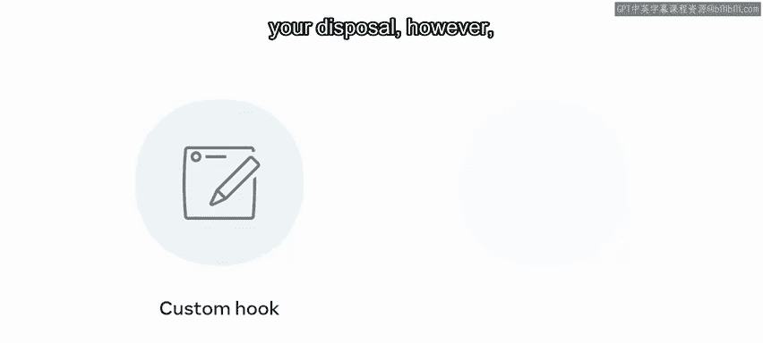

你可以想象，在一个大型应用中，这种订阅数据源并用新数据设置本地状态的模式会反复出现。

## 复用逻辑的挑战

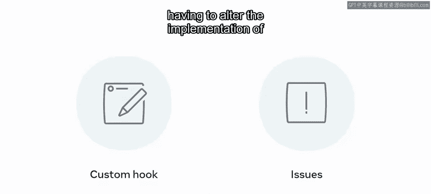

到目前为止，你已经看到，使用自定义 Hook 来封装这种逻辑是你可以采用的解决方案之一。

然而，这会带来一个问题：你必须修改每个需要该数据的组件的实现，从而使它们都变成有状态的。

那么，如何才能在一个地方定义订阅逻辑，在许多组件之间共享它，同时保持这些组件不变且无状态呢？

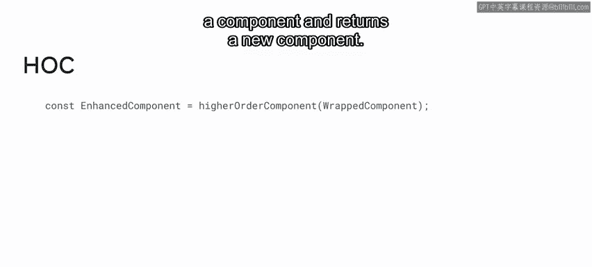

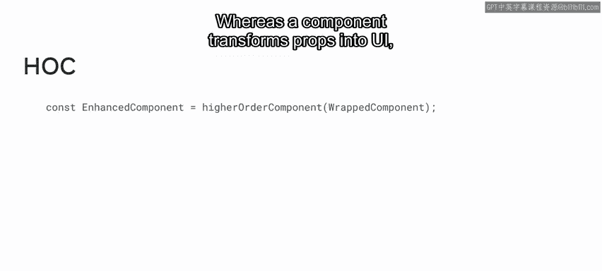

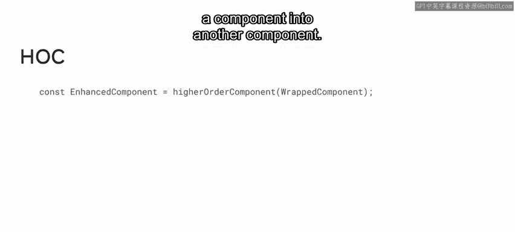

## 高阶组件解决方案

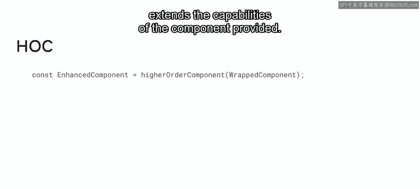

这正是高阶组件成为完美解决方案的地方。

高阶组件，也称为 HOC，是一种源于 React 组合特性的高级模式。具体来说，**高阶组件是一个接收一个组件并返回一个新组件的函数**。如果说组件将 props 转换为 UI，那么高阶组件则是将一个组件转换为另一个组件。换句话说，它增强或扩展了所提供组件的能力。

让我们来研究一下，使用高阶组件实现这种可复用的订阅逻辑会是什么样子。

`withSubscription` 是一个高阶组件，它接收你想要增强订阅能力的**包装组件**，以及一个 `selectData` 函数来确定你从数据源获取的数据类型（在本例中是订单或用户）。然后，它返回一个新组件，该组件渲染提供的组件，并向其提供一个名为 `data` 的新 prop，该 prop 将包含来自目标数据源的最新项目列表。它还将其他 props 传递给包装组件，这是 HOC 中的一种惯例。

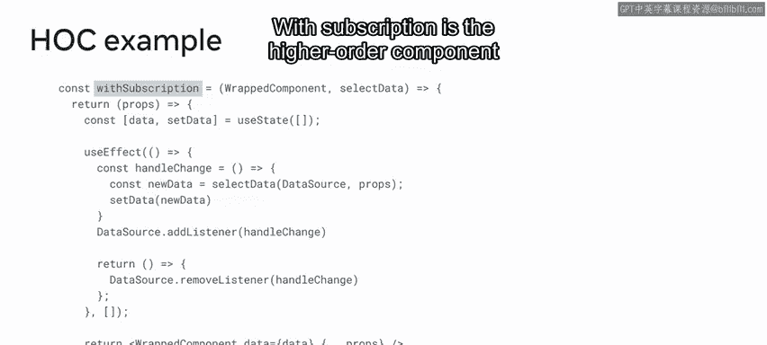

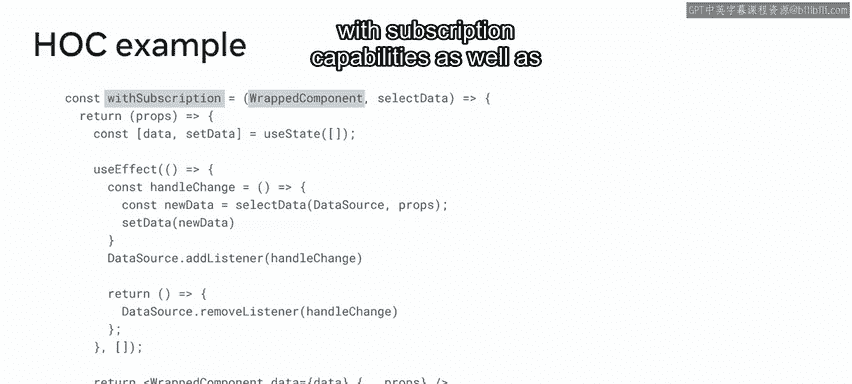
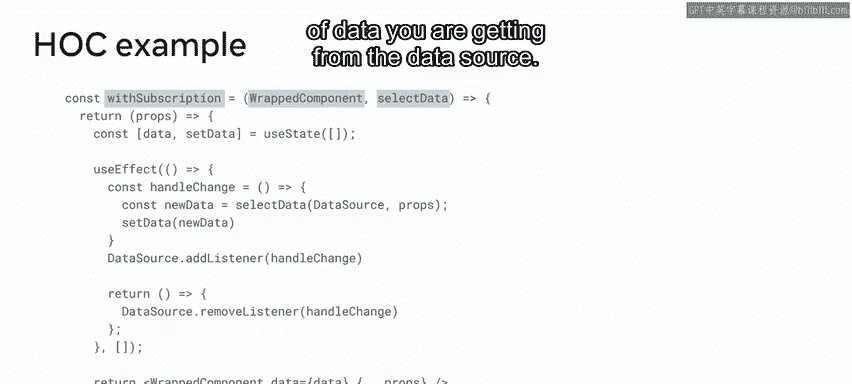
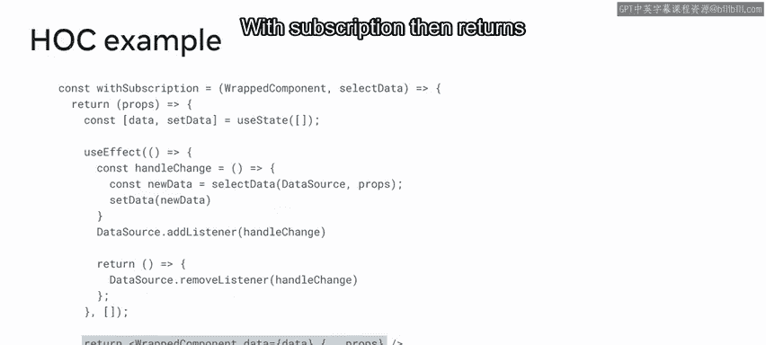
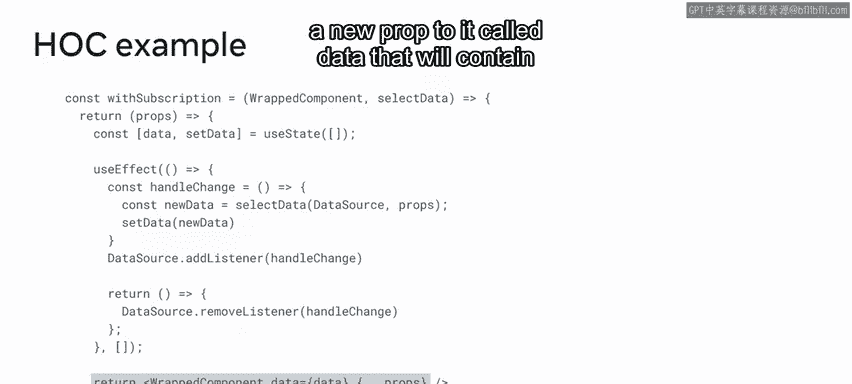
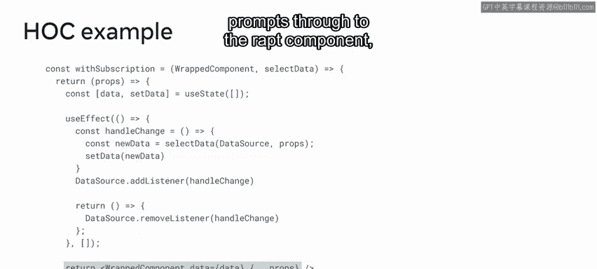

这是实现，那么它的用法呢？在这种情况下，你可以定义两个配置了不同参数的组件，一个用于实时订单，另一个用于新闻通讯订阅者，而无需在 `LiveOrders` 或 `UserList` 中重复订阅实现，这使得它成为一个更高效的解决方案。

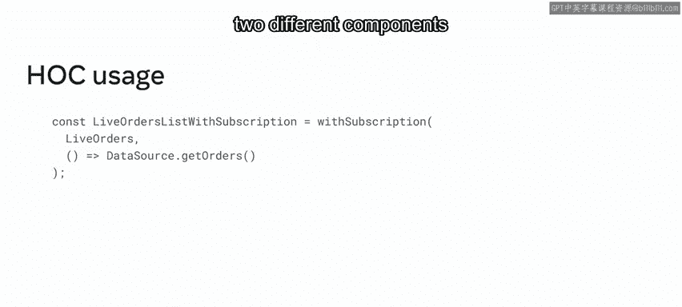

## 后续展望

还有一种用于处理跨切面关注点的模式，你很快就会学到，它叫做 **Render Props**。

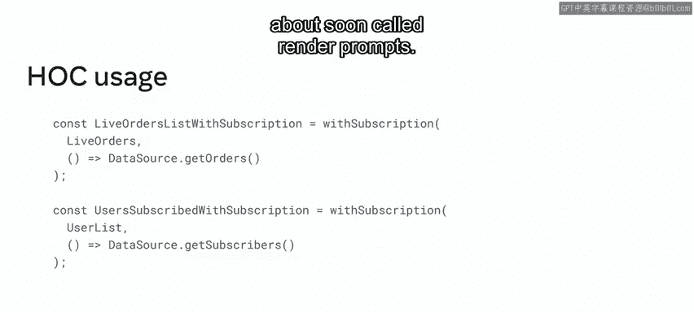

---

## 总结

本节课中我们一起学习了跨切面关注点的概念，以及为什么组件并不总是足以复用行为。你还探索了一种在 React 应用中封装通用行为的替代模式——高阶组件。