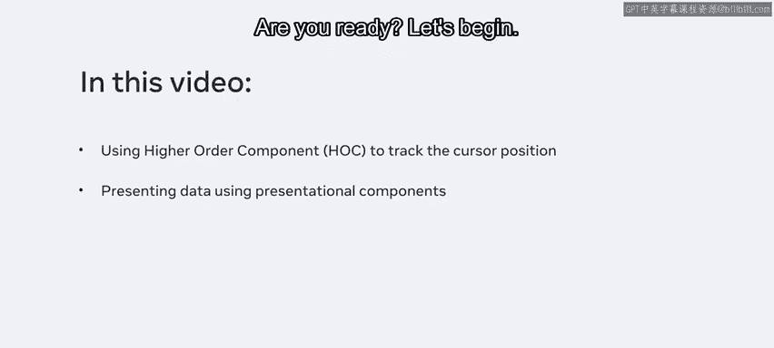
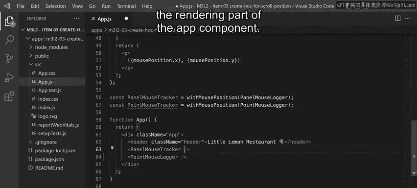
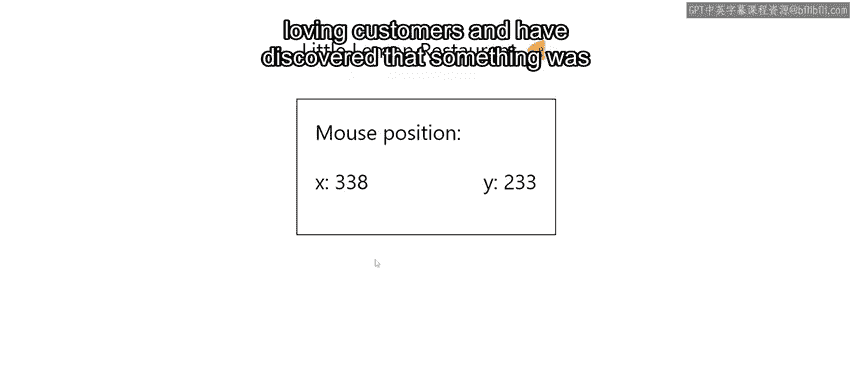
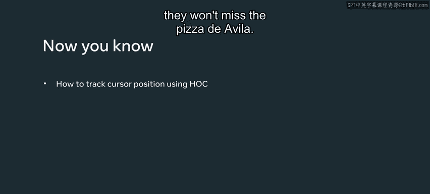

# 74：32_为光标位置创建高阶组件 🖱️

## 概述
在本节课中，我们将学习如何使用React的高阶组件（HOC）来封装和复用追踪用户鼠标位置的功能。我们将通过一个为“小柠檬餐厅”网站分析用户对披萨图片关注度的实际案例，来掌握HOC的核心概念和实现步骤。

---

## 背景与需求 🍕

上个月，由于主厨推出的几款特色披萨深受喜爱，“小柠檬餐厅”网站的访问量激增。

然而，并非所有披萨都获得了同等的关注度。

因此，餐厅决定实施基础数据分析，以更好地了解哪些披萨最畅销，哪些披萨点单频率较低。

为此，他们希望在用户浏览披萨版块时追踪其鼠标位置，从而精确掌握哪些图片吸引了用户注意，哪些被忽略了。

## 高阶组件解决方案 🧩

在接下来的内容中，我将展示如何通过使用高阶组件来实现此功能。

该高阶组件将负责封装追踪访客光标位置的逻辑和状态。



之后，我将展示两个不同的展示型组件，它们将消费这些数据并以不同的方式呈现出来。

---

## 初始应用状态

当前应用是使用 `create-react-app` 创建的。在 `App` 组件的渲染部分，有一个显示餐厅标题的页头，以及两个组件：`PanelMouseLogger` 和 `PointMouseLogger`。

这两个组件都期望接收一个名为 `mousePosition` 的属性（prop），如果未提供该属性，它们将返回 `null`。这就是目前它们完全不渲染任何内容的原因。

你可以在每个组件中分别实现鼠标追踪逻辑。

但请注意，这会导致代码重复，相同的逻辑会在两个不同的地方出现。

因此，推荐的方法是使用React提供的封装横切关注点的技术之一。

在本示例中，我将演示如何使用高阶组件来实现。

---

## 创建高阶组件

我将这个高阶组件命名为 `withMousePosition`。名称以 `with` 开头是React推荐的一种通用约定，因为它表达了该技术的“增强”本质，即为组件提供额外的功能。

回顾一下，高阶组件本质上是一个**函数**，它接收一个组件作为参数，并返回一个新的组件。

让我们完成初始的脚手架代码，返回一个渲染传入函数的组件的组件，同时不要忘记展开它接收到的props，以确保它们被传递下去。

```jsx
const withMousePosition = (WrappedComponent) => {
  return (props) => {
    return <WrappedComponent {...props} />;
  };
};
```

很好，现在为了追踪光标位置，我需要定义一个新的局部状态。

我将状态数据命名为 `mousePosition`，状态设置函数命名为 `setMousePosition`。

初始状态是一个包含 `x` 和 `y` 两个属性的对象，用于定义屏幕上的二维坐标，我将它们都初始化为 `0`。

`x = 0` 和 `y = 0` 代表屏幕的左上角。

接下来，我需要在 `window` 对象上为 `mousemove` 事件设置一个全局监听器。

由于这是一个副作用，我需要在 `useEffect` 钩子内部执行订阅和取消订阅的逻辑。

让我们开始实现。我将为 `window` 对象添加一个鼠标移动事件监听器。对于回调函数，我将其命名为 `handleMousePositionChange`，目前它不执行任何操作。

在组件卸载时移除任何订阅非常重要。

实现方法是从 `useEffect` 返回一个函数，并在其中执行所需的清理工作。在本例中，我需要调用 `window.removeEventListener`，并传入 `mousemove` 事件和之前相同的回调函数作为参数。

为了完成逻辑并用当前鼠标位置更新状态，我需要从作为参数传递给回调函数的浏览器事件对象中读取信息。

该事件对象包含定义坐标的两个属性：`clientX` 和 `clientY`。因此，我将把它们分别赋值给对应的维度。

最后，完成实现的最后一步是在被包装的组件上设置一个名为 `mousePosition` 的新prop，以将该信息传递给所有对此数据感兴趣的组件。

```jsx
import React, { useState, useEffect } from 'react';

const withMousePosition = (WrappedComponent) => {
  return (props) => {
    const [mousePosition, setMousePosition] = useState({ x: 0, y: 0 });

    useEffect(() => {
      const handleMousePositionChange = (e) => {
        setMousePosition({
          x: e.clientX,
          y: e.clientY,
        });
      };

      window.addEventListener('mousemove', handleMousePositionChange);

      return () => {
        window.removeEventListener('mousemove', handleMousePositionChange);
      };
    }, []);

    return <WrappedComponent {...props} mousePosition={mousePosition} />;
  };
};
```

---

## 应用高阶组件

现在高阶组件的实现已经完成，让我们添加最后几个部分，以在屏幕上显示鼠标位置。

为了增强之前定义的两个组件 `PanelMouseLogger` 和 `PointMouseLogger`，我将使用高阶组件来创建两个知晓鼠标位置数据的新组件版本。

我分别将它们称为 `PanelMouseTracker` 和 `PointMouseTracker`。

最后，我将在 `App` 组件的渲染部分使用这些增强后的版本。

```jsx
// 增强组件
const PanelMouseTracker = withMousePosition(PanelMouseLogger);
const PointMouseTracker = withMousePosition(PointMouseLogger);



// 在App组件中使用
function App() {
  return (
    <div className="App">
      <header>
        <h1>小柠檬餐厅</h1>
      </header>
      <PanelMouseTracker />
      <PointMouseTracker />
    </div>
  );
}
```

太棒了，需求现已全部实现。如果我在屏幕上移动光标，可以看到两个不同的追踪器以不同的方式显示相同的信息：一个以面板形式显示，下方的一个以数据点形式显示。

---

## 成果与影响 📈

虽然本视频到此结束，但“小柠檬餐厅”现在使用这个解决方案来追踪他们喜爱披萨的顾客，并发现了一些影响其“魔鬼披萨”销量的因素。



猜猜发生了什么？一名员工调查了应用中该特定披萨后，他们注意到其中一张照片有点模糊。

多亏了这个小小的追踪应用，他们现在已经采取行动，上传了新的高质量照片。这样，下次顾客浏览菜单时，就不会错过“魔鬼披萨”了。

---

## 总结



在本节课中，我们一起学习了如何创建和使用React高阶组件。我们通过封装鼠标位置追踪逻辑，解决了代码复用的问题，并将该功能以props的形式注入到不同的展示组件中。这种模式是处理横切关注点、增强组件功能的强大工具。