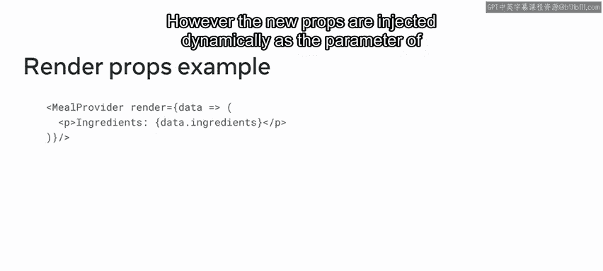
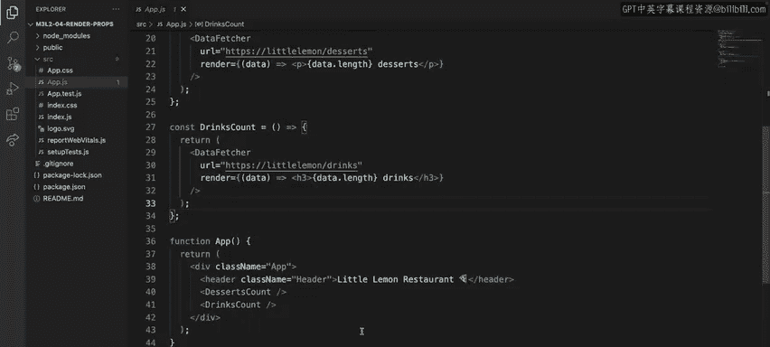
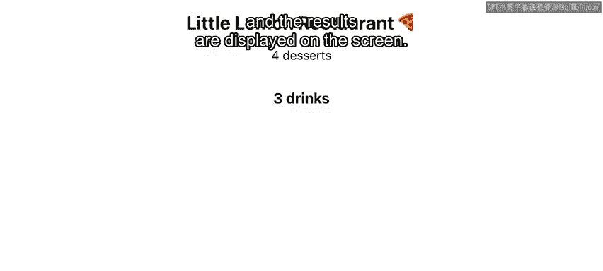

# 75：渲染属性模式 🧩

在本节课中，我们将要学习一种名为“渲染属性”的代码复用模式。这是一种与高阶组件功能类似，但实现方式不同的技术，它通过一个特殊的属性来动态地向组件注入功能。

到目前为止，你已经学习了一种名为高阶组件的技术，它用于封装通用功能。但这并非唯一可用的技术。代码复用有多种工具可供选择，选择哪种取决于具体的场景。

## 渲染属性模式简介

渲染属性模式之所以得名，是因为它几乎可以顾名思义。其核心是使用一个名为 `render` 的属性，并且这个属性的值必须是一个函数。

更准确地说，一个使用渲染属性的组件会接收一个返回 React 元素的函数，并在其自身的渲染逻辑中调用这个函数。例如，一个数据提供者组件就可以使用这种模式。

如果你还记得，高阶组件通过向被包装的组件提供新的属性来增强它。而渲染属性模式则是将新的属性动态地作为参数注入到函数中。你可能已经发现了二者的一些相似之处。它们的最终目标是一致的：在不修改原始组件实现的前提下增强组件。它们之间的区别在于注入这些新属性或增强功能的方式。

## 应用场景示例

为了更好地说明这一点，让我们通过一个应用示例来探索一个使用渲染属性的组件的实现。

在这个例子中，假设小柠檬餐厅希望统计菜单上所有甜点和饮品的数量。这些信息需要从他们控制的服务器上获取，并在应用中通过一段文本显示出来。数据获取逻辑是“横切关注点”的一个典型例子。多个组件可能都依赖于外部数据，但你肯定不想在每个需要数据的组件中重复实现相同的获取逻辑。

这正是使用渲染属性模式来抽象此功能的绝佳场景。

## 实现步骤解析



为了展示其工作原理，我创建了一个名为 `DataFetcher` 的组件，其唯一目的是根据 URL 获取数据。URL 是它的一个属性，但第二个属性 `render` 更值得你关注。

以下是该组件的核心代码结构：

```jsx
function DataFetcher({ url, render }) {
  const [data, setData] = useState(null);

  useEffect(() => {
    // 模拟数据获取逻辑
    const fetchData = async () => {
      // 根据 url 返回模拟数据
      const mockData = url.includes('desserts') ? ['Cake', 'Pie'] : ['Coffee', 'Juice'];
      setData(mockData);
    };
    fetchData();
  }, [url]);

  // 关键：调用 render 函数，并将数据作为参数传递
  return render(data);
}
```

在这个例子中，我没有获取真实数据，而是创建了一个模拟的 `if` 语句，根据 URL 路径返回可用的甜点或饮品列表。通常，这种获取逻辑是副作用，应放在 `useEffect` 中。

最后，让我们看看 `return` 语句。这是不同寻常的部分。该组件返回调用 `render` 函数的结果，自身没有其他渲染逻辑。这使其非常灵活。`DataFetcher` 只有一个目的：获取数据。而接收数据的方式，是通过 `render` 函数的参数，该参数是用于存储甜点或饮品列表的本地状态。然后，由开发者决定他们希望如何在屏幕上呈现这些数据。

## 使用渲染属性

接下来，让我们看看我定义的两个展示组件，它们分别用于显示菜单中可用的甜点和饮品数量。

以下是使用 `DataFetcher` 的组件示例：

```jsx
function DessertsCount() {
  return (
    <DataFetcher
      url="/api/desserts"
      render={(data) => <p>我们有 {data ? data.length : 0} 种甜点。</p>}
    />
  );
}

function DrinksCount() {
  return (
    <DataFetcher
      url="/api/drinks"
      render={(data) => <h3>饮品数量：{data ? data.length : 0}</h3>}
    />
  );
}
```

`DessertsCount` 组件使用特定的端点获取甜点数据，并使用一个段落元素作为 `render` 属性的返回值，将甜点数量显示为单一文本。`DrinksCount` 组件同理，区别在于它使用了另一个 URL，并显示一个反映饮品数量的标题元素。

最后，`App` 组件渲染它们两者，结果将显示在屏幕上。



## 总结



本节课中我们一起学习了另一种可以和高阶组件搭配使用的技术，即渲染属性模式。现在，希望小柠檬餐厅能够实时统计饮品数量，以便用你最喜欢的饮料填满他们的冰箱。😊

总而言之，渲染属性模式通过一个函数属性，将数据或逻辑动态地传递给子组件进行渲染，提供了一种灵活且强大的组件复用和组合方式。