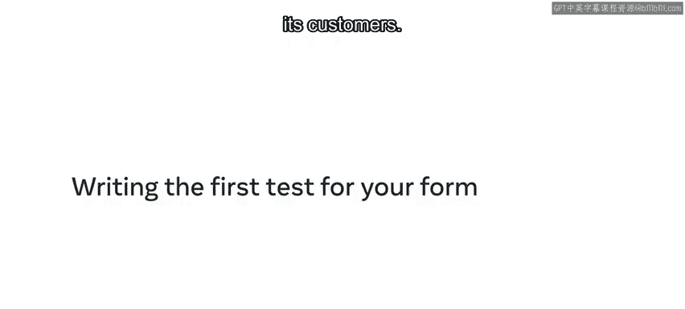
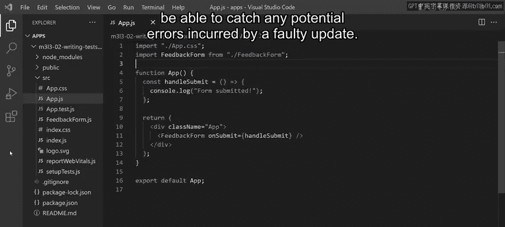
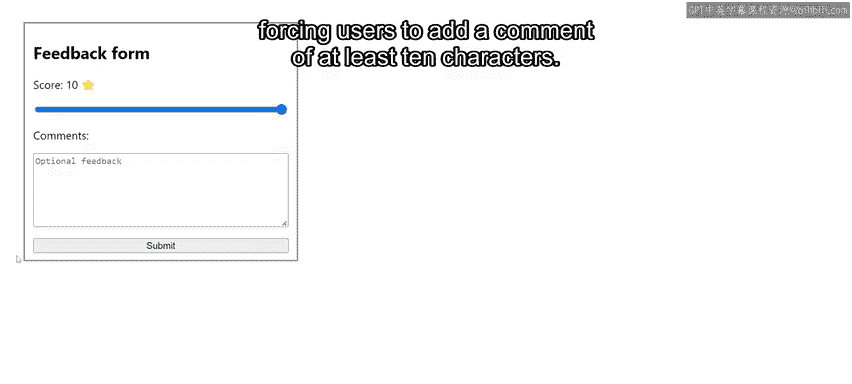
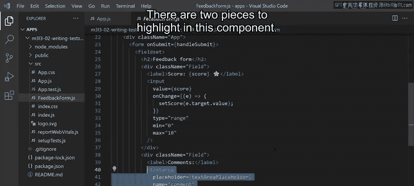
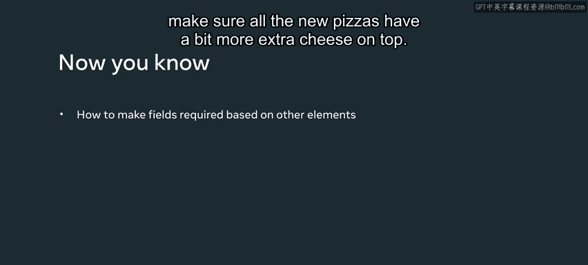

# 77：为表单编写第一个测试 🧪

## 概述
在本节课中，我们将学习如何为React表单组件编写自动化测试。我们将通过一个具体的案例——为“小柠檬餐厅”的反馈表单编写测试，来确保当用户评分低于5分时，必须提供至少10个字符的额外评论才能提交表单。我们将使用Jest和React Testing Library来实现这一目标。

---

## 背景与需求
小柠檬餐厅开始收到一些顾客的差评。问题在于，他们无法准确找出问题所在并采取相应措施，因为用户只提供了较低的数字评分，跳过了提供额外反馈的环节，导致信息无法传递给厨师。



为了解决这个问题，他们决定在用户提供的评分低于5分（评分范围为0到10）时，将评论文本框设为必填项。




此外，他们希望用自动化测试来保护这项新逻辑。这样，每当进行任何更改时，测试套件都会运行，并能捕获由错误更新引起的任何潜在问题。




## 应用程序结构
该应用程序包含一个反馈表单，表单中有一个用于输入0到10分数字评分的范围输入框，以及一个用于填写额外评论的文本框。

为了满足小柠檬餐厅的要求，当评分低于5分时，提交按钮将被禁用，从而强制用户添加至少10个字符的评论。现在，让我们来查看代码。


入口点是`App.js`组件，其中渲染了一个`FeedbackForm`组件。该组件接收一个名为`onSubmit`的prop，这是一个包含表单值作为参数的函数，以便父级`App`组件可以执行提交操作。

`FeedbackForm`代表一个HTML表单，并通过本地状态包含两个受控组件：一个范围输入框和一个文本区域。



该组件中有两个关键部分需要强调。第一部分是按钮的禁用逻辑。变量`isDisabled`控制该状态，当评分低于5分且评论少于10个字符时，它被设置为`true`。


另一个重要部分是`handleSubmit`函数，它被挂载到表单的`onSubmit`属性上。当点击提交按钮时，将调用`handleSubmit`函数。该函数本身会调用父组件提供的prop函数，并传入相应的表单值。

## 编写测试
很明显，`FeedbackForm`组件包含了所有相关的业务逻辑。因此，让我们开始为提交逻辑编写测试。

测试的惯例是将其创建在具有`.test`扩展名的文件中。这样，当你在终端运行测试命令时，测试运行器Jest就能自动识别它们。

我已经编写了一个测试场景，现在将带你逐步了解每一行代码，以便你理解测试是如何构建的。该测试场景旨在检查：如果评分低于5分，并且没有额外反馈或反馈过短，用户是否被阻止立即提交表单。

以下是测试步骤的分解：

首先，我使用Jest创建一个新的模拟函数。回想一下，模拟函数是一种特殊的函数，允许你跟踪外部代码如何调用特定函数。当`FeedbackForm`调用你作为`onSubmit` prop提供的函数时，你将能够检查调用时传递的参数。

```javascript
const handleSubmit = jest.fn();
```

然后，我渲染`FeedbackForm`组件，并将模拟函数作为`onSubmit` prop传递。

```javascript
render(<FeedbackForm onSubmit={handleSubmit} />);
```

接下来的步骤是定位范围输入框并为其填充一个值。请注意，为了找到输入框，我使用了`screen.getByLabelText`并传递一个正则表达式进行匹配。

`screen`是React Testing Library提供的一个实用对象，代表整个页面。这基本上等同于要求根文档查找文本包含“score”一词的`label`标签，然后返回与该标签关联的`input`元素。

```javascript
const rangeInput = screen.getByLabelText(/score/i);
```

为了给输入框填充值，你必须使用React Testing Library的`fireEvent`工具并调用`change`函数。虽然React受控组件通过`onChange` prop更新其状态，但React Testing Library遵循一个略有不同的约定：去掉“on”部分，并将更新方法改为小写。

```javascript
fireEvent.change(rangeInput, { target: { value: '4' } });
```

为了模拟表单提交，我必须定位按钮元素。请注意我使用了不同的查询方法：`getByRole`，它查找具有特定`role`属性的元素。由于HTML按钮内部已经将`role`属性设置为“button”，所以这种方法效果很好。

```javascript
const submitButton = screen.getByRole('button');
```

要执行按钮点击，我必须使用`fireEvent.click`。它遵循与之前相同的约定：去掉prop名称中的“on”部分，并将所有内容改为小写。

```javascript
fireEvent.click(submitButton);
```

最后两个语句是测试的断言。

第一个断言展示了一个`expect`匹配的例子，它通过在调用最终匹配器之前加上`.not`来检查相反的情况。它断言处理表单提交的函数没有被调用，这正是当省略额外评论时期望的结果。

```javascript
expect(handleSubmit).not.toHaveBeenCalled();
```

此外，我添加了第二个断言，通过使用`toHaveAttribute`匹配器来确保提交按钮确实被禁用了。

```javascript
expect(submitButton).toHaveAttribute('disabled');
```

## 总结
在本节课中，我们一起学习了如何使用React Testing Library编写强大的代码来保护你的业务逻辑。通过为“小柠檬餐厅”的反馈表单编写测试，我们确保了在评分较低时，用户必须提供有意义的反馈才能提交。更重要的是，这使得小柠檬餐厅的厨师最终能够收到必要的反馈，并确保所有新披萨都能多加点奶酪！



