# 83：0_用户体验和用户界面设计原则简介 🎨

## 概述

在本节课中，我们将要学习用户体验和用户界面设计的基础知识。课程将围绕一个餐厅网站的设计问题展开，引导你了解UX/UI的核心概念、工具和工作流程。

---

## 课程简介

欢迎来到这门关于用户体验和用户界面设计原则的课程。用户体验和用户界面，简称UX和UI，其核心是关于人的。每个人都希望体验最新的技术，但他们不希望为此花费过多时间，或给本已繁忙的思绪增加负担。因此，若想使一个网站成功，正确把握这两者至关重要。

本课程将为你介绍UX和UI。关于这些学科还有更多内容需要学习，但本课程将为你提供一个样本，帮助你理解其中涉及的内容。

课程围绕Adrian和Mario的“小乐餐厅”网站所面临的问题展开。该网站在设计时，没有将UX和UI原则应用于在线订餐和餐厅订座这两个核心功能。

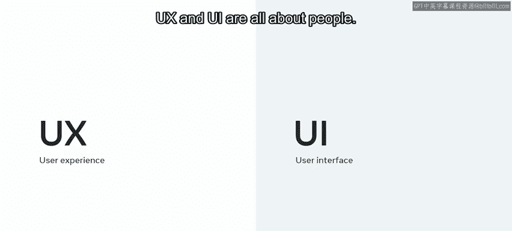

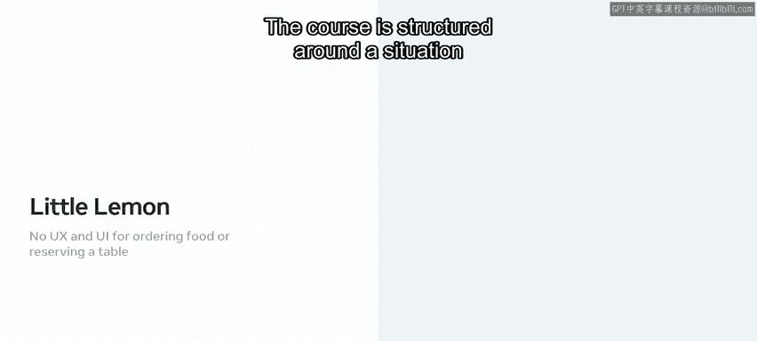

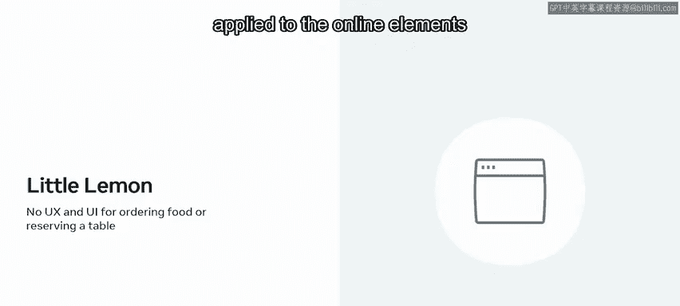

---

## 课程结构与目标

在整个课程中，你将跟随指导，运用UX和UI的方法论来解决其中一个问题：通过移动设备在网站上在线订餐。另一个问题——预订餐桌，将成为你最终课程作业的主题。

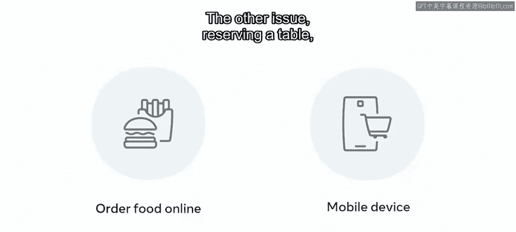

以上只是对课程内容的简要概述，但它确实能说明UX/UI专业人员会遇到的一些任务。

在课程中，你将接触到这些任务，以及构成UX/UI专业人员职责的许多其他任务。具体来说，你将学习：

*   区分UX和UI。
*   使用Figma——当今最流行的设计工具之一。
*   评估交互设计。
*   创建现代用户界面。

---

## 你将学习的设计流程

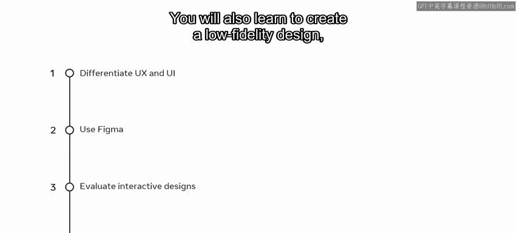

上一节我们介绍了课程目标，本节中我们来看看你将经历的具体设计流程。你将学习创建一个低保真设计，这是一个简单且低技术含量的概念原型。

你只需要纸和笔。然后，你将学习如何将其转化为高保真设计，这种设计功能完善、交互性强，并且非常接近最终产品。最后，你将学习创建原型。

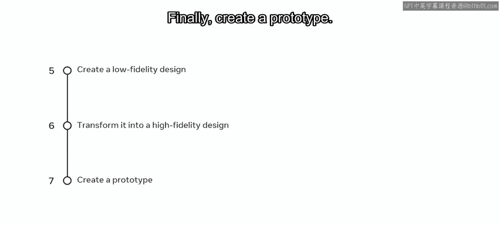

如果你不熟悉这些术语，请不要担心。你将在本课程的学习旅程中逐步掌握它们。换句话说，在课程项目中，你将创建一个原型或最终提案设计的模型，该模型可用于测试和验证提出的想法与设计假设。

---

## 学习建议与支持

但你可以放松，现在并不要求你立即成为UX或UI专家。你的课程中包含许多视频，将逐步引导你实现该目标。观看、暂停、回放并重新观看视频，直到你对自己的技能充满信心。

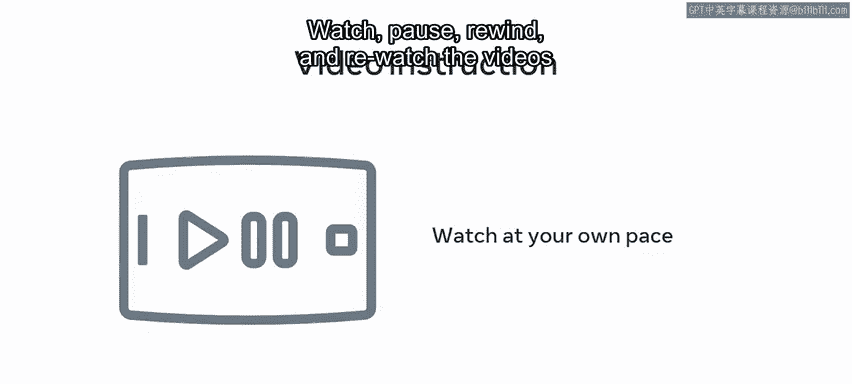

然后，通过查阅课程阅读材料来巩固你的知识，并在课程练习中将你的技能付诸实践。

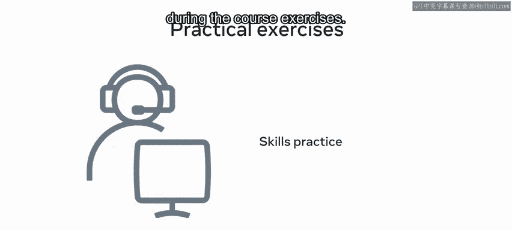

在学习过程中，你会遇到几个知识测验，你可以在那里自我检查学习进度。就像你一样，有许多人正在考虑成为UX/UI专业人员，课程讨论提示将使你能够与你的同学——那些和你一起学习材料的人——建立联系。这是一个分享知识、讨论难点和结交新朋友的好方法。

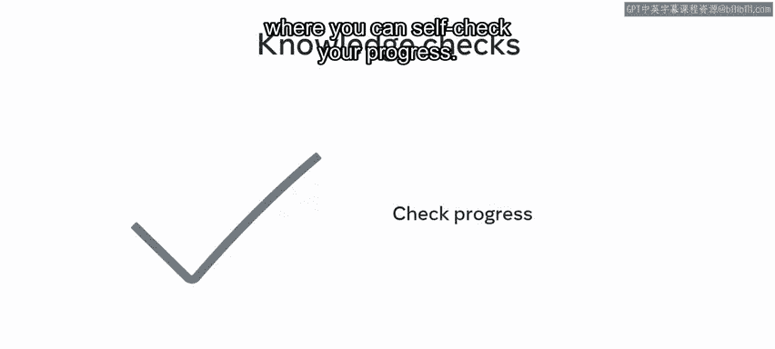

---

## 成功学习的关键

若想在本课程中取得成功，采用规律且自律的学习方法会很有帮助。你需要认真对待学习，如果可能的话，制定一个学习计划，标明你可以投入课程学习的日期和时间。这是一门在线的自定进度课程，但将你的学习想象成在培训机构定期上课，会对你有所帮助。

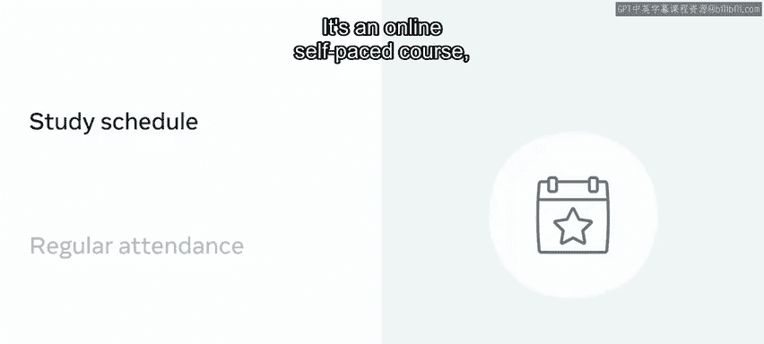

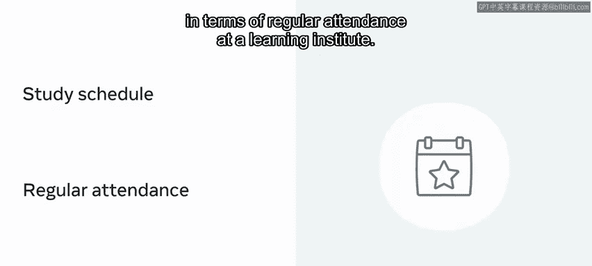

---

## 总结

本节课中我们一起学习了用户体验和用户界面设计的完整入门知识。总而言之，本课程为你提供了关于UX和UI的完整介绍。祝你在学习旅程中一切顺利。