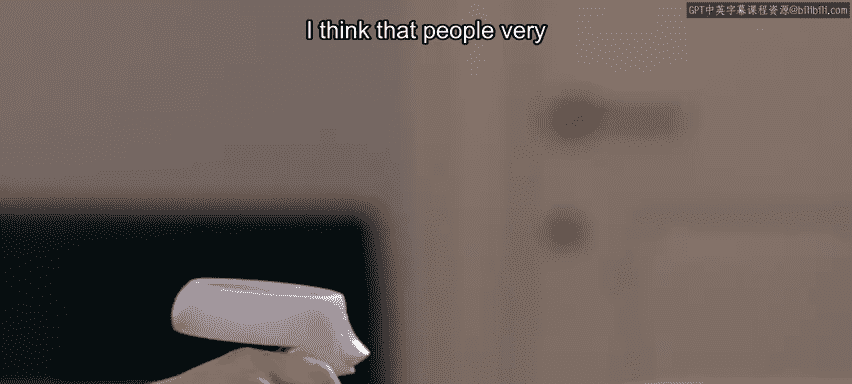
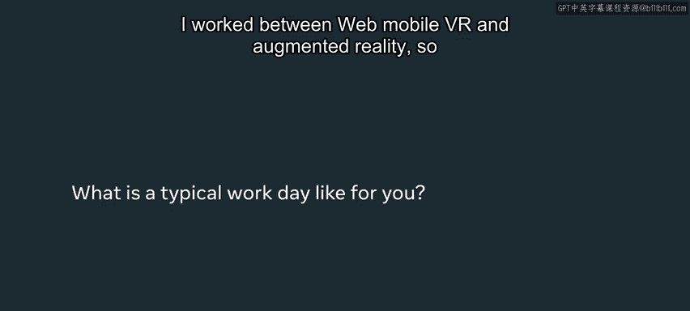
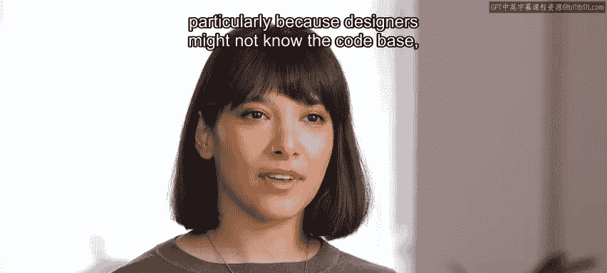
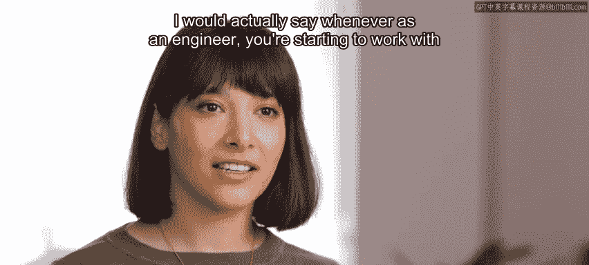
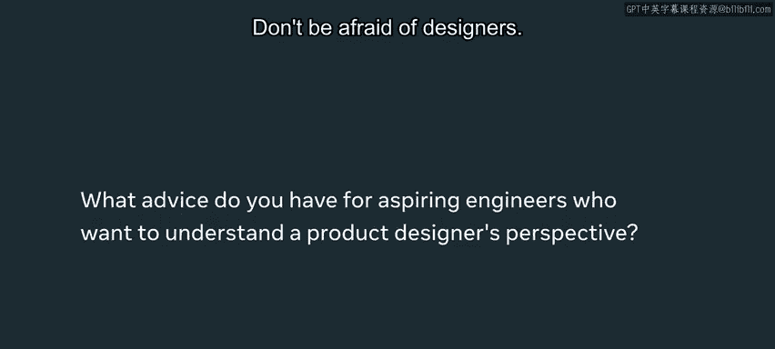

# 84：Meta产品设计师的一天 🎨

在本节课中，我们将跟随Meta的产品设计师Petra，了解她一天的工作内容、职责以及她如何与工程师等跨职能团队合作。这有助于我们理解产品设计师在大型科技公司中的角色，以及如何与设计师进行有效协作。

---

Meta每天有35亿用户使用我们的产品。他们以各种不同的方式使用产品。产品设计师的职责，就是提醒跨职能团队我们构建这些产品的初衷。

我是Petra，是Meta Reality Labs的一名产品设计师，住在伦敦。人们常常认为产品设计师把所有时间都花在设计上。实际上并非如此。产品设计师大部分时间都在与人沟通。大部分时间都在处理文档，并全面地思考产品。

我每天都会对用户与产品互动的方式感到惊讶。意识到自己的假设是错误的，这非常有价值。看到这一点让人谦逊。显然，当你为如此多的人构建全球性产品时，你必须提醒自己，并非每个人都会以你设想的方式使用产品。

我们不断地与产品的目标用户交谈。说实话，这可能是我工作中最好的部分之一。这些对话提醒你，你不是你的用户。我几乎每天都会对人们如何与我们正在构建的产品互动感到惊讶。

在我的成长过程中，我很早就接触了软件。原因很普通。我想在12岁时，把自己P到奥兰多·布鲁姆旁边。这是我第一次接触Photoshop。从那以后，我开始探索其他类型的软件，并自学了编程。

从插画专业毕业后，我已经开始尝试像Connect这样的新技术，以及Arduino、树莓派等有趣的科技产品，构建互动体验。这很自然地引导我进入了当时的数字设计师角色。我的第一份工作是作为数字平面设计师为某个平台做设计。

从那以后，我转向前端工程。我得承认我不是最好的工程师。我更感兴趣的是用户旅程、产品如何运作以及产品解决了什么问题。因此，从前端开发转向产品设计师，并更多地发挥我的视觉技能，是一个非常自然的转变。

我的工作涉及网页、移动端、VR和增强现实。具体取决于手头的项目。通常，我的一天从查看邮件和了解我睡觉期间发生的事情开始。Meta是一家全球性公司，夜间可能发生很多事情。

大约一小时后，我会与我的首席工程师和产品经理沟通，然后一天的工作正式开始。我们在非常跨职能的团队中工作。这意味着你可能会与内容设计师开会，他们负责我们的书面内容；或者，如果你有即将上线的新功能，可能会与营销人员合作；当然，最常合作的还是工程师。

我认为工程师和设计师之间有时确实存在脱节。特别是因为设计师可能不了解代码库，可能不理解工程上的限制。反过来，工程师也可能不太了解设计流程。重要的是，从一开始就在这两个职能之间建立非常牢固的伙伴关系。

实际上我想说，作为一名工程师，当你开始与设计师合作时，不要立即投入工作。暂停一下，花些时间了解这个人，讨论双方都感到舒适的工作流程。之后，再深入探讨工作中更技术性的方面，比如需求、依赖关系，或者讨论你们将要共同构建的实际功能。

不要害怕设计师。我见过不少次，前端工程师倾向于不反驳他们的设计师。但请自由地进行对话。如果你发现设计师的设计不符合要求、不易执行，或者有成本更低的执行方式，去找你的设计师，和他们谈谈，进行一次对话。设计师是来帮助你的。我们是这项事业的合作伙伴，我们最终朝着同一个目标前进。因此，协作对我们来说绝对至关重要。

祝你在成为工程师的旅程中好运。有时可能会感到畏惧，但请坚持下去。当你看到自己如何影响产品用户的生活时，这一切都是值得的。

---

本节课中，我们一起学习了Meta产品设计师Petra的日常工作。我们了解到产品设计师的核心工作远不止视觉设计，更包括大量沟通、用户研究和跨团队协作。她强调了工程师与设计师建立牢固伙伴关系的重要性，并鼓励工程师主动与设计师沟通，共同寻找最佳解决方案。理解这些，将帮助我们在未来的工作中更好地进行团队合作。