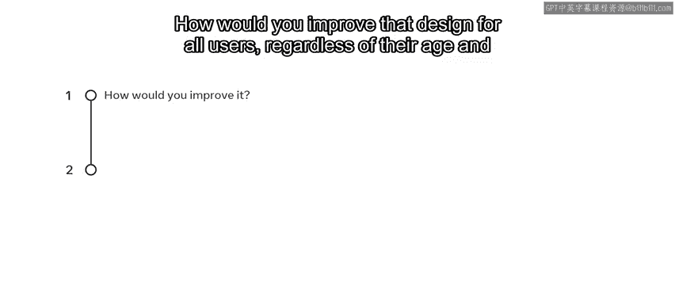
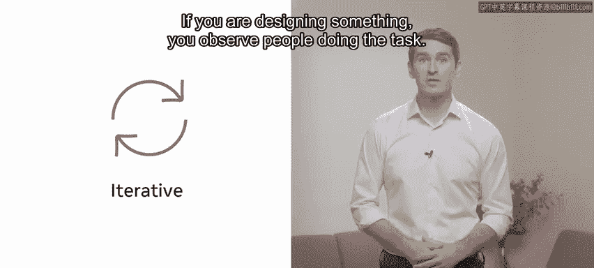
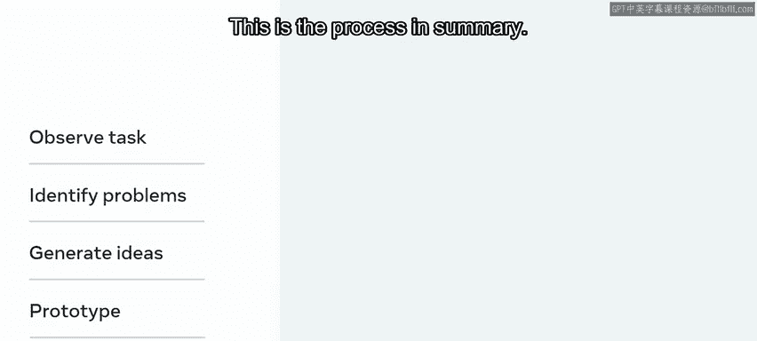
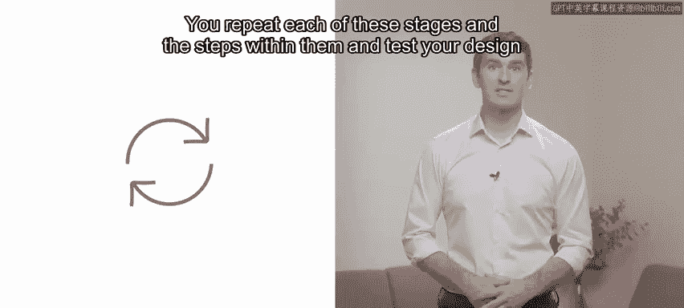

# 88：什么是用户体验 🧠

在本节课中，我们将要学习用户体验（UX）的基本概念、核心流程及其重要性。通过学习，你将能够定义什么是UX，并认识到它是一个包含多个阶段的系统性过程。

---

Adrian 了解到，他的顾客对于无法轻松通过网站预订餐桌或下单外卖感到沮丧。他知道，解决这些问题有助于获得更多业务。你将运用 UX/UI 原则来帮助 Adrian 实现他的商业目标。你将开始探索 UX，并学习遵循 UX 过程如何能让你从用户的角度解决这些问题，从而增加销售额并留住回头客。

## 什么是用户体验？🤔

UX 即用户体验。它涵盖了用户与公司服务及产品进行的所有互动。例如，使用遥控器、手机、应用程序或网站的感觉如何？在与一个产品互动之前、之中和之后，你的感受是怎样的？用户能否轻松地通过产品实现他们的目标？界面是否提供了流畅、愉快的体验？用户是否感觉一切尽在掌握？为什么顾客会持续回头消费？让我们进一步探讨。

著名设计领域研究者 Don Norman 创造了“用户体验”这个术语。他关注的是顾客使用产品时的整体体验：用户如何在商店里找到产品？如何将其带回家？打开包装的体验如何？组装说明是否易懂？使用起来感觉怎样？它是否直观且令人愉悦？UX 关乎所有这一切。

你是否曾用过某个电器却不知道它是开是关？或者用过某个应用程序，却很难找到你想要的功能？😊 这些问题都可以通过 UX 来解决。

## 优秀用户体验的核心要素 🔑

一个产品的功能需要**易于发现**，这样用户才知道自己在寻找什么。成功的产品设计还需要能够**与你对话**，它需要对你的操作给予反馈。你不希望用户因为点击按钮后毫无反应而感到困惑。

成功 UX 的关键在于**为用户考虑和设计**，而不是为你认为用户想要的东西设计。请花一分钟思考一下，哪些产品或设计非常直观，而哪些用起来完全不合逻辑。你会如何改进那个设计，使其适合所有用户，无论其年龄和能力如何？你会做出哪些改变？

## 用户体验是一个过程 🔄

要理解 UX 的真正含义，重要的是认识到它已被提炼为一个过程，你将在后续课程中更详细地探索。但让我们先快速概览一下，以便了解这个过程涉及哪些环节。

这个过程是**迭代的**，你可能需要多次回到之前的步骤，调整你的设计以适应顾客和商业目标。

**以下是UX设计过程的核心阶段：**

1.  **观察与发现问题**：如果你在设计某个东西，你需要观察人们执行任务，并从中识别他们在完成任务时可能遇到的问题。
2.  **构思与创意**：基于观察，你可能会产生一些需要着手实施的想法。
3.  **原型制作与测试**：接着，为你设想的解决方案制作原型并进行测试。

**这个过程可以总结为：观察 -> 构思 -> 原型 -> 测试。**

你需要在每个阶段及其内部步骤中不断重复，并一遍又一遍地测试你的设计，直到得到一个对所有人都**可用且令人愉悦**的产品。😊

遵循这些步骤，并考虑当前网页和产品设计中的最佳实践方法与行为，将帮助你重新设计 Little Lemon 网站的点单表单。

---

本节课中，我们一起学习了 UX 是什么、它包含哪些阶段，以及如何通过从一开始就考虑你的用户，将这些阶段成功应用于产品或服务的重新设计。