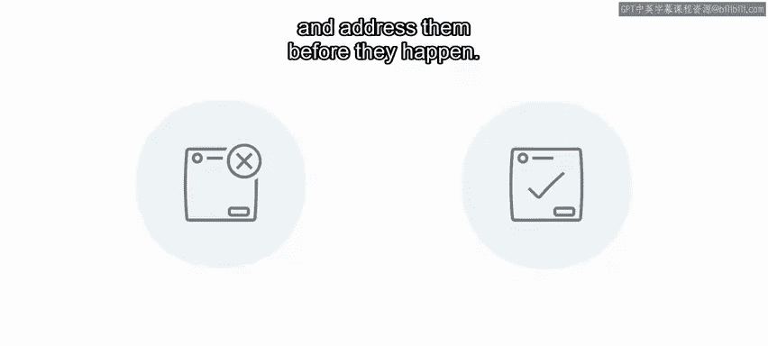
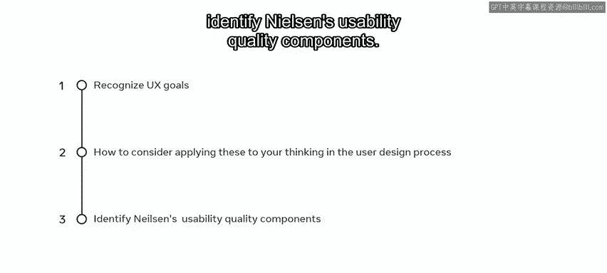

# 89：用户体验目标与质量组件 🎯

在本节课中，我们将学习如何识别用户体验目标，如何在用户设计过程中应用这些目标，并了解尼尔森提出的可用性质量组件。这些知识将帮助你设计出更智能、更愉悦的用户体验。

与Adrian交谈后，你意识到顾客无法通过Little Lemon网站轻松下单或预订餐桌，这不仅是设计问题，更是一个可用性问题。作为一名有抱负的UX/UI设计师，你需要运用方法来构建你的设计思维，从而为用户提供最佳体验。在这个过程中，你将更好地理解客户及其痛点。你需要思考如何将客户目标与Adrian的商业目标结合起来。

---

### **理解可用性：用户体验的核心**

上一节我们提到了可用性问题，本节中我们来看看可用性这一UX和UI设计中的核心概念。

**可用性**衡量的是一个产品有多直观或多容易使用。该领域的知名专家雅各布·尼尔森提出，可以通过五个可用性组件来评估可用性。

以下是这五个组件：

*   **易学性**：当顾客第一次尝试下单外卖时，Adrian希望这个过程从一开始就易于学习。
*   **效率**：如果用户想修改订单，操作是否简单？他们能否快速高效地完成？
*   **可记忆性**：如果用户中途被打断，当他们返回时，是否容易记起刚才进行到哪一步？他们能多快找到之前的位置？
*   **容错性**：良好的可用性需要考虑错误。无论用户何时犯错，设计都应提供解决方案，并在错误发生前就加以防范。
*   **满意度**：网站使用起来是否愉悦或令人满意？用户喜欢使用它吗？它是否易于使用？

衡量用户满意度并非易事，但当你使用一个直观且设计精良的产品时，你自然能感受到。在你的设计各个阶段，思考这些可用性质量组件都很有帮助。如果你从一开始就考虑它们，就能在流程早期解决问题。

---

### **设定用户体验目标：连接用户与设计**

了解了评估标准后，现在我们需要思考使用你设计的用户，并考虑如何让你的设计对他们而言是令人满意和愉悦的。

当你使用一个产品时，可能会经历一系列情绪，从无聊到开心，从兴奋到困惑，有时甚至会放弃。尽早考虑用户的体验目标，是一种可以帮助你记住用户体验不断变化本质的方法。

你可以将体验目标组织为**期望的**和**不期望的**两个方面。

让我们思考一下你的客户及其目标：

**期望的体验目标包括：**
*   你希望你的产品使用起来**有趣且令人愉悦**。
*   你希望你的设计能让人**放松、满意且高效**。
*   你当然希望客户能**投入、有动力并受到激发**。
*   另一个重点是，你**不希望**用户需要费很大劲才能使用你的产品，它应该是**直观的**。

**不期望的体验目标包括：**
*   另一方面，你**不希望**你的网站或应用**速度慢、令人困惑或使用复杂**。
*   你**不希望**你的客户感到**无聊、沮丧或有压力**。

---

### **应用目标：从理论到实践思考**

那么，如何将这些目标应用到具体设计中呢？客户需要能轻松找到网站上正确的部分来完成他们想做的事。

你的解决方案如何能在提供帮助的同时，又不显得居高临下或自以为是？例如，在Little Lemon预订餐桌时，顾客需要知道餐桌是否可用以及可以预订多久。你的设计能否向用户提供这些信息，让他们感到被支持并被赋能？信息呈现是否清晰而不惹人厌烦？

假设一位顾客使用拐杖，希望坐在门边。你的设计能否潜在地满足这一要求？如果不能，用户需要时能否足够容易地找到这个信息？

尽管你尚未实施任何具体设计，但你现在已经在考虑用户的目标和需求，并思考如何通过你的设计方案来帮助他们满足这些需求。

---

### **总结与回顾** 📝

本节课中，我们一起学习了：
1.  **识别用户体验目标的重要性**，以及如何将其融入设计思维。
2.  **尼尔森的五个可用性质量组件**：**易学性、效率、可记忆性、容错性、满意度**。它们是评估设计好坏的关键标准。
3.  如何将体验目标分类为**期望的**和**不期望的**，从而更全面地指导设计。

这些是构建智能且令人愉悦的设计的关键方法。请记住，在你的设计流程早期就将它们考虑在内非常重要，这有助于在问题发生前就尝试避免它们。