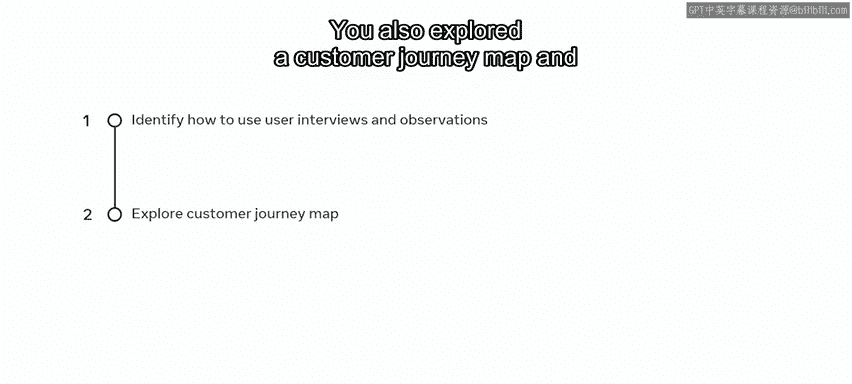

# 93：10_你的用户是谁

在本节课中，我们将学习如何利用用户访谈和观察的研究结果来指导设计。我们将探索如何识别用户，理解他们的需求，并学习一种名为“客户旅程地图”的工具来可视化用户体验过程。

## 概述

你已经准备好为Little Lemon网站进行工作，现在你获得了五位同意接受访谈并在使用网站时被观察的用户的研究结果。这种信息收集被称为用户研究，它能为你提供关于客户在线订餐和预订体验的宝贵信息。换句话说，它帮助你确定用户是谁。

## 用户研究的重要性

如果不进行用户研究就进行设计，你最终会基于对客户的假设来工作，这可能导致产品失败。对你和你的经验来说看似合乎逻辑的东西，在创建时对另一个人来说可能被证明是无法使用的。

还记得之前学过的用户体验流程阶段吗？设计师需要**共情**、**定义**、**构思**、**原型制作**和**测试**。其中，共情和测试的重要性怎么强调都不为过。在本案例中，测试参与者几乎无法成功完成订餐流程。这些数据对你构建问题和构思解决方案非常有价值。

## 用户访谈与观察发现

以下是用户访谈和观察中发现的主要问题：

首先，所有参与者都发现很难找到特定的菜品。菜单按钮不易识别，而且一旦发现，下拉菜单没有按食物类别（如前菜、主菜）进行分类。

其次，发现购物篮图标不可见。没有购物篮图标，一位参与者无法确认是否成功添加了物品。这个简单的疏忽迫使用户试图重新开始，却发现没有返回按钮或导航回主页的方法，因此他们放弃了任务。

第三，另一位参与者最终成功下单。然而，他们无法编辑或更新该订单。例如，在观察参与者尝试订餐时，注意到他们想为菜品添加额外的配料，但网站上没有这个功能。

最后，在另一次观察中，参与者在注册表单中填写了所有信息。然而，由于一个错误，他们无法完成订单。他们尝试了多次，但一直收到验证错误，而这个错误只在输入信息后才显示。他们再次放弃了任务。

## 客户旅程地图

你可以通过客户旅程地图来说明参与者的体验。它展示了某人完成任务所采取的步骤。在追踪用户体验目标时，你可以识别他们在各个步骤中的情绪。

让我们探索一个说明他们体验的客户旅程地图。

请记住，你应该记录用户在执行每项任务时的互动和反应。

从客户旅程地图的顶部开始，你可以列出客户的姓名、图像、场景和期望。

接下来，你可以列出她试图完成的步骤，并追踪她的想法和感受。

例如：进入网站、选择和定制订单、添加详细信息并付款。随着流程推进，旅程地图捕捉了她的**行为**、**想法**、**言论**以及在与网站互动时的**感受**。

最终，你会得到一组有用的要点，可以帮助你与用户共情，从而改进你的重新设计。

## 总结

本节课中，我们一起学习了如何利用来自用户访谈和观察这两种研究方法的数据。你学会了如何使用这些数据来优先处理关键的设计改进机会。我们还探索了客户旅程地图，以及如何用它来可视化客户的任务流程。请务必查阅补充阅读材料，以了解更多关于用户研究、访谈和观察的知识，它们将为你重新设计Little Lemon网站做好更充分的准备。