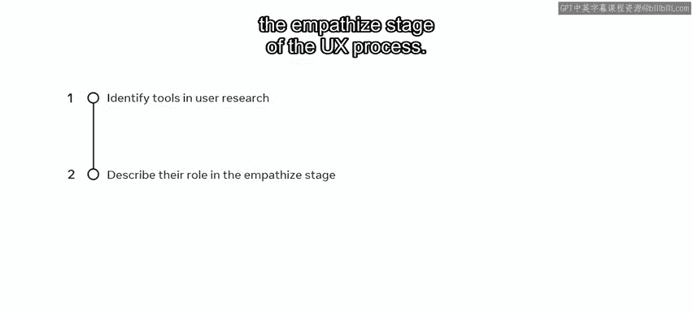
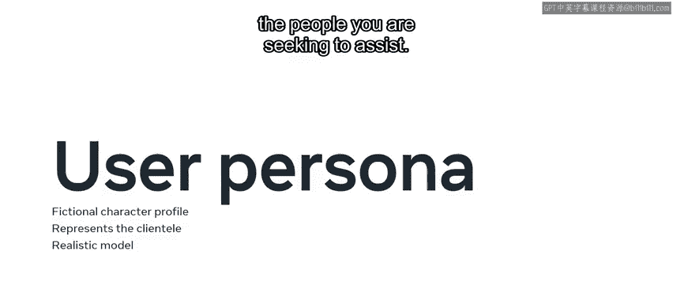
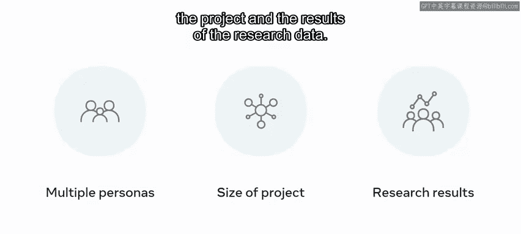
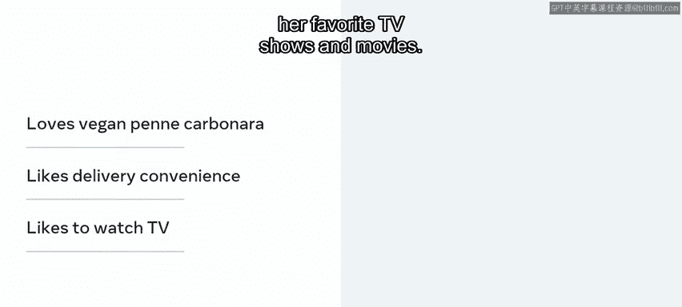
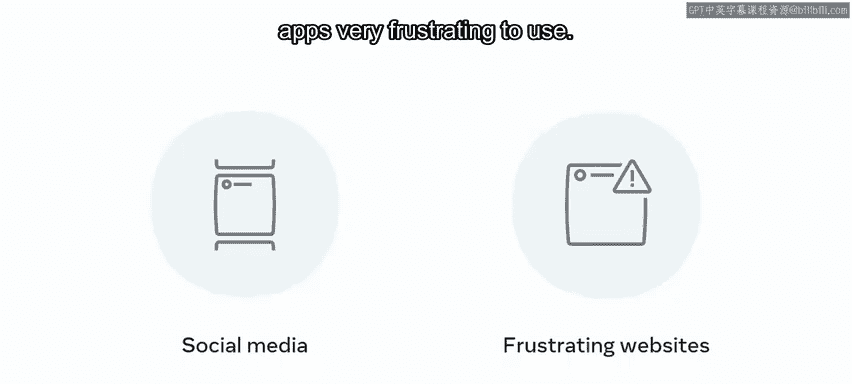
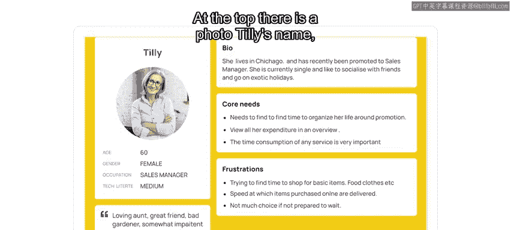
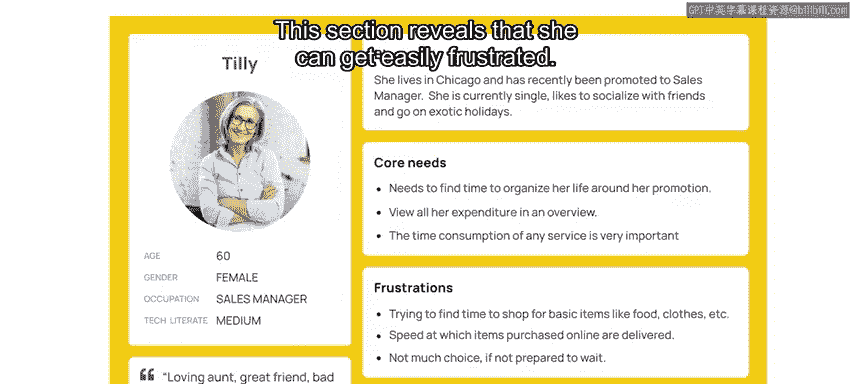
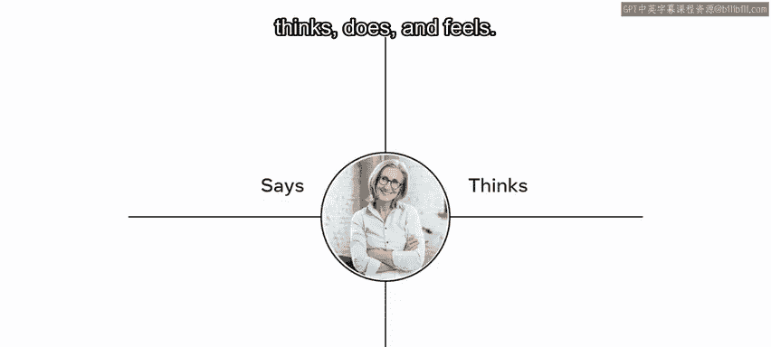
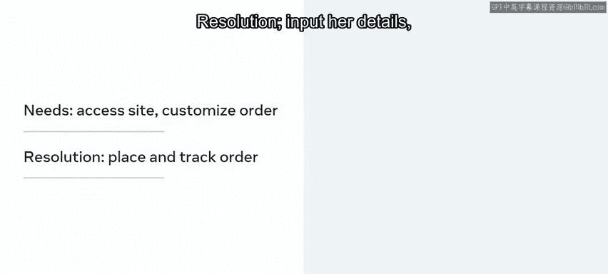
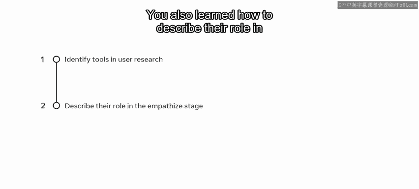

# 94：同理心工具 🧠

在本节课中，我们将要学习用户体验设计流程中的“同理心”阶段，并了解该阶段的核心工具。我们将重点探讨如何利用用户研究、访谈和观察的发现，来创建用户画像、同理心地图和用户场景，从而确保设计决策以用户为中心。

上一节我们介绍了用户研究、访谈和观察的发现。本节中，我们来看看如何将这些信息整合，并应用于用户体验设计流程的“同理心”阶段。

你可能还记得，用户体验流程主要包括五个阶段：**同理心**、**定义**、**构思**、**原型**和**测试**。通过综合所有访谈用户的信息，你将学会如何创建用户画像。这个画像将指导你在用户体验设计流程中的决策，并始于“同理心”阶段。

## 用户画像：虚构的核心用户模型

“同理心”阶段的一个关键工具是用户画像。用户画像是一个虚构的角色档案，代表公司的主要客户群体。它是你所寻求帮助人群的真实模型。它能引导设计师避免做出假设，并鼓励基于对这个虚构用户的同理心来构思解决方案。

> 虽然这个用户是虚构的，但其特征基于用户访谈和观察的结果。

可以将用户画像视为研究参与者的特质混合体。用户体验团队可以创建多个画像来解决不同问题，具体数量取决于项目规模和研究数据的结果。

以下是用户画像通常包含的几个部分：

*   **基本信息**：包括照片、姓名、年龄、性别、职业和技术能力。
*   **一句话描述**：概括角色的核心特征或身份。
*   **简短简介**：提供更多背景信息。
*   **核心需求**：列出用户的目标。
*   **痛点**：描述阻碍用户实现目标的挫折或障碍。

## 案例分析：用户画像“Tilly”

以“小柠檬餐厅”项目为例，团队创建了两个用户画像：一个是典型回头客，另一个是新顾客。让我们深入了解其中一个。

她的名字叫Tilly。她60岁，热爱美食，住在小柠檬餐厅附近。她喜欢餐厅的素食版佩内阿拉碳烤面。她享受外卖的便利，这样她就可以在家一边享用美食，一边看她最喜欢的电视节目和电影。她通过手机下单。Tilly喜欢可靠的东西，不介意为确定好用的产品多花点钱。她使用社交媒体与朋友和家人保持联系，但仍然觉得有些网站和应用程序非常难用。

查看Tilly的画像，顶部是她的照片、姓名、年龄、性别、职业和技术能力。接下来是一句描述：“慈爱的阿姨，好朋友，糟糕的园丁”。右侧是她的简短简介。然后是“核心需求”部分和“痛点”部分，列出了Tilly的目标，并描述了阻碍她实现这些目标的挫折。这一部分揭示了她很容易感到沮丧。值得注意的是，这是一种定性的画像。画像有不同的类型，你可以在补充资源中阅读更多相关内容，那里还提供了一个用Figma创建的画像模板链接。

## 同理心地图：洞察用户全貌

接下来，你将探索一个已创建的同理心地图。

Tilly位于同理心地图的中心，地图被分为四个象限，分别描述她**说**什么、**想**什么、**做**什么以及**感受**什么。同理心地图既非按时间顺序也非按序列排列，它能让你整体地窥见用户的性格。

同理心地图帮助你更好地了解Tilly，并让你设身处地为她着想。你同样可以在补充资源中找到同理心地图的模板。

## 用户场景：定义问题与目标

最后，为Tilly创建一个场景，这将帮助你解决她的问题。请记住，你目前是在与Tilly共情，而不是重新设计任何东西。

这些工具共同帮助创建了以下场景：
*   **画像**：Tilly
*   **目标**：享用她最爱的餐食
*   **期望**：订购一份素食版佩内阿拉碳烤面外卖
*   **需求**：访问网站，选择并定制订单
*   **解决方案**：输入她的详细信息，支付并跟踪订单

本节课中我们一起学习了设计师在用户体验流程的“同理心”阶段可以使用的一些工具，包括用户画像、同理心地图和用户场景。我们也学习了如何描述它们在“同理心”阶段的作用。请记住，将你的思维围绕用户而非你自己展开，不对客户做主观假设，这一点至关重要。这种方法将指导你改进“小柠檬”网站。