# 99：16_表单设计 📝

在本节课中，我们将学习优秀表单设计的重要性，并通过一个为“小柠檬”网站设计的登录表单示例，来探讨如何应用最佳实践以提升表单的可用性和用户体验。

你之前已经学习过优秀的设计原则。在实际创建自己的设计时，这些原则通常需要与最佳实践相结合。这甚至包括像表单这样非常简单的元素。如果设计时没有充分考虑用户体验，表单可能会让用户感到沮丧。为了说明优秀表单设计的重要性，我们将以“小柠檬”网站的登录表单为例进行讲解。

## 表单设计的重要性 🤔

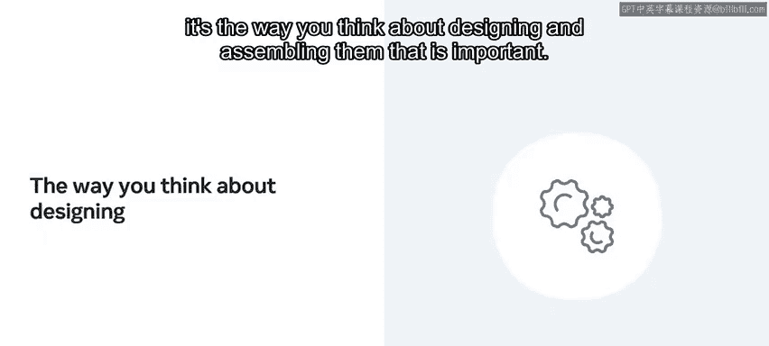

你可能会想，表单设计真的有那么重要吗？对某些人来说，这可能并不显而易见。但事实是，在可用性和用户目标的背景下分析交互式表单，能帮助你创建逻辑清晰、以用户为中心、且所有用户都熟悉的解决方案。理解开发者和设计师可用的简单元素的最佳实践建议，有助于你建立一种设计思维方式。

当然，简单表单和复杂交互组件的行为可能大不相同，但重要的在于你设计和组合它们时的思考方式。这些基本规则始终是相同的。最有效的方法是查阅最佳实践，并尽可能多地应用它们。

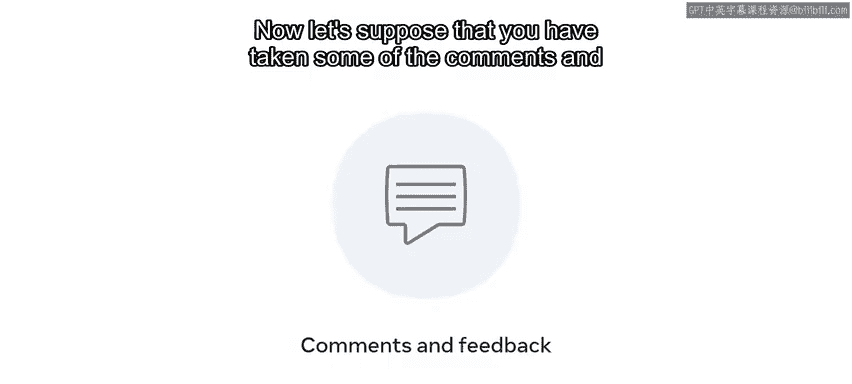

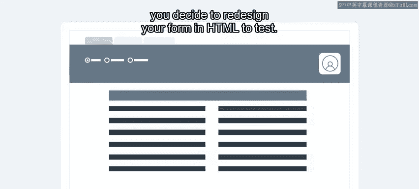

稍后，你将找到额外的资源和一份表单设计最佳实践指南，它们将帮助你更全面地理解这些实践。

## 实践：重新设计表单 🔧

现在，假设你已经采纳了之前访谈和观察中获得的一些评论与反馈。基于从用户那里收到的反馈，你决定用HTML重新设计你的表单进行测试。

你随后询问了你的同事恩佐——一位经验更丰富的UX/UI设计师——是否愿意对你用HTML创建的简单原型发表看法。他同意了并签署了同意书。你已经尝试改进了食品订购表单。现在，让我们探讨一下恩佐的一些评论，以及可能帮助你改进表单的最佳实践解决方案。

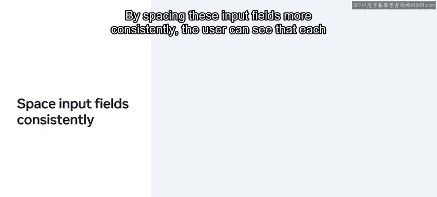

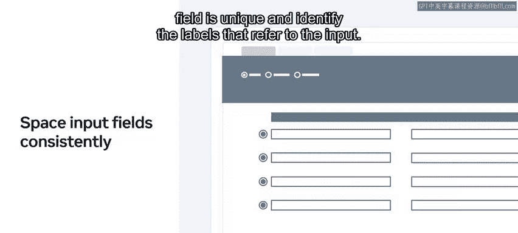

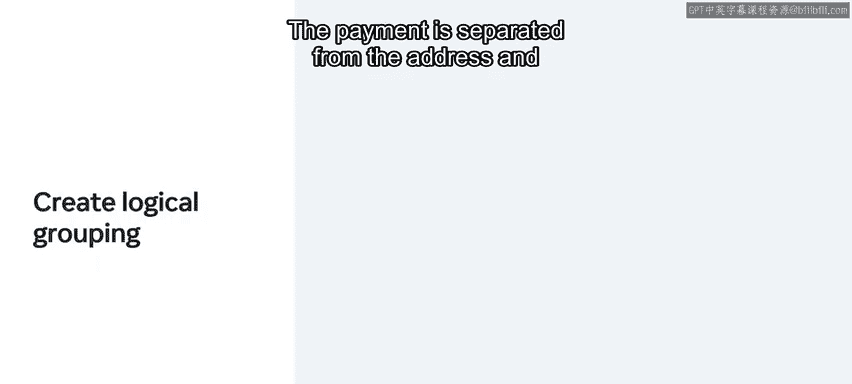

## 改进表单的具体建议 📋

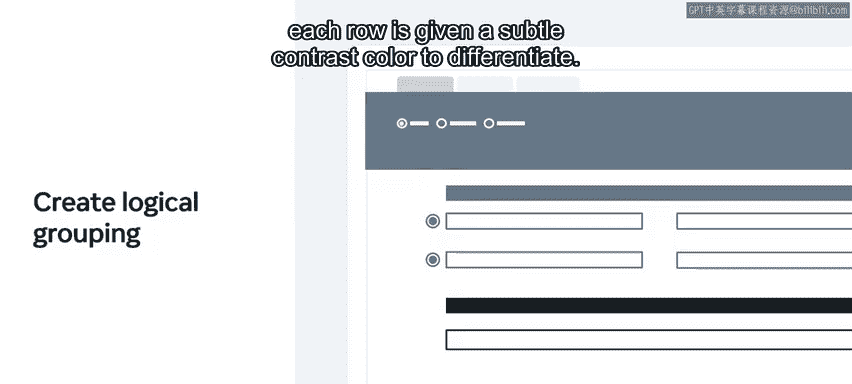

以下是恩佐提出的主要问题及相应的最佳实践解决方案：

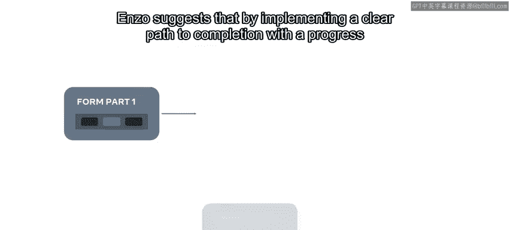

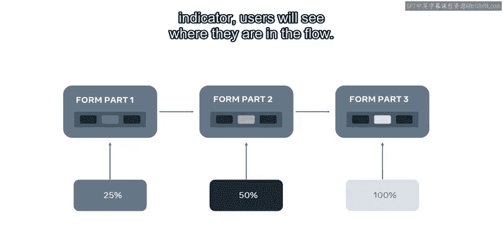

**恩佐似乎不理解你表单上某些问题的所指。** 他还提到输入框之间距离太近。他建议你增加用户输入字段（如文本字段、密码字段、复选框和单选按钮）之间的间距。通过更一致地间隔这些输入字段，用户可以清楚地看到每个字段是独立的，并能识别出对应的标签。

**你可以通过逻辑分组使表单更易于理解。** 例如，将支付信息与地址信息分开，并为每一行使用微妙的对比色进行区分。

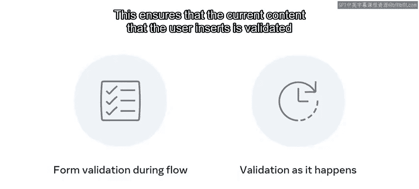

**恩佐评论说他在填写流程中感到困惑。** 他无法返回上一步，并且系统状态不可见。他表示不知道自己是否接近完成表单。恩佐建议，通过实现一个清晰的完成路径和进度指示器，用户将能看到自己在流程中的位置。这意味着他们甚至可以返回去查看已输入的内容。

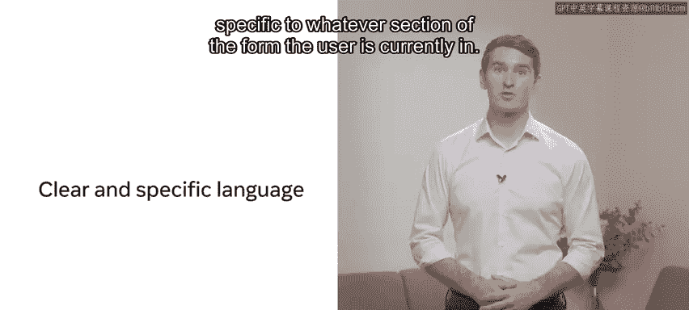

**只有在输入了所有信息后，恩佐才被告知他犯了错误。** 他表示不知道自己在表单的哪个部分犯了错，或者是什么类型的错误。恩佐建议，你的表单输入应该在填写流程中进行验证。这确保了用户当前插入的内容在输入时即得到验证。他还提醒你，所使用的语言应该清晰且具体，与用户当前所在的表单部分相关。

**作为一名UX/UI设计师，你深知安全至关重要。** 如今大多数网站都要求密码由小写字母、大写字母、符号和数字混合组成。恩佐指出，在设计你的表单时，你假设用户知道这一点，但没有为他们提供任何创建密码的指导。由于没有明确说明具体要求，用户并未意识到问题所在。他建议你提供清晰的说明和一个强度指示器，给用户关于其选择的即时反馈。

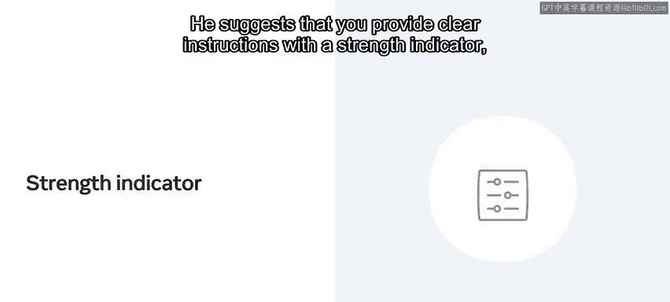

## 总结与收获 🎯

通过请恩佐对你的表单提供反馈，你获得了宝贵的见解，有助于使表单更易于访问和理解。你现在应该对表单设计以及如何利用反馈来改进“小柠檬”网站上的表单更加熟悉了。

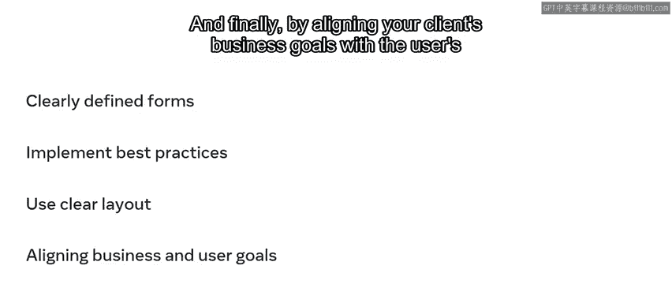

在本节课中，我们学习了设计定义清晰表单的重要性，并通过应用最佳实践来提升表单设计和可用性。具体方法包括：使用清晰的布局来区分字段和区块，以及最终将客户的业务目标与用户目标对齐，以帮助你更接近成功的产品设计。做得好！