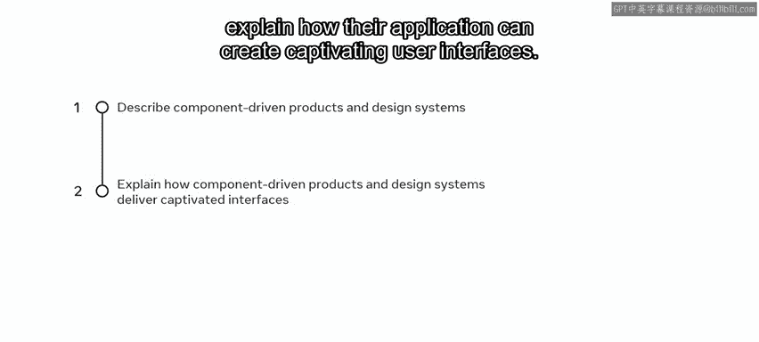
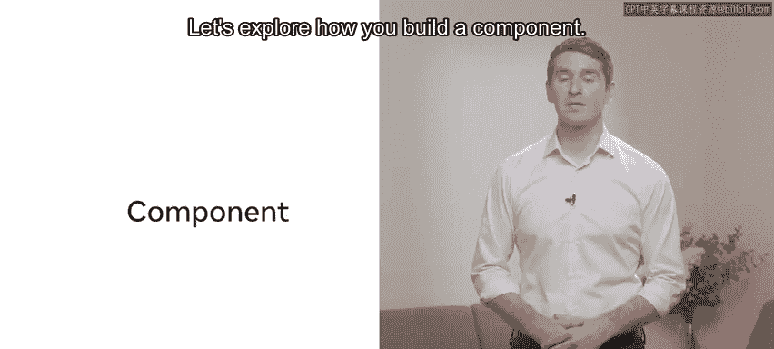
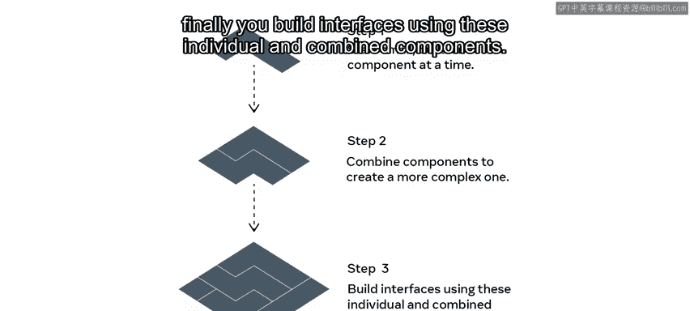
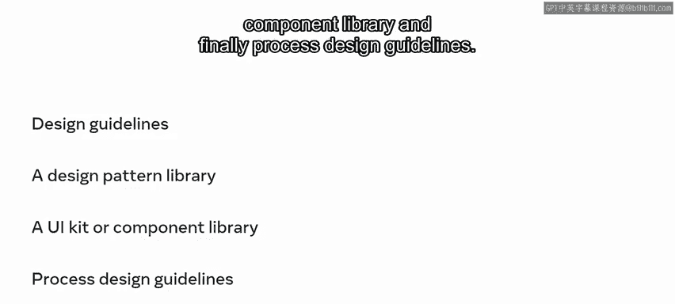
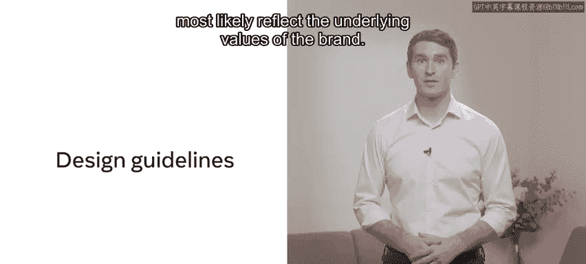
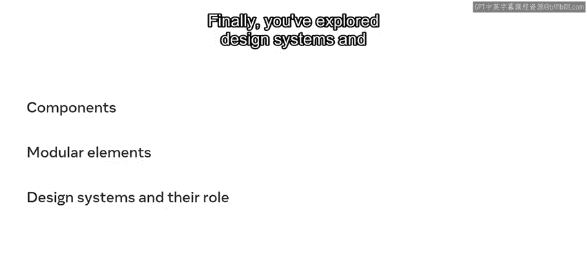

# 100：用户界面设计中的组件 🧩

在本节课中，我们将要学习用户界面设计中的核心概念——组件。你将了解什么是组件驱动设计，以及如何利用设计系统来构建一致且高效的用户界面。

---

## 什么是组件？

上一节我们介绍了课程主题，本节中我们来看看什么是组件。在UI设计中，组件是设计中任何可以被逻辑分组的、被视为独立的、并且可以复用的部分。

简单来说，组件就像**可互换的积木块**，你可以将它们组装和重新组装以构建用户界面。

---

## 如何构建组件？

理解了组件的基本概念后，我们来看看如何构建它们。构建组件遵循一个从简单到复杂的过程。

以下是构建组件的步骤：

1.  **从小处着手**：一次构建一个组件。
2.  **组合组件**：将组件组合起来，创建更复杂的组件。
3.  **构建界面**：使用这些独立的和组合的组件来构建完整的用户界面。

让我们探索一个实际例子。你的网站可能在每个页面上都有一个页眉。因此，与其为每个页面从头开始创建页眉，不如简单地构建一个页眉组件并重复使用它。

这个页眉组件可能包含其他组件，例如：
*   一个按钮组件
*   一个搜索栏组件
*   一个导航栏组件

这些组件本身是独立的元素。它们被用在页眉中，但同样可以在网站的其他地方被复用。

以这种方式组装用户界面的优势在于，设计和开发工作可以快速复制。你可以为不同的操作创建替代组件。这也会使用户受益。如果组装得当，这些一致的组件将具有美观、易于学习和记忆的特点。

---

## 什么是设计系统？

现在，让我们探索什么是设计系统。设计系统是一套可复用的、预先制作好的设计组件和模式，可用于大规模设计产品。类似于品牌风格指南，它们包含设计组件的规则和最佳实践行为。

大型公司可以拥有非常详细的设计系统。虽然没有固定的项目清单必须包含在设计系统中，但最成功的设计系统通常具有以下特征。

以下是设计系统的核心组成部分：

*   **设计指南**
*   **设计模式库**
*   **UI工具包或组件库**
*   **流程设计指南**

让我们更详细地探讨这些是什么。

---

### 设计指南

首先，也是最重要的，是设计指南。这些指南因企业而异，很可能反映了品牌的基本价值观。

### 设计模式库

设计模式库是已接受和广泛使用的设计模式的集合，或一个中央存储库。根据交互设计基金会的定义，模式是多个相互协作的设计元素的重复出现。请注意，这些元素可以是形状、线条和颜色。

### UI工具包

UI工具包，也称为组件库或UI组件集合，由按钮、小部件等组成。借助这些资源，团队可以快速生成对用户友好的UI设计。

### 流程设计指南

最后，流程设计指南是已接受和广泛使用的模式的集合，例如设计模式库。这有助于设计师在执行任务时解读设计原则。

---

## 总结

本节课中，我们一起学习了用于设计用户界面的组件和库。你也了解了组合起来构成用户界面的模块化元素。最后，我们探索了设计系统，并思考了它们在产品设计中的作用。

出色的工作。