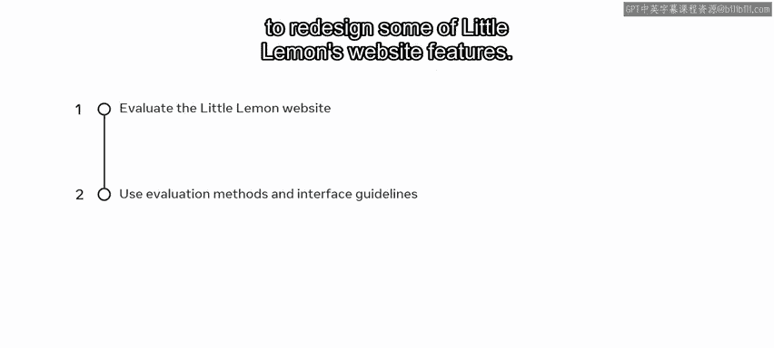
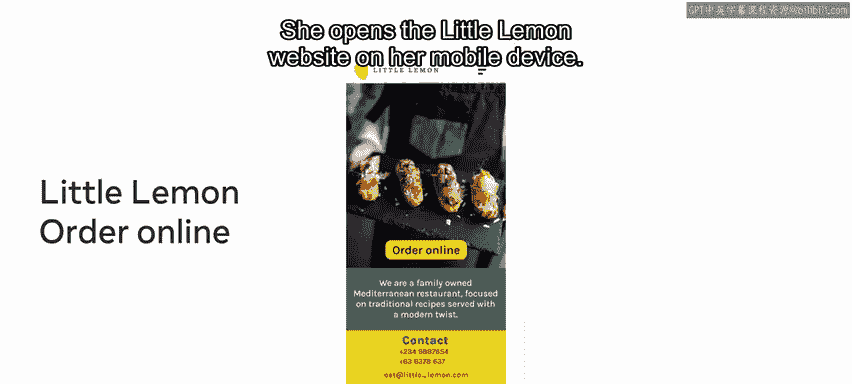
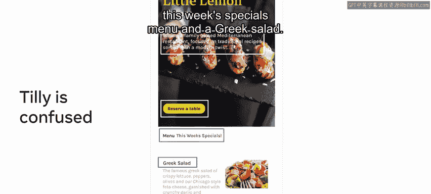
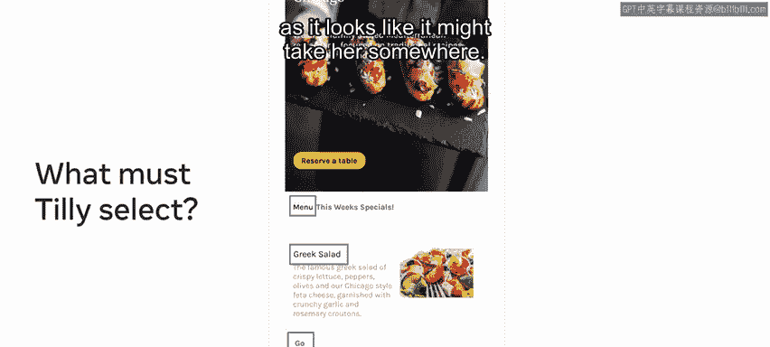
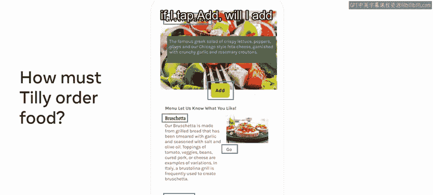
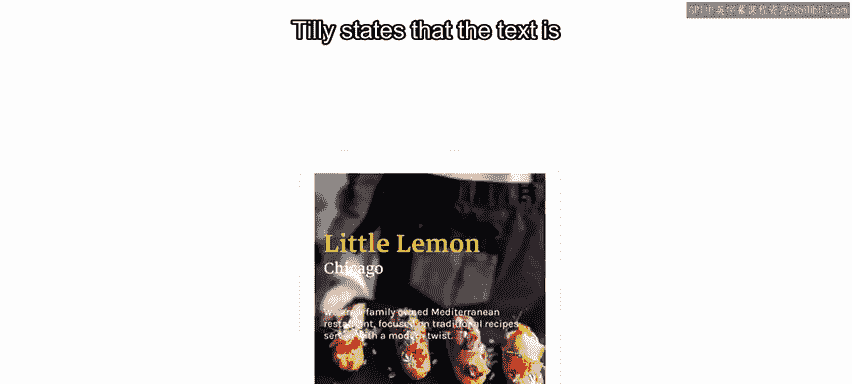
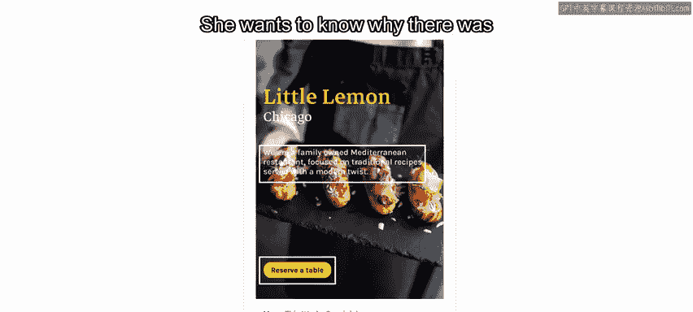
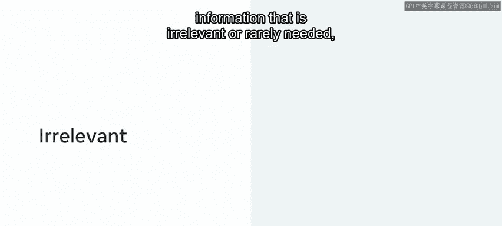
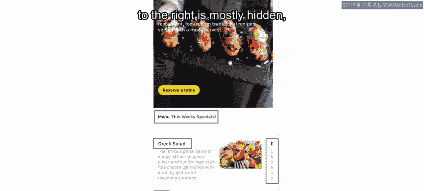
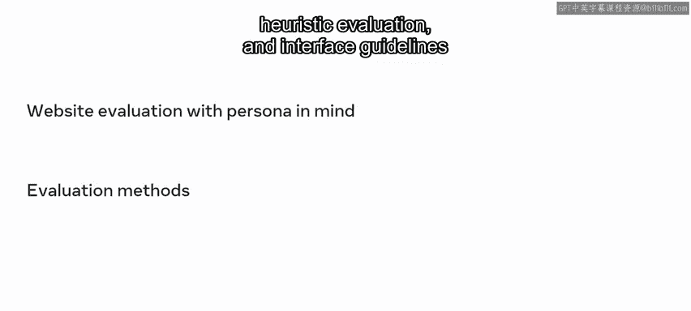

# 101：18_小柠檬评估 🍋

在本节课中，我们将学习如何评估一个现有的用户界面。我们将以“小柠檬”餐厅网站的在线订餐功能为例，通过代入用户角色“蒂莉”，并运用经典的设计原则和启发式评估方法，来识别界面中存在的问题和改进机会。

上一节我们介绍了用户角色和同理心地图等概念，本节中我们来看看如何将这些知识应用于实际的界面评估。

---

## 评估准备：代入用户角色

在评估“小柠檬”网站当前的设计时，你需要时刻牢记在上节课中创建的用户角色——蒂莉。尝试从她的视角出发，体验整个使用流程，并大声说出蒂莉在使用时会怎么想。你应该成为你的用户角色。在评估过程中，可以自由地使用一些工具，例如为你的角色绘制同理心地图和用户旅程图。

在本视频中，你将评估“小柠檬”网站的用户界面，并使用评估方法和界面设计准则，例如优秀设计原则、启发式评估和界面设计准则，来重新设计“小柠檬”网站的部分功能。

---

## 蒂莉的用户旅程与痛点

蒂莉是“小柠檬”餐厅的常客。她饿了，并且喜欢舒舒服服地待在家里，一边看她最喜欢的节目和电影一边吃饭，所以她决定点一些外卖。于是她在移动设备上打开了“小柠檬”网站。

她点击了“在线订购”按钮。蒂莉立刻感到困惑。内容很难阅读。她跳转到了“预订餐桌”页面。但她想点餐，而不是预订餐桌。菜单在哪里？她找不到。她只能看到“本周特价菜单”和一个“希腊沙拉”的选项。

她想知道自己是不是做错了什么。但她怎么返回呢？她没有意识到“菜单”这个词是可以点击的，也没意识到“希腊沙拉”可以点击。没有任何迹象表明这一点。有一个“前往”按钮。她怎么知道“前往”是什么意思？她想知道，难道没有其他餐点了吗？她决定点击“前往”这个词，因为它看起来可能会带她去某个地方。

蒂莉想：“哦，只有两个菜单项，一个希腊沙拉和一个布鲁斯凯塔。”她在想：“我喜欢吃什么？为什么这里有用户评价？”蒂莉不知道点击或触摸哪里才能点餐。

她观察到的两个操作令人困惑。她看到了两个按钮。她问自己：“我是点‘前往’还是‘添加’？如果我点‘前往’，会像上一个屏幕那样出现更多食物选项吗？还是如果我点‘添加’，就会把希腊沙拉或布鲁斯凯塔加到我的订单里？”

蒂莉还想知道购物篮在哪里。蒂莉觉得屏幕上似乎混合了各种信息。她还感觉到按钮标签、操作和设计不一致。她想知道为什么布鲁斯凯塔旁边没有“添加”按钮。

你的用户角色会如何看待这个设计？现在，让我们使用拉姆斯的十大优秀设计原则、尼尔森的十大可用性启发式原则以及施奈德曼的八大黄金法则来评估它。

---

## 应用设计原则进行评估

请记住，你之前已经学习过这些评估方法。

以下是蒂莉指出的问题以及它们违反的设计原则：

**蒂莉指出，部分文本难以阅读。这不太美观，也不易理解或不彻底。这似乎考虑不周。她想知道为什么有一个“预订餐桌”的按钮。**

这些问题违反了拉姆斯原则的第3、4和8条。

*   **第3条**：优秀的设计是美观的。
*   **第4条**：优秀的设计使产品易于理解。
*   **第8条**：优秀的设计是彻底到最后一个细节的。

尼尔森的启发式原则第8条也被违反了。

*   **第8条**：界面不应包含不相关或很少需要的信息，例如本例中的“预订餐桌”。

---

让我们进一步探讨蒂莉在“小柠檬”网站上提出的更多问题，以及这些问题是否违反了任何原则。

**记住蒂莉的评论：“菜单”这个词看起来像是句子的一部分，没有给出任何提示表明它或“希腊沙拉”是可以点击的。她还评论说，“前往”按钮看起来不像一个按钮，也不像是希腊沙拉部分的一部分。布鲁斯凯塔的文本大部分被隐藏了，而且没有导航或购物篮。**

这些问题违反了拉姆斯原则的第2、3、4和8条。

*   **第2条**：优秀的设计使产品有用。
*   **第3条**：优秀的设计是美观的。
*   **第4条**：优秀的设计使产品易于理解。
*   **第8条**：优秀的设计是彻底到最后一个细节的。

这些问题也违反了尼尔森启发式原则的第1、4、6和8条。

*   **第1条：系统状态可见性**：设计应始终让用户了解正在发生的事情。
*   **第4条：一致性和标准**：用户不必怀疑不同的词语、情况或动作是否意味着同一件事。
*   **第6条：识别而非回忆**：通过使元素、动作和选项可见，最大限度地减少用户的记忆负担。
*   **第8条：美观和简约的设计**。

不仅拉姆斯和尼尔森的原则被违反了，施奈德曼的界面黄金法则第1、7和8条也被违反了。

让我们更详细地探讨这些：

*   **第1条：力求一致性**。
*   **第7条**：设计应支持内部控制点，允许用户成为动作的发起者。
*   **第8条**：设计应减少用户的短期记忆负荷。

---

## 从评估到重新设计

在识别出这些违反最佳实践的问题后，考虑重新设计这两个屏幕，也许可以问问自己：蒂莉想要什么？

现在你已经评估了“小柠檬”网站，知道了哪些问题违反了重要的设计原则。这应该能帮助你创建一个更好的设计，让顾客更加满意。

---

## 总结

本节课中，我们一起学习了如何代入用户角色“蒂莉”来评估“小柠檬”网站，并使用了优秀设计原则、启发式评估和界面设计准则等评估方法来识别用户界面缺陷。干得漂亮！