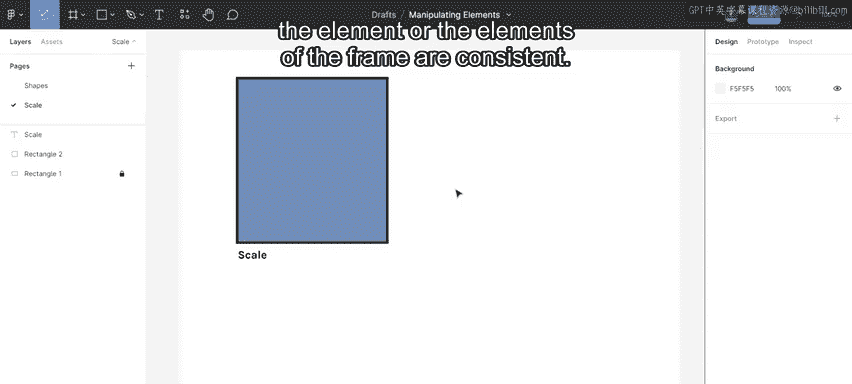
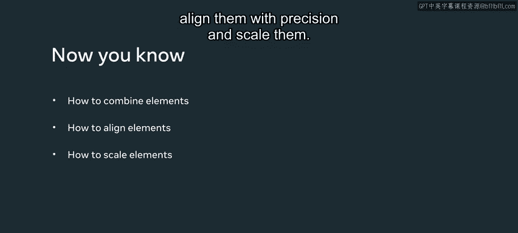

# 107：24_操作元素 ✨

在本节课中，我们将学习如何在Figma中通过组合、对齐和缩放基本形状来创建新的设计元素。掌握这些操作是进行精确界面设计的基础。

## 组合元素 🧩

你已经知道Figma提供了一些基本形状，但有时你会需要一些现成形状库中没有的图形。因此，了解如何通过组合和操作现有形状来创建新形状非常重要。

以下是组合元素的步骤：
1.  在画布上选择你想要组合的多个形状。
2.  前往顶部工具栏，点击两个正方形叠加的图标。
3.  在下拉菜单中，你会看到几个选项：
    *   **联集**：将选中的形状合并为一个。
    *   **减去顶层**：从底层的形状中移除上层的形状。
    *   **交集**：只保留所有选中形状重叠的部分。
    *   **差集**：排除所有形状相交的区域，保留不相交的部分。

## 对齐与分布对象 📐

设计师都知道，让产品看起来美观很重要，而实现这一点的方法之一就是对对象进行恰当的对齐。

要对齐对象，请先选中所有目标对象，然后转到右侧边栏的“设计”面板。对齐工具位于面板顶部。

该面板提供了多种选项。前六个选项用于让元素彼此对齐，它们分别是：左对齐、水平居中对齐、右对齐、顶对齐、垂直居中对齐、底对齐。

最后两个选项用于分布元素。你可以选中多个对象，然后选择“垂直分布”或“水平分布”，使它们之间的间距相等。

## 缩放对象 🔍

此外，确保对象的尺寸符合设计意图也很重要。因此，让我们来学习如何使用常规缩放来实现这一点。

缩放对象意味着调整它的大小。要缩放一个对象，只需选中它并拖动其边角即可。

现在，让我选中多个对象，看看会发生什么。当我调整一个组的大小时，其子元素会随之缩放。然而，效果、描边和文本大小不会自动缩放。

请注意，元素中的文本不会缩放，效果和描边也不会。如果我希望这些属性也一同缩放，可以使用屏幕左上角的“缩放工具”。

选中组，点击缩放工具，然后使用缩放控制点进行拖动。缩放工具有助于确保框架内元素的一致性。

---

在本节课中，我们一起学习了如何组合元素以创建新图形、如何精确地对齐它们以及如何缩放对象。这些是构建复杂且视觉和谐的UI设计所必需的核心技能。