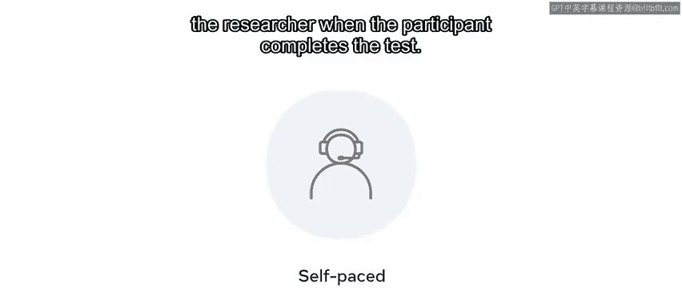

# 110：可用性测试 🧪

在本节课中，我们将要学习可用性测试。我们将了解其定义、核心参与者以及不同类型的测试方法。可用性测试是确保产品设计有效、高效且令人愉悦的关键步骤。

## 什么是可用性测试？

上一节我们探讨了线框图设计，本节中我们来看看如何测试设计的可用性。可用性测试是指让真实用户使用你设计的网站、应用程序或其他产品，同时观察他们的行为和反应的过程。这个过程对于确保为用户创造有效的、高效的和愉悦的体验至关重要。

研究人员会观察用户执行特定任务，以发现他们在何处遇到困难或感到困惑。如果许多用户遇到相同的问题，就可以提出建议来修复这些可用性问题。这为产品改进提供了机会。

## 可用性测试的核心参与者 🎭

可用性测试有多种类型，但在大多数测试中，**引导者**、**参与者**和**给定的任务**是核心参与者。

以下是这些参与者的详细说明：

*   **引导者**：引导者负责向参与者布置任务。他们观察参与者的行为，并在参与者完成任务时听取反馈。引导者还可能提出后续问题，以从参与者那里获取更多信息。
*   **参与者**：参与者是你设计的产品或类似产品的用户。
*   **任务**：任务是基于参与者在日常生活中可能执行的实践操作来设定的。根据研究目标和测试类型，任务描述可能非常详细，也可能比较模糊。

## 任务设计的关键点

在进行可用性测试时，任务措辞至关重要。任务描述中的微小不准确都可能导致参与者误解他们需要完成的内容，或影响他们执行任务的方式。

引导者可以向参与者口头宣读任务指令，也可以将任务写在任务单上交给参与者。参与者通常被要求在完成任务时“出声思考”，这能让引导者跟踪他们的进度，了解用户正在完成哪个任务，并确认参与者是否正确理解了指令。

## 可用性测试的类型 🔬

现在，我们来探讨不同类型的可用性测试。

首先，**定性可用性测试**旨在收集关于用户如何与产品互动的见解、结果和叙述。定性测试是发现用户体验问题的最有效方法。与定量测试相比，这种类型的测试更为普遍。

另一方面，**定量可用性测试**的目标是收集能衡量用户体验的指标。**任务成功率**和**任务完成时间**是定量测试中经常收集的两个指标。定量可用性测试是收集基准数据的最有效方法。

根据研究类型的不同，可用性测试所需的人数也不同。尼尔森诺曼集团建议，针对单一用户群体的典型定性可用性研究，使用**五名参与者**就足以发现产品的大部分问题。

## 线上与线下测试 💻

现在，我们来介绍其他类型的可用性测试。可用性测试可以在线上进行。线上测试很受欢迎，因为线下研究通常需要更多的时间和金钱。

线上测试可以分为**有引导的**和**无引导的**。

线上有引导的可用性测试与线下测试的运作方式非常相似。在线下环境中，引导者与参与者交谈并布置任务。而在线上，引导者和参与者之间存在物理距离。有引导的测试通常可以使用屏幕共享应用程序进行。

相比之下，远程无引导的可用性测试没有相同的参与者与引导者互动。引导者使用在线远程测试技术来发布任务。参与者独自工作，按照自己的节奏完成任务。当参与者完成测试后，会话录像和任务成功率等指标会发送给研究人员。

## 总结 📝

本节课中我们一起学习了可用性测试。我们定义了可用性测试，识别了其中涉及的核心参与者（引导者、参与者和任务），并描述了不同类型的测试方法，包括定性测试、定量测试以及线上有引导与无引导测试。理解这些概念对于评估和改进产品设计至关重要。