# 112：29_使其美观 🎨

在本节课中，我们将学习如何将线框图转化为美观的设计。我们将探讨设计中的核心元素，如图像、颜色和形状，并了解它们如何共同作用以提升最终产品的视觉吸引力和用户体验。

## 概述

你已经设计好了线框图，现在需要让它们变得美观。为此，你必须理解经过深思熟虑的设计元素如何提升最终产品。在接下来的内容中，我们将识别图像、颜色和形状的用途及其在设计中的角色。请将设计元素视为食谱中不可或缺的部分，它们共同作用，以视觉方式构建数字界面。这些基本元素至关重要。

视觉信息的每个组成部分都至关重要，它们的组合方式影响着设计被解读的方式。根据你的目标，你可以单独使用其中某个方面，也可以混合使用它们。

主要的设计元素包括：**线条**、**文本**、**颜色**、**形状**、**图形元素**（如图标和图像）以及**空间**。

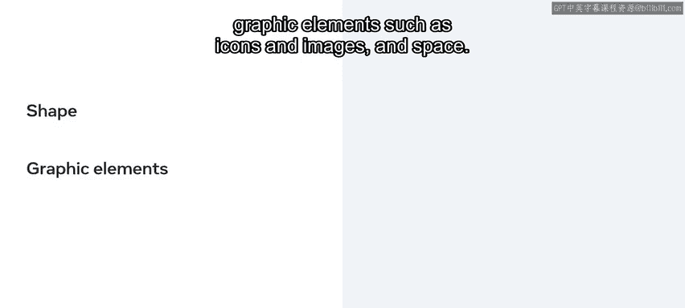

接下来，让我们花些时间更详细地探讨每个组件的功能和应用。

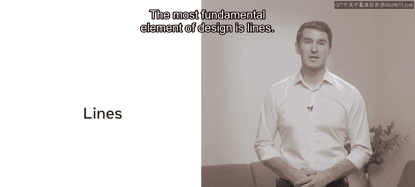

## 线条

设计中最基本的元素是线条。它们有各种颜色、大小和形状。

方向线可以是可见的，也可以是不可见的，它们有助于将视线引导到特定区域。线条的粗细可以传达额外信息：粗而宽的线条可以吸引眼球，细线条则相反。根据赋予它们的含义，颜色可以传达各种信息。你可以使用颜色和线条来强调设计布局中的特定方面。

## 文本与排版

现在让我们探讨文本。网页排版与印刷排版类似，但它还需要考虑额外的因素，以确保在所有屏幕尺寸上都能轻松阅读。

为了使阅读体验愉悦，必须妥善平衡一些排版元素。以下是这些元素：

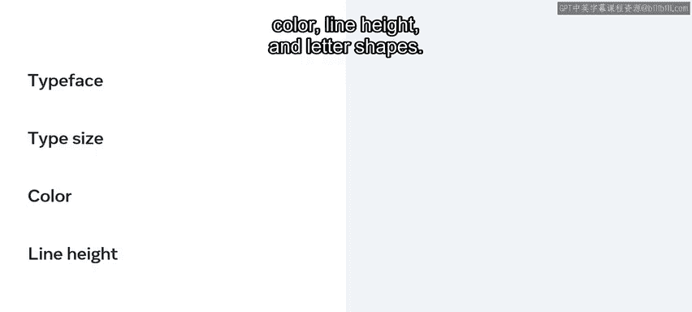

*   **字体**：字体的风格和家族。
*   **字号**：文字的大小。
*   **颜色**：文字的颜色。
*   **行高**：行与行之间的垂直间距。
*   **字形**：字母的具体形状。

## 颜色

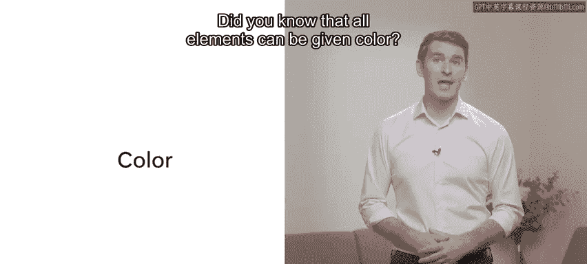

下一个元素是颜色。

你知道吗？所有元素都可以被赋予颜色。颜色可以设定氛围，是建立品牌识别和唤起情感的有效工具。

颜色也可以突出设计布局中的特定部分。

设计中使用的颜色模型是 **RGB** 和 **CMYK**。**RGB** 颜色系统专门用于数字设计，其原色是红、绿、蓝。当以不同组合叠加时，可以再现广泛的颜色。其他颜色则由几种原色混合而成。

让我们进一步探讨颜色的一些特性。颜色还具有**色相**、**浅色**、**色调**、**暗色**和**饱和度**等特性。我们来了解一下它们的含义。

*   **色相**：描述一种颜色与红、橙、黄、绿、蓝、靛、紫这些基本颜色的相似或不同程度。例如，当你将一种颜色定义为蓝绿色时，你使用了两种色相来描述它。
*   **浅色**：通过向颜色中添加白色使其变亮。
*   **色调**：通过添加灰色使颜色变得柔和的过程。
*   **暗色**：通过向色相中添加黑色，创建出该色相的暗色版本。
*   **饱和度**：描述颜色的强度。降低饱和度会使颜色看起来褪色且更浅，而增加饱和度则使其更丰富、更深。

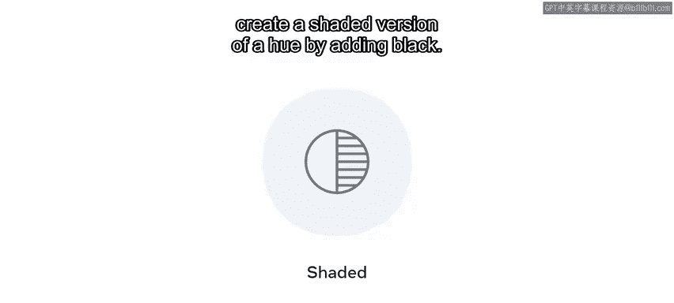

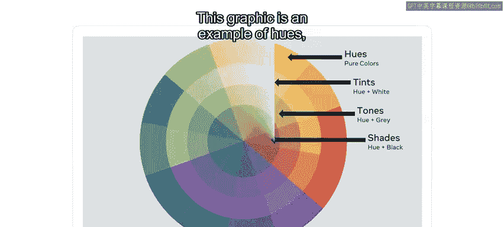

下图是色相、浅色、色调和暗色的示例。

术语“浅蓝色”和“深绿色”指的是饱和度的变化。

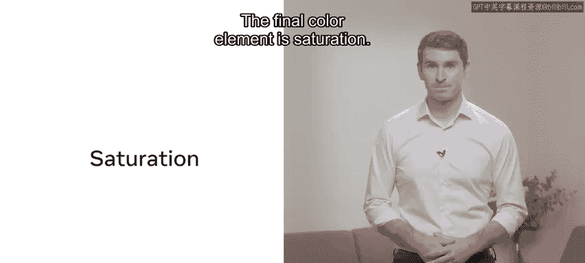

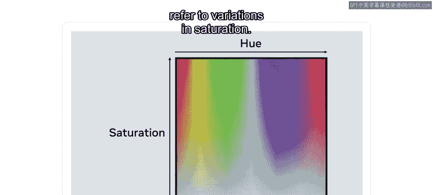

## 形状

下一个设计元素是形状。形状能够将你的注意力吸引到布局中。形状有三种类型：**几何形状**、**有机形状**和**抽象形状**。

以下是各种形状的介绍：

*   **几何形状**：通常精确且结构分明，例如数学上的正方形、圆形和三角形。
*   **有机形状**：通常没有尖锐的边缘，感觉平滑自然。这些形状为布局增添了重点。
*   **抽象形状**：以极简的方式呈现现实。人类的简笔画就是一个很好的抽象形状例子。大多数徽标使用抽象形状，通过抽象图形来反映公司的精神。

## 图像

图像也是一个重要的设计元素，因为使用各种媒体元素可以改善用户体验。视觉媒体仍然是最流行和最容易获取的媒介，因为图像实用、吸引人、易于记忆，并且对我们有吸引力。😊

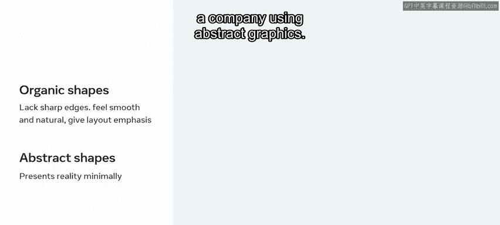
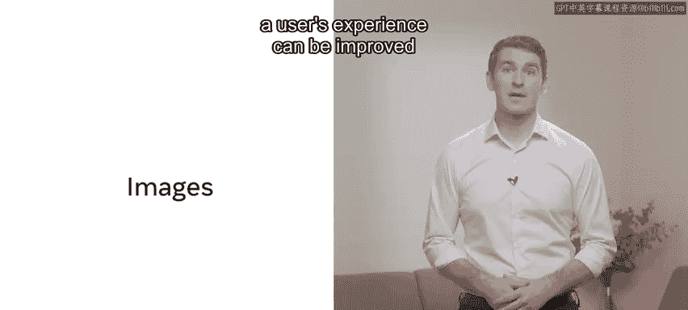

如果运用得当，图像可以吸引并引导访问者的注意力，唤起情感，并促进信任感。

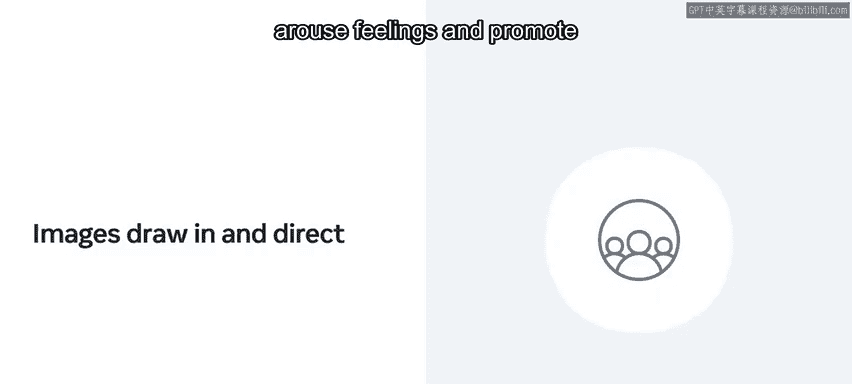

## 空间

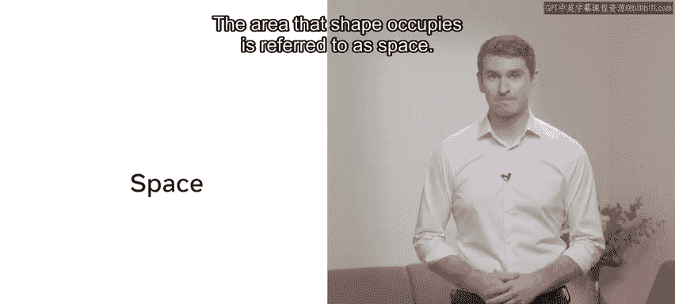

最后的设计元素是空间。形状所占用的区域被称为空间，它也描述了形状或形式所处的背景。

空间有**正空间**和**负空间**。设计中感兴趣的区域被称为设计的正空间，其周围的空间则是负空间。让我们看一个例子：在这张图片中，有一个白色花瓶，这是正空间。它周围的黑色区域是负空间。

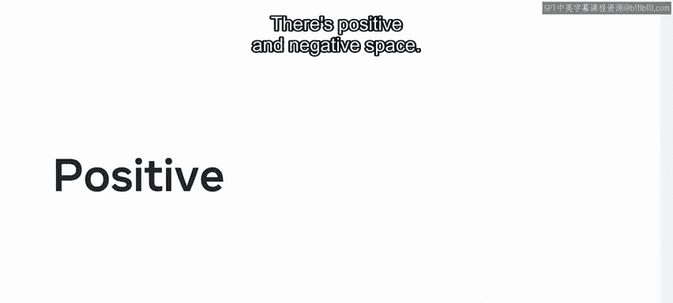

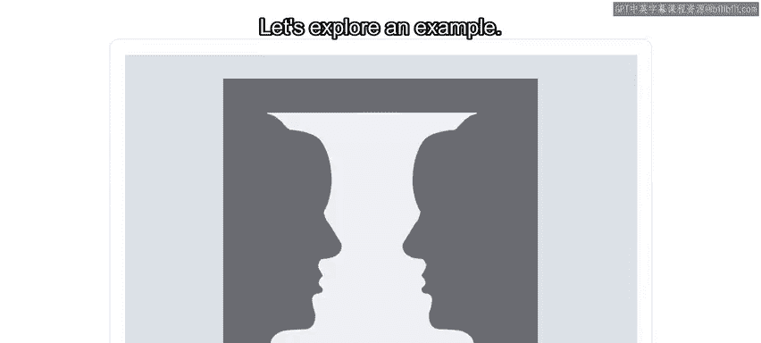

在这张图片中，还有两个黑色的脸，这也是正空间，而白色则变成了负空间。

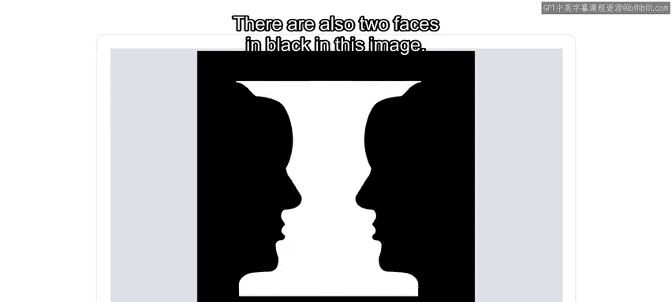

空间可以用来连接和/或分隔设计中的元素。较窄的空间将项目连接起来以显示它们之间的联系，而较宽的间隙则将元素分开以显示它们之间的分离。元素的重叠增强了它们的联系。

## 总结

在本节课中，我们一起学习了设计元素的基础知识及其在设计中的作用。你已经了解到，像 Little Lemon 网站这样的优秀产品不仅需要制作精良，还必须看起来美观。出色的工作！

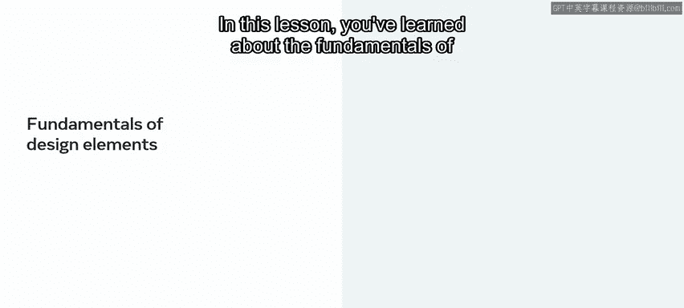

