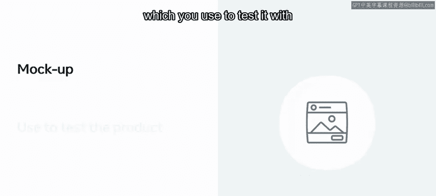
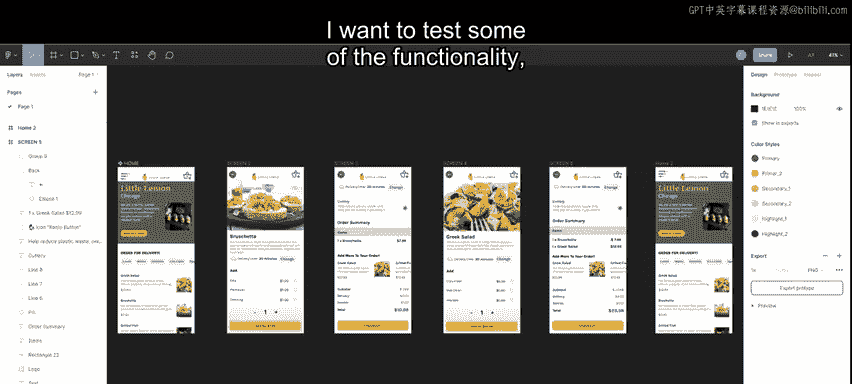
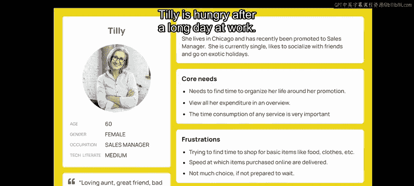
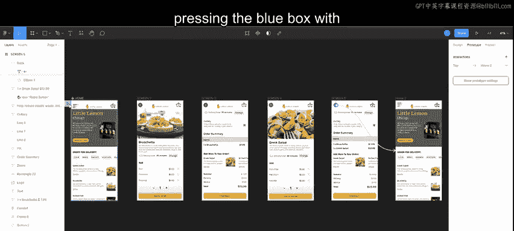
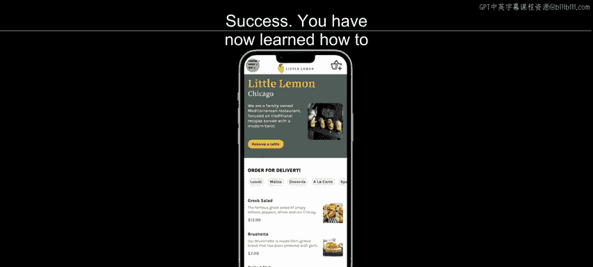
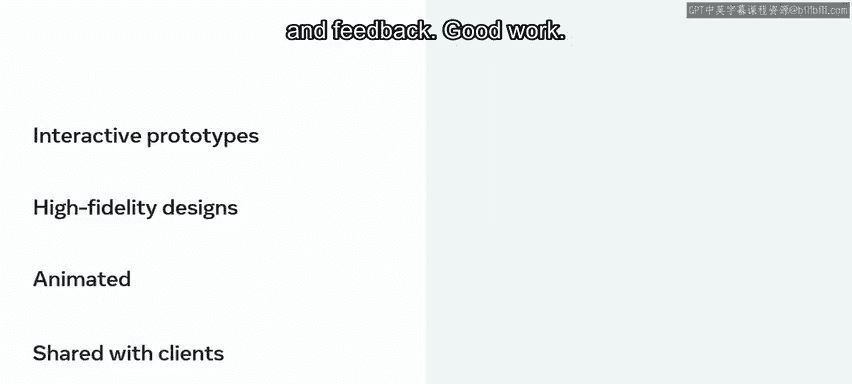

# 116：从设计到原型制作 🎨

在本节课中，我们将学习如何使用高保真设计在 Figma 中创建交互式原型。原型是获取宝贵反馈的绝佳方式，Adrian 要求你为订餐流程创建一个原型。通过学习，你将能够制作可动画化并与客户、同事分享的原型，以进行进一步测试和反馈。

## 什么是原型？🤔

上一节我们介绍了课程目标，本节中我们来看看原型的定义。

原型是产品的一个近乎可工作的模型或模拟。你用它来与潜在用户和利益相关者进行测试。

## 构建交互式原型 🛠️

现在你已经设计了一些用户界面布局，并充实了你的设计系统和 UI 套件，接下来让我们将所有内容整合到一个交互式原型中。

使用交互式原型，你可以展示设计将如何运行，这有助于帮助他人理解你的设计在最终产品建成后的外观和行为。

首先，需要创建设计，我在这里已经完成了。我想测试一些功能，所以我使用人物角色 Tiie 或 Tillly 开发了一个场景，并生成了她的用户流程。

以下是 Tillly 的用户订餐流程描述：

*   Tillly 在漫长的工作日后感到饥饿。她在 Little Lemon 网站的移动版上打开了在线订餐选项。
*   起初，她不确定想点什么。她看到了意式烤面包，并想了解更多信息，于是她点击了意式烤面包。
*   这为她提供了所有想要的细节和自定义选项。她决定就这样下单，将其添加到订单中，并获得了价格摘要和明细。
*   随后，她发现了一个添加更多菜品的选项，想看看希腊沙拉。
*   同样，她获得了描述和添加其他配料的所有选项。她再次决定就这样下单，并点击添加。
*   出现了更新后的订单摘要，右上角的购物篮图标也同步更新，显示有两件商品。
*   Tillly 看到购物篮中有两件商品，并考虑是否要再点一份甜点。她点击返回按钮，回到了可以浏览其他菜单类别并查看购物篮商品数量的页面。

## 在 Figma 中链接元素与屏幕 🔗

现在让我们看看如何在 Figma 中链接这些元素和屏幕。

1.  点击右侧面板上设计面板旁边的“原型”链接。你会注意到主页屏幕画框上出现了一个带箭头的蓝色方框以及一个蓝色圆形图标。
2.  选择它。我想选择意式烤面包。我双击该区域，直到相关部分高亮显示。
3.  我点击右侧的蓝色按钮，并将其拖拽到屏幕二。我现在已经链接了这两个屏幕。
4.  交互细节出现在右侧，上面写着“点击时导航到屏幕2”。
5.  接下来，我将“添加”按钮链接到屏幕三。
6.  从这里，我将“希腊沙拉”元素链接到屏幕四。
7.  然后将“添加”按钮链接到屏幕五（即更新后的订单摘要）。
8.  最后，从这里将“返回”按钮链接回主页屏幕。

## 预览与测试原型 👀

好的，现在完成了链接，让我们通过点击 Figma 画布上带箭头的蓝色方框来查看交互式原型。

这将打开原型。我点击意式烤面包，显示了它的详细信息。我将其添加到购物篮，并跳转到订单摘要。我点击希腊沙拉，查看其详细信息，这又将我带到了更新后的摘要页面。当我点击返回按钮时，我回到了主页屏幕。

成功！你现在已经学会了如何在 Figma 中创建一个简单的交互式原型。Adrian 和用户对你提供的原型感到满意。恭喜！

## 总结 📝

本节课中我们一起学习了如何使用 Figma 中的高保真设计创建交互式原型。这些原型可以添加动画效果，并与客户和同事分享，以进行进一步的测试和反馈。干得好！