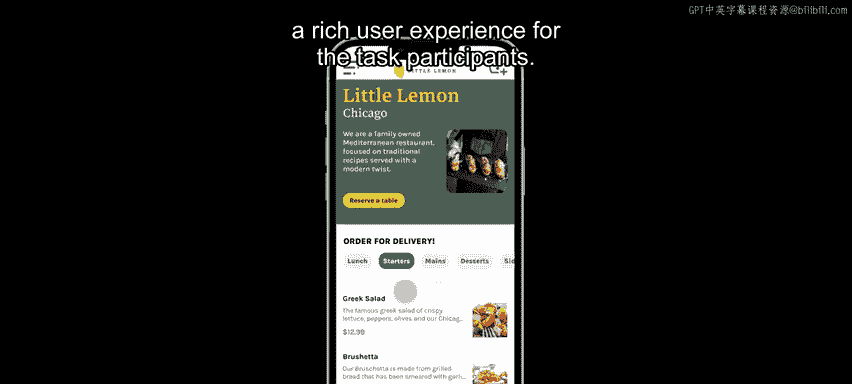
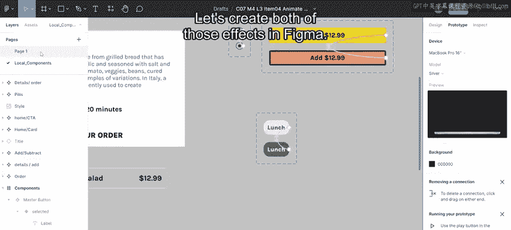
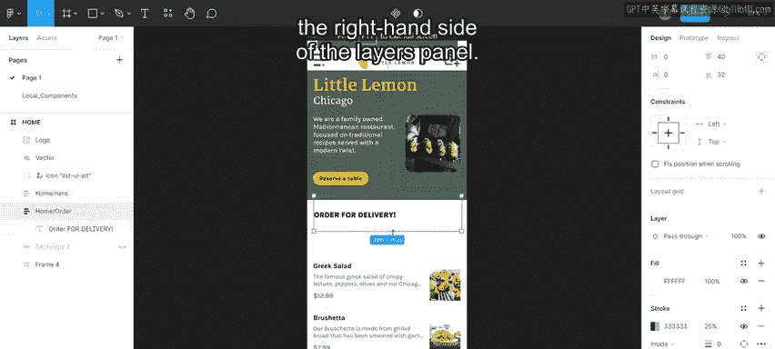
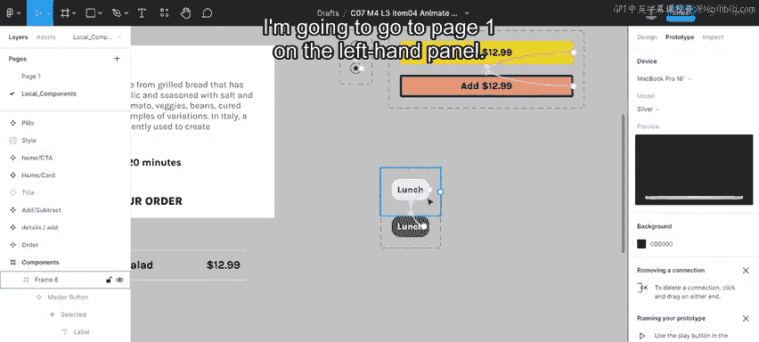
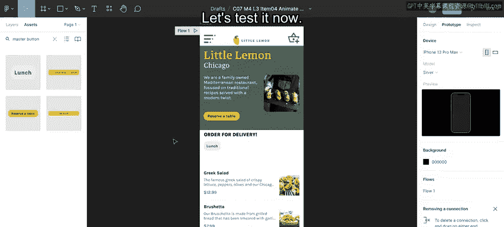
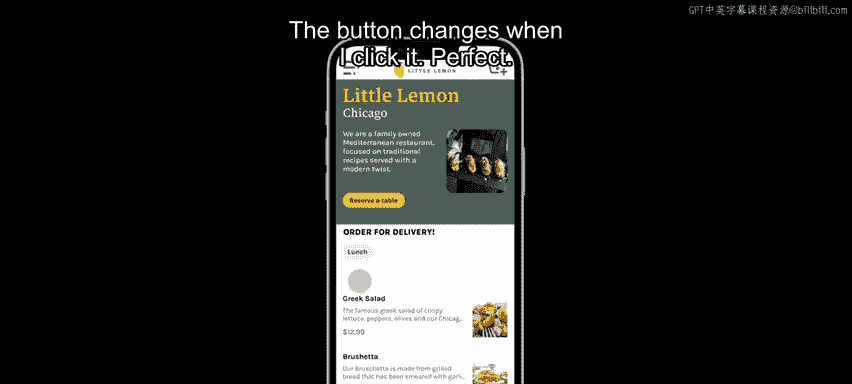
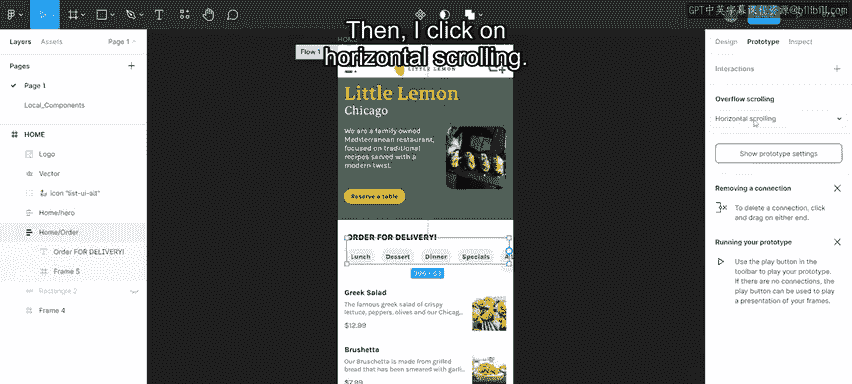
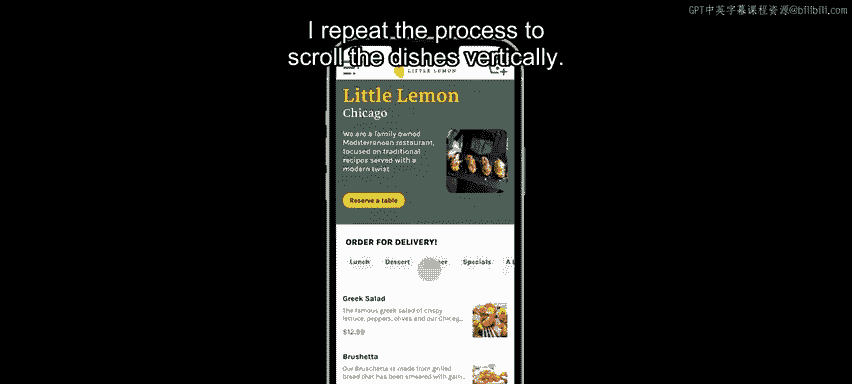
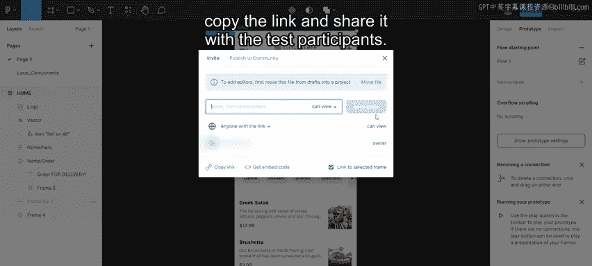

# 117：制作原型并测试 🎨

在本节课中，我们将学习如何在Figma中为应用程序创建交互式原型，以便进行用户测试。我们将重点介绍如何制作可切换的按钮组件和实现水平/垂直滚动效果，最终生成一个可分享的测试链接。

---

## 概述

你已经准备好通过Figma上的交互式原型为应用程序的测试做准备。当测试准备就绪时，你可以创建原型并与用户分享链接。让我们开始了解如何制作这个原型。

首先，我打开我的Figma文件。现在，我可以水平滚动类别按钮，并垂直滚动菜品列表。我还可以切换类别的开启和关闭状态。请注意，在这个原型中动态过滤内容超出了范围，但它是为测试参与者提供丰富用户体验的一个良好起点。

## 创建可切换的按钮组件

上一节我们介绍了原型的目标，本节中我们来看看如何创建核心的交互组件——可切换的类别按钮。

为了复现这个效果，我需要删除主页面上当前的一组类别按钮。在图层面板的右侧，我转到本地组件页面，这个页面是我创建用来存储组件的地方。

以下是创建类别按钮切换交互组件的步骤：

1.  **创建基础按钮**：首先，创建一个自动布局按钮并将其转换为组件。
2.  **设置主组件**：点击组件按钮，将其命名为“Master button”，然后按回车键确认。
3.  **添加变体**：右键单击此组件，选择“主组件”，然后选择“添加变体”。这里将放置按钮的变体状态，即用户点击或切换时发生的变化。
4.  **设计变体样式**：选择新创建的变体，在设计面板的标签中输入“selected”并按回车。接着，自定义其外观：选择按钮并将填充色改为更深的颜色。然后，双击文本，将文本的填充色改为更浅的颜色。
5.  **设置原型交互**：点击右侧的“原型”选项卡。双击第一个实例（默认状态），将其原型图标拖拽到第二个实例（选中状态），此时会出现原型设置面板。你会看到交互设置为“On click”时“Change to” “selected”图标。接着，双击第二个实例并将其原型图标拖拽回第一个实例，以设置反向切换过程。这样，当选中状态的按钮被点击时，它会变回默认状态。这就是在两个状态之间切换的方法。

## 将组件应用到原型中

现在我们已经创建了可切换的按钮组件，接下来看看如何将它应用到我们的主页原型中，并测试其功能。

我转到左侧面板的“Page 1”。然后，我转到旁边的“Assets”选项卡，输入“Master button”进行搜索。按钮组件显示出来后，我将其拖拽到“Order for delivery”标题下的自动布局区域中。

让我们现在测试它。我点击“Present prototype”按钮。当我点击按钮时，它成功改变了状态。效果完美。

## 制作多个按钮并实现水平滚动

单个按钮已经可以工作，但我们的界面需要一组可以水平滚动的类别按钮。本节我们将完成这个布局。

我需要制作更多的类别按钮。我选择现有的按钮，然后按 `Ctrl+D`（或 `Command+D`）复制一个按钮组件实例。按钮被复制了，但它们一个叠在另一个上面。这是因为父级的自动布局框架被设置为垂直堆叠。

以下是实现水平滚动按钮组的步骤：

1.  **创建按钮组框架**：选择所有按钮，将它们组成一个自动布局框架。
2.  **调整布局方向**：在右侧的自动布局属性面板中，将方向改为水平。
3.  **复制并命名按钮**：我可以根据需要复制任意多个类别按钮。在每个按钮中输入文字，给它们独特的标题。我为每个按钮都设置了新标签。
4.  **设置水平滚动**：双击这个包含按钮的框架（例如“Frame 5”），我将其重命名为“dish category”。为了限制这些按钮在屏幕内的滚动范围，我双击进入该框架并将其转换为组件。接着，右键单击并选择“Frame selection”。我从右侧缩放框架，使其边缘与设备窗口的边缘对齐，这样就创建了溢出边界。
5.  **启用滚动原型**：我选择“原型”选项卡，点击“Overflow scrolling”，然后选择“Horizontal scrolling”。

让我们检查一下效果。现在，类别按钮可以切换开关状态，并且我可以左右滚动它们了。

## 实现菜品的垂直滚动

类别按钮的水平滚动已经完成，使用户能够浏览所有选项。类似地，菜品列表也需要支持垂直滚动，以展示更多内容。

我重复相同的过程来实现菜品的垂直滚动。创建一个包含菜品项目的框架，将其转换为组件，设置框架边界以匹配可视区域，然后在原型选项卡中为这个框架选择“Vertical scrolling”。

## 分享原型进行测试

所有交互功能都已就绪，原型已经成为一个可以模拟真实体验的工具。最后一步是生成一个链接，以便与测试参与者分享。

要分享我的原型，我点击“Share”按钮，复制生成的链接，然后将其分享给测试参与者。

---

## 总结

本节课中我们一起学习了在Figma中创建交互式原型的完整流程。我们首先创建了一个可切换状态的按钮组件，然后将其组合成支持水平滚动的按钮组。接着，我们为菜品列表实现了垂直滚动效果。最后，我们生成了可分享的原型链接，为后续的用户测试做好了准备。这个过程是连接设计与用户反馈的关键步骤。