# 120：37_课程回顾 📚

在本课程中，我们学习了用户体验和用户界面设计的原则。现在，让我们花一些时间来回顾一下所学到的关键主题。

## 概述 📋

本节课我们将一起回顾整个课程的核心内容，从UX/UI设计的基础概念，到交互设计评估，再到应用设计基础和高级UI设计技巧。通过本次回顾，你将巩固对UX/UI设计全流程的理解。

## 开篇课程：UX与UI设计导论 🎯

在开篇课程中，我们介绍了UX和UI设计的基础知识。

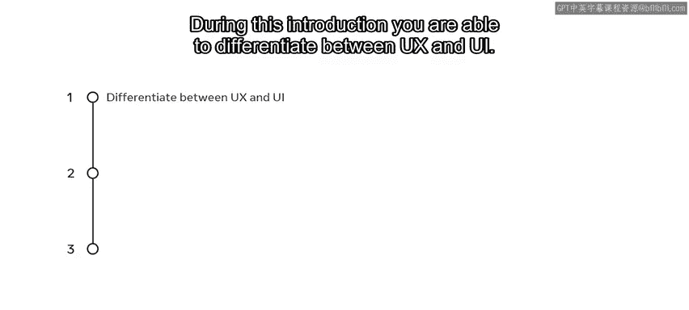

以下是该部分的核心学习内容：
*   能够区分UX和UI。
*   描述了什么是UX，其目标和质量构成要素。
*   定义了UI以及不同类型的设计。

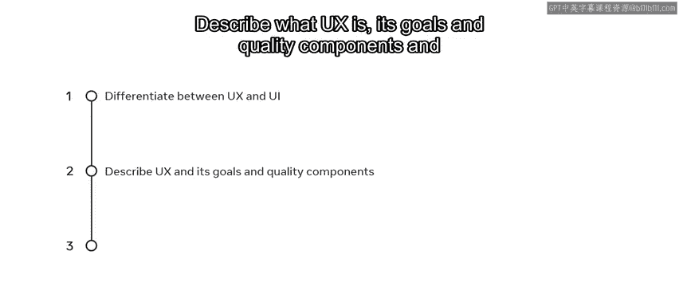

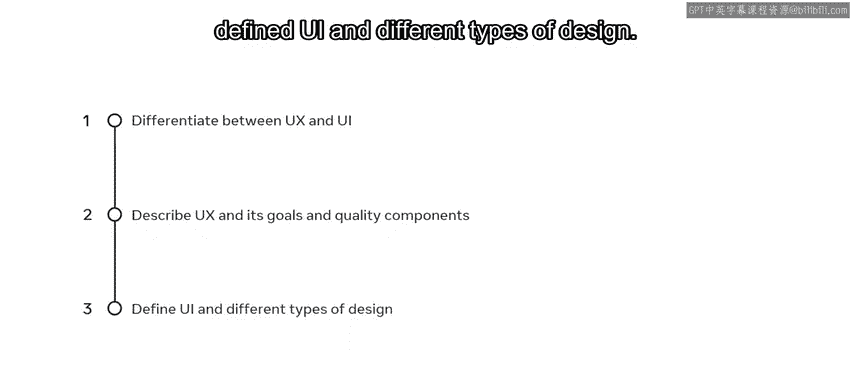

此外，我们开始接触Figma，并探索了以用户为中心的设计，以及UX设计中的共情工具和用户画像概念。

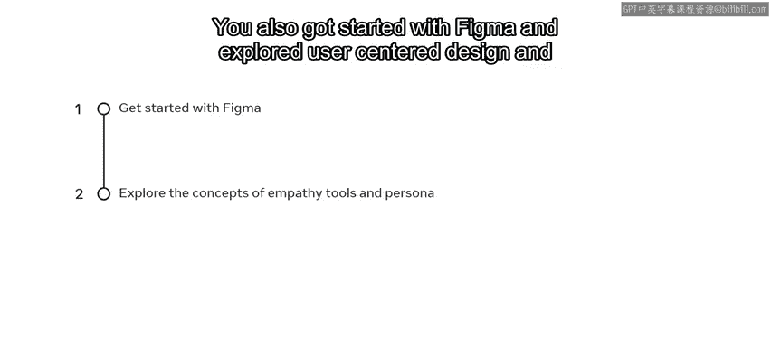

## 交互设计评估 🔍

上一节我们介绍了设计基础，本节中我们来看看如何评估交互设计。

在这个主题中，我们探索了评估方法，并涵盖了无障碍设计。通过研究导航和表单设计的实际案例，我们还审视了评估的最佳实践原则。

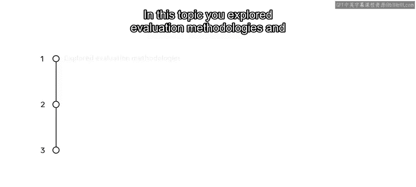
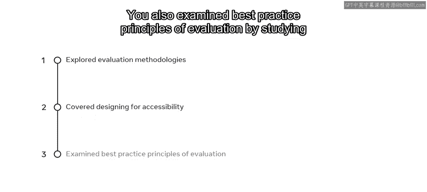
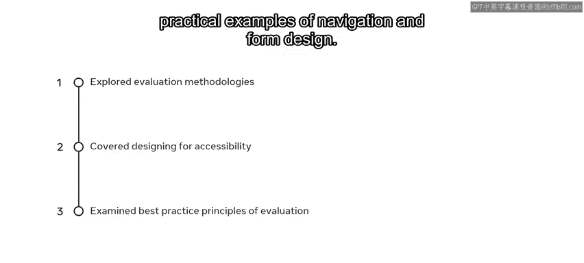

## 应用设计基础 🛠️

掌握了评估方法后，我们进一步学习了应用设计基础。

在这个主题中，我们探索了使用Figma的基本功，并回顾了迭代设计的原则，包括线框图绘制、原型制作和可用性测试。

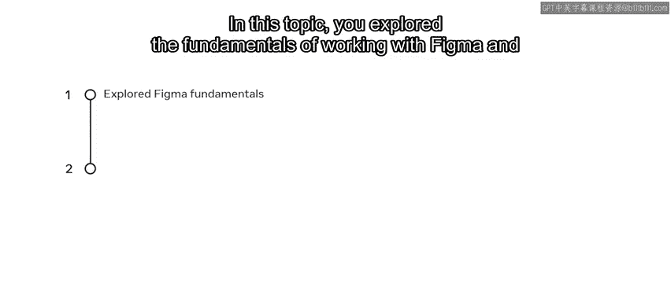
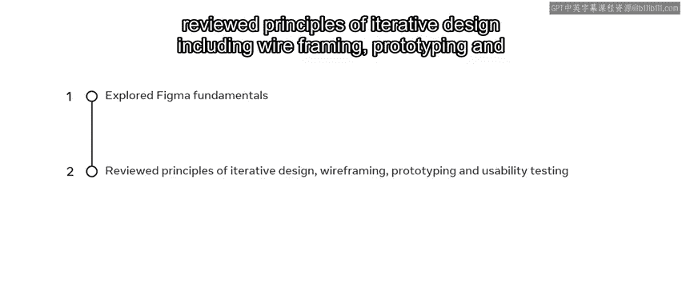

## 设计你的UI 🎨

接下来，我们开始探索如何设计你的用户界面。

在这里，你学习了如何优化设计，并创建基于组件的高保真设计。

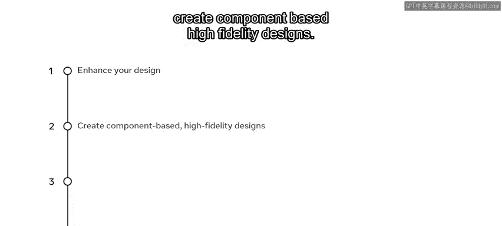

你还学习了如何使用情绪板，以及如何在Figma中创建设计系统。

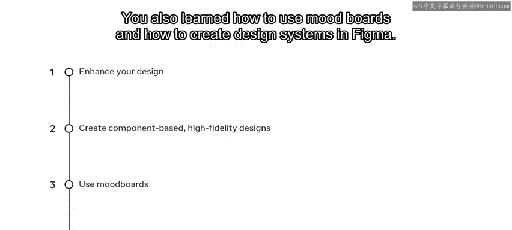

然后，我们学习了如何创建高保真设计原型，并在UI中包含微动效。

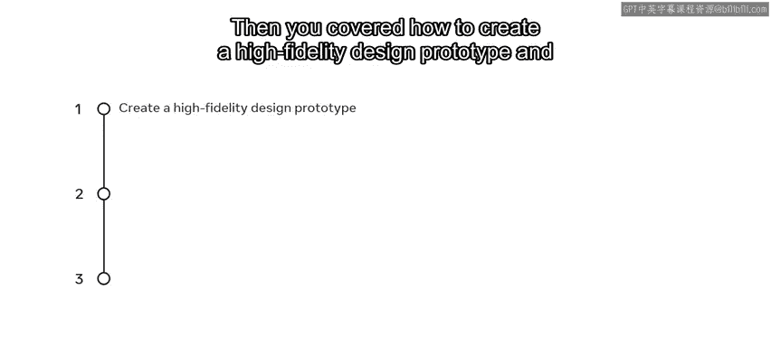
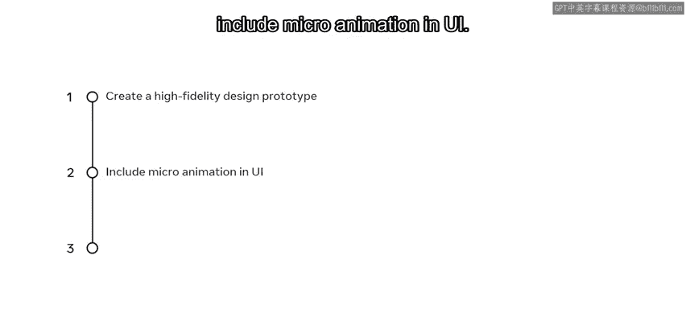

最后，你学习了如何为原型添加动画并进行测试。

## 总结与下一步 🚀

本节课中我们一起回顾了整个UX/UI设计课程的学习路径。

完成所有内容后，你现在已经准备好完成你的作业：在Little Lemon网站上预订餐桌，以实践你所学的知识。之后，你将参加分级评估，检验你在本课程中学到的内容。

祝你顺利！😊