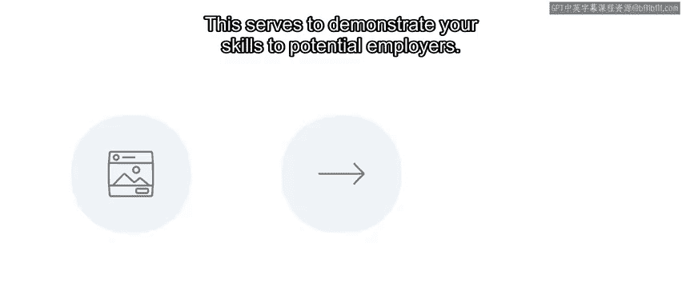
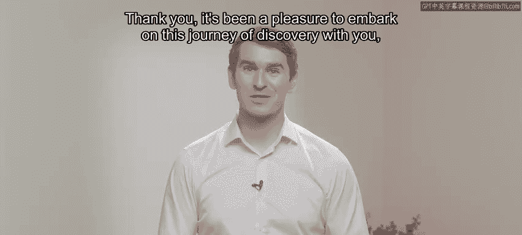

# 121：38_恭喜你完成了用户体验和用户界面设计原则 🎉

在本节课中，我们将对您完成的用户体验与用户界面设计原则课程进行总结，回顾您已掌握的核心技能，并展望后续的学习路径。

您已经完成了这门Meta用户体验与用户界面课程。您付出了辛勤的努力，并在此过程中发展了许多新技能。您在用户体验与用户界面的学习之旅中取得了巨大进步。现在，您应该已经理解了用户体验和用户界面设计的原则。

在课程作业中，您通过为Little Lemon网站创建一个餐桌预订功能元素，展示了部分学习成果以及您实用的用户体验与用户界面技能。

完成这门Meta用户体验与用户界面课程后，您现在应该能够：

*   在采用以用户为中心的设计方法时，应用用户体验和用户界面原则。
*   使用设计方法和最佳实践原则来评估交互设计。
*   在Figma中应用设计基础知识。

上一节我们回顾了基础设计原则的应用，本节中我们来看看更具体的设计流程与工具技能。

您还应该能够：

*   使用线框图、快速原型制作和可用性测试，遵循迭代式设计流程。
*   创建基于组件的高保真设计。
*   使用情绪板。
*   在Figma中创建设计系统。

课程中的分级评估所衡量的关键技能，证明了您在这些主题上的能力。

## 后续步骤 🚀

那么，接下来的步骤是什么？这门Meta用户界面课程为您初步介绍了几个关键领域。您可能意识到自己仍有更多需要学习的内容。

因此，如果您觉得这门课程有帮助并希望了解更多，何不注册下一门课程呢？无论您是刚刚起步的技术专业人士、学生还是商业用户，本课程和项目都能证明您了解用户体验与用户界面的价值和能力。

最终作业通过在实际项目中应用您的用户体验与用户界面技能，巩固了您的能力。但它还有另一个重要的好处：这意味着您将拥有一个可以在作品集中引用的真实设计。

这有助于向潜在雇主展示您的技能。

它不仅向雇主表明您具有自我驱动力和创新能力，还充分说明了您作为个人的特质以及您新获得的知识。

谢谢。很荣幸能与您一同踏上这段探索之旅。祝您未来一切顺利。😊

## 总结 📝

本节课中我们一起学习了课程完成的总结。我们回顾了您已掌握的核心用户体验与用户界面设计技能，包括原则应用、设计流程和工具使用。同时，我们也探讨了如何将课程成果转化为作品集项目，并为您的持续学习指明了方向。恭喜您达成这一里程碑！