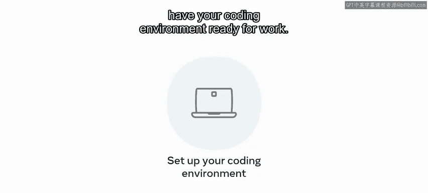
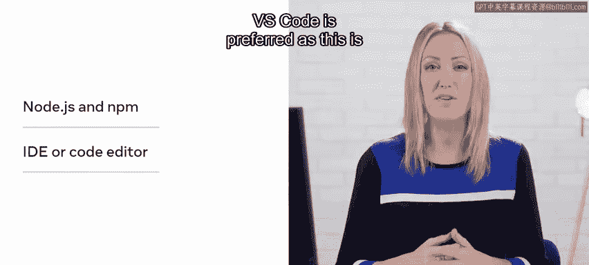
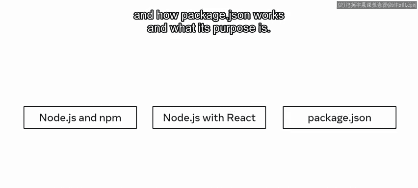
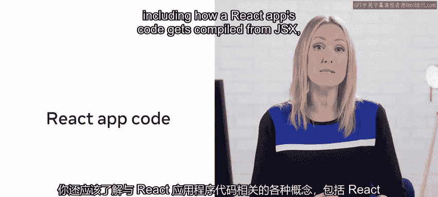
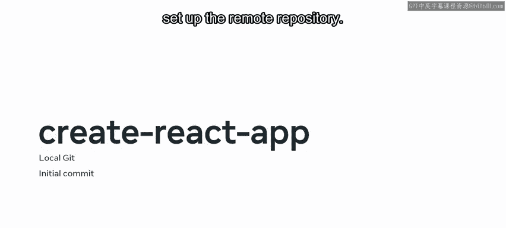
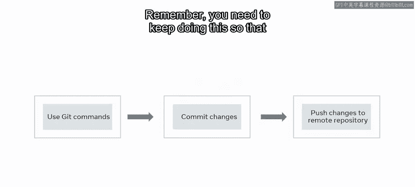

# 123：设置项目 🛠️

在本节课中，我们将学习如何为毕业项目设置开发环境。我们将确保你的机器已准备好进行React开发，并使用Create React App初始化项目，同时建立Git版本控制。

## 概述

课程介绍完毕后，现在开始为毕业项目进行设置。本节课将回顾与项目设置相关的几个核心概念。

## 开发环境准备

首先，需要确保你的编码环境已准备就绪。具体而言，这意味着：

*   你的机器上安装了正确版本的 **Node.js** 和 **NPM**。
*   你的操作系统允许你自由地与Node.js交互并构建项目。
*   你使用的计算机拥有管理员权限，可以自由执行操作。

以下是需要安装和设置的工具列表：

*   **IDE或代码编辑器**：已安装并设置为可与React和Git协同工作。推荐使用VS Code，因为它在其他前端课程中也被使用。
*   **Git**：已在你的机器上安装。
*   **GitHub账户**：用于为你的代码添加远程仓库。

## 使用Create React App初始化项目

你将使用 **`create-react-app`** 这个NPM包来构建一个React样板应用。这是一个最小的React启动应用，包含你可以基于其进行开发的起始代码。

以这种方式设置React项目意味着你需要理解：
*   Node.js和NPM是什么。
*   Node.js如何与React协同工作（高层次理解）。
*   `package.json`文件如何工作及其用途。

你还应该理解与React应用代码相关的各种概念，包括React应用的代码如何从JSX（浏览器无法理解）被编译成JS（浏览器可以理解），并借助如Webpack这样的模块打包工具在本地进行打包和服务。

这个React样板应用是你的毕业项目的起点，并将构成你在此过程中完成的大部分工作的基础。

## 设置Git版本控制

你可能已经知道，当你使用`create-react-app`构建React项目时，该项目会附带一个本地Git设置和一个初始提交。这使得设置远程仓库以正确使用此Git设置变得更容易一些。

为了能正确使用这个Git设置，你需要回顾并确保至少对以下概念有基本理解：
*   Git及其如何在本地跟踪文件。
*   Git中的暂存区。
*   远程仓库：如何设置仓库以及如何使用`git add`、`git commit`、`git push`、`git log`和`git branch`命令。

在本节课中，你将有机会重温版本控制的工作原理，并为你的React毕业应用设置一个Git仓库。

## 实践：更新与代码追踪

你将通过更新启动的React应用并使用Git跟踪这些更新来实践。你将使用前面提到的一些Git命令来提交代码更改，并将其从本地文件夹推送到远程Git仓库。

请记住，你需要持续进行此操作，以确保你的远程源仓库和本地文件夹保持同步。这很重要，因为它能确保你的项目在需要时始终准备好接受更多贡献者。

现在，让我们开始设置你的项目。

## 总结

本节课中，我们一起学习了为毕业项目设置完整开发环境的步骤。我们回顾了确保Node.js、NPM、代码编辑器和Git正确安装的重要性，使用`create-react-app`初始化了React项目，并建立了Git版本控制流程，为后续的开发工作奠定了基础。