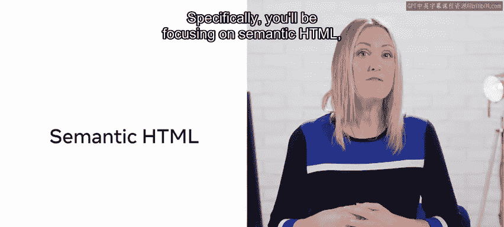
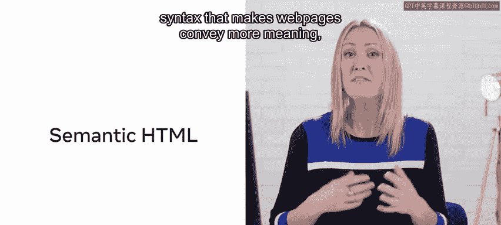
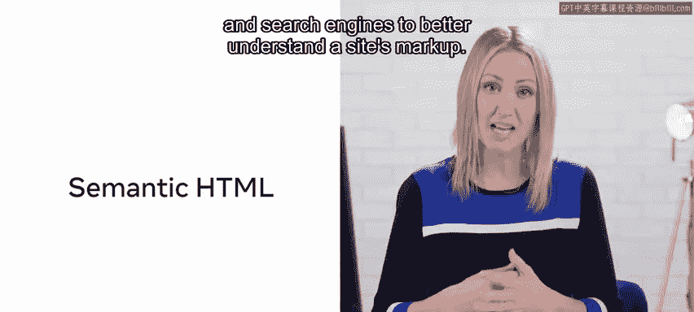
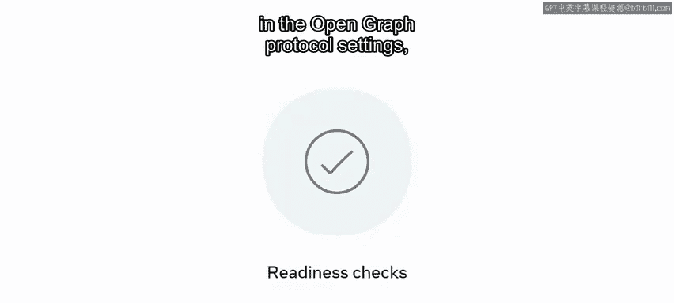

# 126：4_设置语义HTML文档 🏗️

## 概述

在本节课中，我们将学习如何为你的毕业项目（Little Lemon餐厅的预订网页应用）正确地组织和构建HTML结构。核心内容是掌握**语义HTML**，这是一种更现代的HTML5语法，它能让网页传达更多含义，从而帮助用户、屏幕阅读器和搜索引擎更好地理解网站的标记。

## 语义HTML的重要性

上一节我们介绍了课程的整体目标，本节中我们来看看为什么语义HTML如此关键。这些课程项目的目的是确保你正确格式化HTML结构，使其符合正确的HTML5语义规范。

需要明确的是，到处使用`<div>`元素并非最佳实践。你应该专注于使用当今可用的众多语义HTML5标签。这些标签能定义网页的各个部分，使代码更具表达性，有助于向人和机器（包括搜索引擎爬虫）传达意图。

以下是HTML5中一些核心的语义标签示例：





```html
<nav> <!-- 定义导航链接部分 -->
<header> <!-- 定义文档或区域的页眉 -->
<footer> <!-- 定义文档或区域的页脚 -->
<main> <!-- 指定文档的主要内容 -->
<aside> <!-- 定义与主内容间接相关的内容（如侧边栏） -->
<article> <!-- 定义独立、可分发的内容块（如博客文章） -->
```



## 设置语义HTML文档

在理解了语义标签的重要性后，接下来我们将动手设置一个语义化的HTML文档。你将重温HTML的历史，了解HTML4与HTML5的区别，以及为何HTML5规范如此强调语义标签。

完成语义HTML文档的设置后，你需要将重点转移到处理**元标签（Meta Tags）**和设置**开放图谱协议（OpenGraph Protocol）**上。这部分内容将帮助你优化网页在社交媒体上的分享预览。

为了巩固这部分知识，你将回顾在《HTML与CSS深入》课程中学到的相关内容，并完成两项准备情况检查：一项是针对元标签和开放图谱协议设置的完成度检查，另一项是使用Git跟踪项目进度的检查。

## 课程总结与评估

本节课将以一个小测验结束，测验内容涵盖语义HTML、元标签和开放图谱标签。此外，还会提供额外的相关资源和阅读材料链接，以进一步强化你在这方面的知识。



现在，让我们开始学习吧！