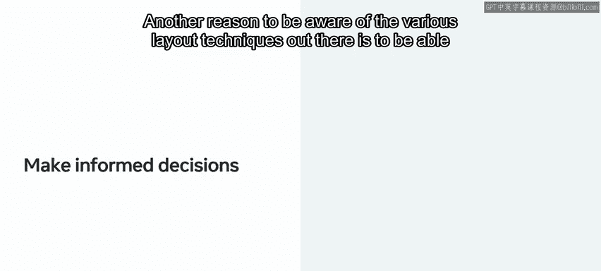
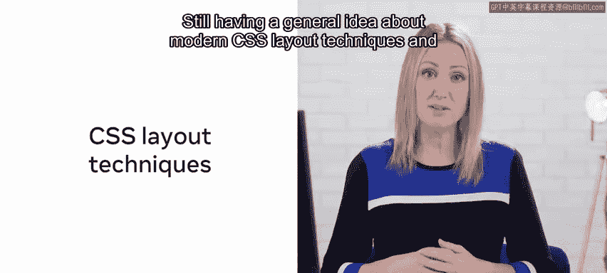
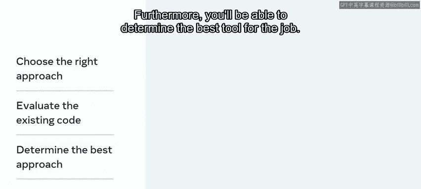

# 127：5_样式化元素 🎨

在本节课中，我们将重新探讨网页和Web应用的样式设计，以便应用课程早期创建的“小柠檬”风格指南和布局设计。我们将首先在不涉及React的情况下，单独探索CSS的使用。之后，我们将从React的角度来使用CSS。

## 网页布局技术演进 📜

你可能还记得，CSS自20世纪90年代末就已存在。这意味着网页布局有多种不同的方式。让我们简要回顾一下。

### 表格布局

一切始于**基于表格的布局**。这是一种现已过时的布局构建方式。

### 浮动布局

之后，在21世纪初，另一种技术变得流行起来：**浮动**。作为一个CSS属性，`float`旨在将HTML元素从正常的文档流中移除。换句话说，当你浮动一个元素时，它不再遵循正常的文档流。

浮动流行了相当长一段时间。然而，由于它并非为构建网页布局而设计，CSS仍然需要合适的布局语法。

### Flexbox布局的尝试

随着业界在2010年代初达成共识，认为需要更好的方案，曾有过几次引入**CSS弹性盒布局模块规范**（即Flexbox布局）的尝试。这是一种一维布局技术，用于在行或列中排列项目。

如果你想了解更多关于Flexbox布局的信息，可以查阅本课的补充资源。然而，值得注意的是，CSS规范中Flexbox布局的初次尝试并不完全成功，原因是规范不断变化，且各浏览器的支持不一致、不完整。

### 现代布局技术的成熟

最终，在2010年代后半期，Flexbox推出了新的规范并得到广泛采用，CSS网格规范紧随其后。**CSS网格布局技术**大约在2018年左右真正兴起。

CSS网格布局模块是CSS规范的一部分，其目的就是构建网页布局。原因很简单：浏览器需要一段时间才能跟上CSS网格规范的发展，而那些不支持CSS网格的旧浏览器也需要时间失去大部分市场份额。因此，在现代浏览器跟上CSS网格之后，不支持它的旧浏览器就逐渐被淘汰了。CSS网格得以广泛采用。

## 选择正确的布局工具 ⚖️

使用CSS Flexbox和CSS网格各有其好处。在本课中，我们将重新审视使用两者的优缺点。

你不应低估CSS Flexbox的作用和地位。重要的是要记住，CSS网格**并非**CSS Flexbox的替代品。了解其中任何一种都很好，但最好两者都掌握。

了解各种布局技术的另一个原因是，能够在日常工作中对布局选择做出明智的决策。开发人员经常需要判断一段代码是否足够好，或者是否需要修改。很多决策过程来自于经验。尽管如此，对于一名全面的前端开发者来说，了解现代CSS布局技术及其适用场景非常重要。

确实，你在这个主题上掌握的知识越多，就越能选择正确的方法，并判断你所参与的任何项目中现有代码是否符合现代标准。此外，你将能够确定最适合当前工作的工具。

综上所述，本课的重点将主要放在使用**CSS网格**构建CSS布局上，因为它是现代CSS布局工具箱中最全面、最多功能的工具。

---

上一节我们回顾了CSS布局技术的发展历程，本节我们将开始动手实践。

是时候开始了。