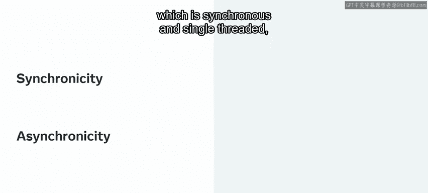
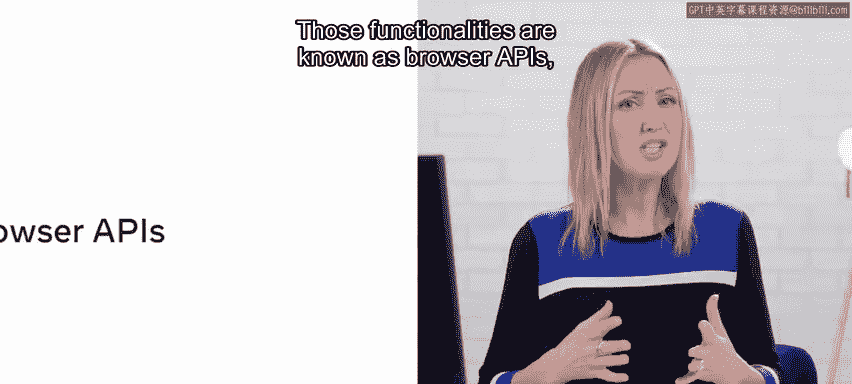
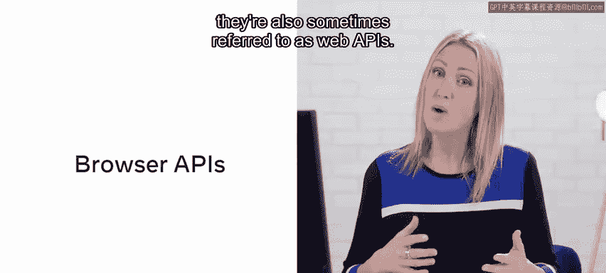
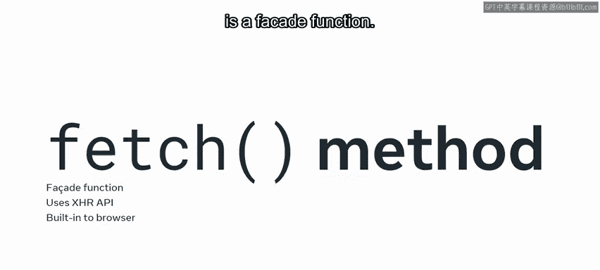
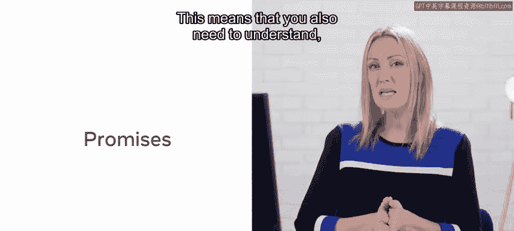
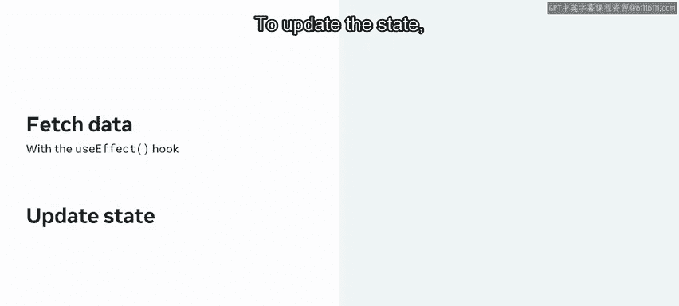
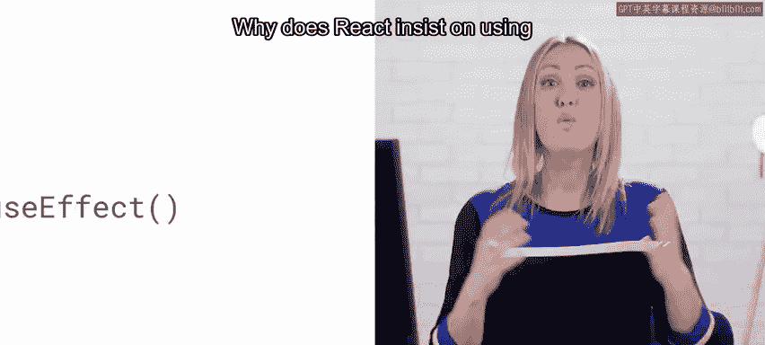
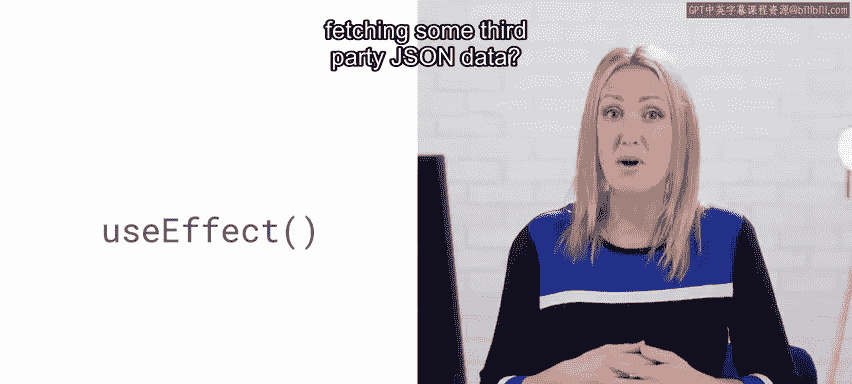
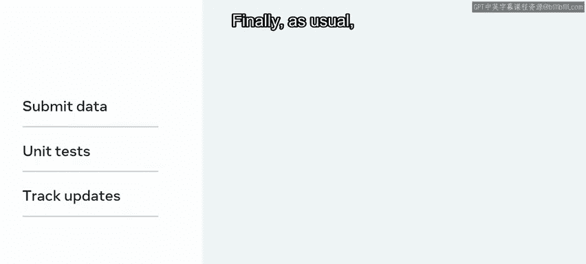

# 131：9_查询预订表 API 📡

在本节课中，我们将学习如何在小柠檬网站的用户进行餐桌预订时，使用 API 发送预订数据。为了正确实现此功能，我们需要回顾一些基础概念。

## 回顾 JavaScript 异步操作

首先，我们需要回顾 JavaScript 中的异步操作主题。显然，这是一个独立于 React 本身的主题，因为 React 是基于 JavaScript 构建的。这意味着你必须至少熟悉 JavaScript 中同步和异步的基本概念。

例如，你需要理解 JavaScript 作为一门同步、单线程的语言，是如何处理异步操作的一般原理。最简短的回答是：它并不真正直接处理。它只是利用其他内置的浏览器功能将工作委托给它们，然后接受这些工作的结果。这些功能被称为**浏览器 API**，有时也称为 **Web API**。

当然，这不应与你可以连接以从网络获取数据的第三方 API 混淆。为了成功完成本课任务，你需要在 React 中实现此功能之前，了解如何在纯 JavaScript 中处理对第三方数据的请求。

幸运的是，其机制大体相同，只是 React 坚持使用专门的 Hook（即 `useEffect` Hook）来处理副作用。

## 使用 Fetch 方法获取数据

在 JavaScript 中有几种方法可以请求第三方 JSON 数据，但更流行的方法之一是使用 `fetch` 方法，它是一个内置的 JavaScript **外观函数**。

`fetch` 方法使用 XHR API（或称 XMLHttpRequest API）。这是一项内置在浏览器中的功能，但它不是浏览器 JavaScript 引擎的一部分。这就是为什么我们说 `fetch` 方法是一个外观函数。

当你调用 `fetch` 方法时，它会返回一个 **Promise**。这意味着你还需要至少从表面层面理解 Promise 在 JavaScript 以及延伸至 React 中是如何工作的。

## 理解 Promise

一个 Promise 是一个可能在稍后时间被履行的对象。实际上，JavaScript 中的每个 Promise 都可以存在于三种状态之一：**等待中（Pending）**、**已履行（Fulfilled）** 和 **已拒绝（Rejected）**。

如果 Promise 被履行，那么 JavaScript 引擎就可以自由执行所有作为 `.then()` 函数调用链接到原始 `fetch` 调用的方法。一旦收到 JSON 数据，你就可以用该数据更新本地组件的状态。

## 在 React 中处理副作用

因为调用 `fetch` 方法构成了一个副作用（即 React 之外的事情），获取这些数据需要使用 `useEffect` Hook 来更新状态。你可以使用 `useState` Hook 或 `useReducer` Hook 来管理状态。

那么，为什么 React 在获取第三方 JSON 数据的情况下坚持使用 `useEffect` Hook 呢？主要原因是为了将副作用与组件的渲染逻辑分离，并确保数据获取在正确的组件生命周期阶段（如组件挂载后）发生。

## 提交数据到 API

你还需要能够将数据提交到 API，就像在本课程之前的课程中所做的那样。你将获得一些练习，目标是完成 API 单元测试。

最后，像往常一样，你还需要使用 Git 来跟踪最新的更新。

本课中有相当多的任务需要完成。让我们开始吧。

---

**本节课总结**：在本节课中，我们一起学习了如何通过 API 处理数据发送。我们回顾了 JavaScript 异步操作和 Promise 的核心概念，介绍了使用 `fetch` 方法获取数据，并解释了在 React 中使用 `useEffect` Hook 处理数据获取这类副作用的必要性。这些知识是构建能够与后端服务交互的现代 React 应用程序的基础。