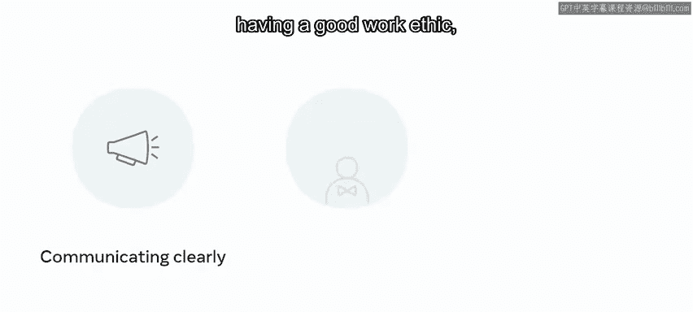
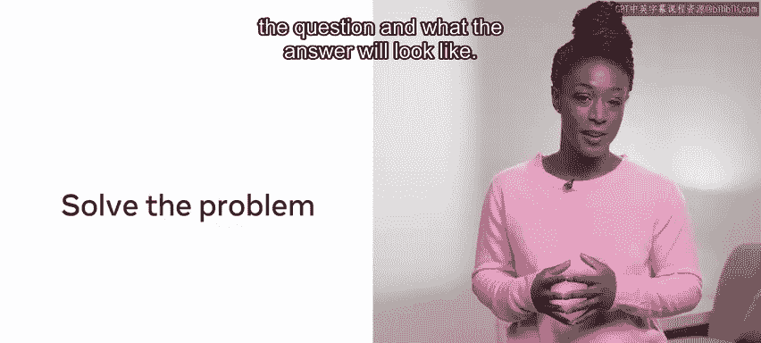
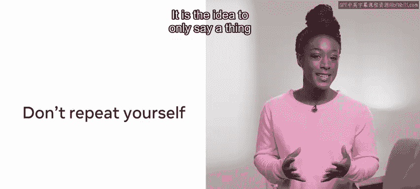
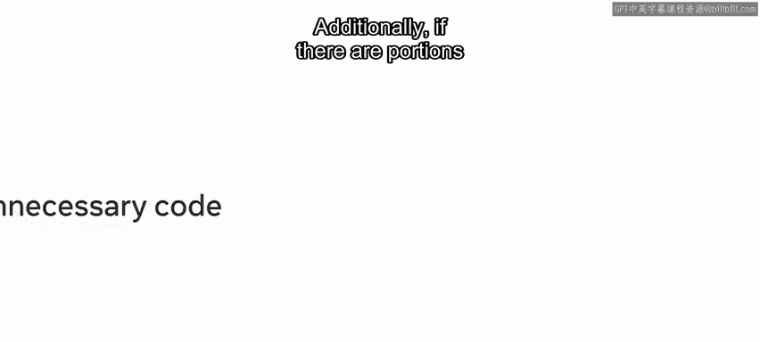
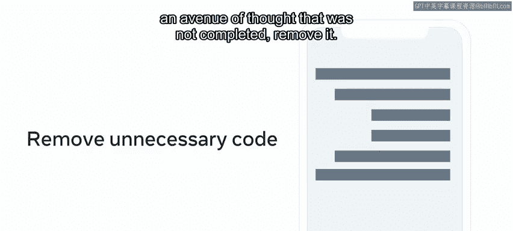
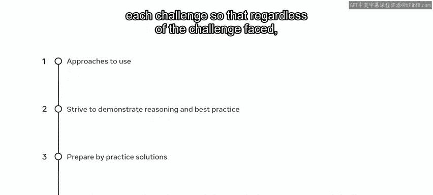

# 138：什么是编码面试 👨‍💻

在本节课中，我们将学习什么是技术面试，并掌握一套系统性的方法来应对编码面试。我们将从理解面试的目的开始，逐步介绍准备和解题的核心步骤，帮助你自信地展示技术能力。

## 概述

技术面试是你展示编码能力的场合。通常，你已经通过了初步的筛选电话面试，证明了你的软技能符合公司要求。软技能关乎你的社交行为能力，包括清晰的沟通、良好的职业道德，以及你的个人表现是否与公司价值观一致。技术面试的目的则是确定你从技术上能否胜任该职位的职责。

在本视频中，你将学习如何应对技术面试。参加编码面试时，牢记以下步骤会对你有所帮助。

## 面试核心步骤

以下是应对编码面试的四个关键步骤。深入理解这些概念将帮助你掌握如何应用这套方法。

### 第一步：充分准备，迎接成功

许多候选人可能会对技术面试感到些许畏惧。如果被问到问题而大脑一片空白怎么办？幸运的是，你可以采取一些步骤来为成功做好准备。未能准备就是在准备失败。

### 第二步：首先进行概念性解题

在实施具体解决方案之前，最好先对问题和答案的样貌有一个清晰的认识。花些时间确保你清楚被问及的内容。面试官不会介意你从一开始就寻求澄清。如果有白板，就使用它。在勾勒潜在解决方案之前，先记下问题的主要要点。

这是一个绝佳的机会，可以在编写任何代码之前，展示你使用伪代码推理问题的能力。展示你推理问题的能力，就等于成功了一半。记住，编码能力是可以被教授的，而解决问题的能力则是备受追捧的才能。在评估问题时，要大声说出你的思考过程，向面试官展示你如何参与问题解决，以及你为什么选择一种方法而非另一种。

如果你能将问题与你已知的问题联系起来，这会是一个很大的帮助。在本课程后面，有一个关于“分而治之”实践的视频。这是运用该策略的好机会。将大问题分解成小问题，有助于解决看似复杂的问题。如果存在额外的时间限制而你超出了允许的时间，你仍然能够展示出功能完整的代码块。

### 第三步：运用合适的工具

编码面试中提出的问题类型需要在面试时间内完成。因此，解决方案本质上不会过于复杂。它们旨在微观层面测试你的问题解决能力，以及你对可用工具的认知。

考虑经典的“数袜子”问题。你得到一个代表袜子颜色的数组：黄色袜子用1表示，蓝色用2，红色用3，绿色用4，橙色用5。袜子颜色对应数字，例如：`[1, 2, 2, 1, 1, 3, 5, 1, 4, 4]`。需要确定存在多少双相同颜色的袜子。

这里有四个1，相当于两双黄袜子。3和5代表单只袜子（一只红袜和一只橙袜），它们没有配对的袜子来组成一双。有两个2和两个4，分别代表一双蓝袜子和一双绿袜子。

为了简洁地解决这个问题，你可以利用合适的数据结构。在本课程后面，你将复习数据结构。有一个视频概述了字典如何存储键值对。一个解决方案是使用袜子颜色作为键，计数作为值，然后遍历字典并检索所有奇数，这表示存在单只袜子。

虽然有很多编程方法可以解决这个问题，但使用现有的结构可以最大限度地减少所需代码，并展示对基础构建模块的熟悉程度。只要可能，尽量利用现有的方法，而不是尝试手动实现解决方案。

除了熟悉常用的数据结构外，在进行任何技术面试之前，请复习常见的排序和搜索算法。

### 第四步：优化你的解决方案

优化代码是一种良好的实践；这意味着编写或重写代码，使程序使用尽可能少的内存或磁盘空间，并最小化CPU时间或网络带宽。编写出解决方案是迈向一个体面解决方案的好一步。确保你留出时间来优化你的代码。

本课程中你将遇到的另一个概念是时间和空间复杂度。你能向面试官展示你理解这些关键概念吗？简单来说，这是一种衡量你的解决方案运行速度和占用空间的方法。

在呈现答案时，概述你的解决方案的时间和空间复杂度，然后看看是否能改进。识别任何重复或重叠的代码，你可以将这些代码模块化为一个可重复调用的函数，并在可能时重用代码。良好编程的一个常被重复的原则是DRY（Don‘t Repeat Yourself）。其思想是在代码中只表达一次，并根据需要尽可能多地重用。此外，如果由于模块化或未完成的思路导致代码的某些部分不再需要，请将其删除。

避免过多的循环调用。如果你在数组中搜索一个值，在找到该项时终止循环。一个非常容易实现的代码优化是，在找到值时包含一个返回语句，或者使用依赖于布尔值的循环。一旦找到结果，循环就可以终止。这提高了整体效率并降低了时间复杂度。

空间复杂度完全是关于巧妙地使用内存。只要可能，避免创建超出需要的变量。

## 总结

在本视频中，你学习了一些无论面对何种挑战都可以使用的方法。即使你不熟悉某个问题，或者在规定时间内没有得出结果，也要始终努力展示你的推理过程和最佳实践方法。

通过在线解答练习题来为技术面试做准备，并在可能的情况下，对每个挑战采用类似的方法论。这样，无论面对何种挑战，你都能在一个熟悉的框架下工作。编码面试可能看起来是一项艰巨的任务，总会涉及未知因素，你对成功的渴望可能会带来一些面试前的紧张。保持冷静，逻辑思考。祝你好运。