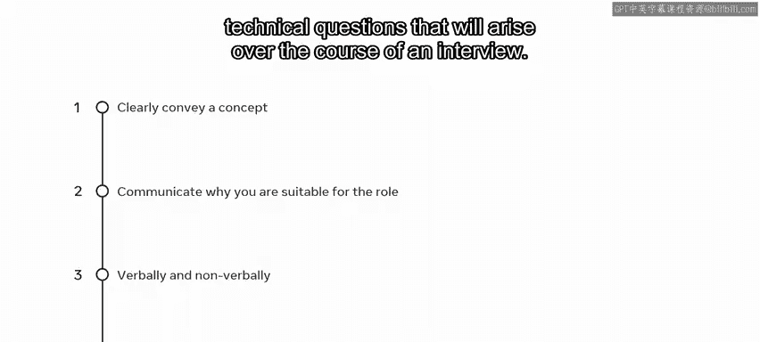

# 139：沟通技巧

在本节课中，我们将学习面试中至关重要的沟通技巧。成功的面试几乎完全取决于你如何与面试官沟通。我们将探讨如何通过语言和非语言方式，有效地展示你与职位的匹配度。

## 第一印象的力量 💡

上一节我们介绍了沟通的重要性，本节中我们来看看如何建立良好的第一印象。永远不要低估第一印象的力量。作为潜在雇员，你与面试官的每一次互动都应反映出你能为组织带来的能力。

以下是建立良好第一印象的几个关键非语言信号：

*   **守时**：最好在预定会议开始前至少10分钟到达，尤其是在你不确定具体面试地点时。寻找地点需要时间，你应该以从容、准备就绪的姿态出现，而不是气喘吁吁、慌乱不安。
*   **眼神交流与倾听**：在面试过程中，确保保持眼神交流，并积极倾听被问到的问题。
*   **着装得体**：通常，工作面试要求穿着专业或商务装。确保衣服干净整洁，这既表示尊重，也为自己树立正面形象。
*   **保持良好姿态**：保持良好的姿势，避免坐立不安、不必要地触摸脸部或绞手。尽管在会议前和会议中感到紧张是可以理解的，但这些手势可能会无意中传达出你感觉无法胜任这项任务的信息。

缓解紧张的一个好方法是在会议前做好充分准备。确保你了解工作的内容、公司的业务及其价值观。

## 语言沟通的艺术 🗣️

上一节我们讨论了非语言沟通，本节中我们来看看同样重要的语言沟通。你需要能够与面试官有效交谈。

在面试中如何表现的一个良好指标是观察面试官。仔细倾听，他们会通过提问来考察你是否符合所需的技能和个性特征。通常，面试官会遵循 **80/20法则**：他们说话占20%的时间，让你展示自己占80%的时间。因此，在回答之前，要让面试官完全把问题引导给你。

以下是进行有效语言沟通的几个要点：

*   **使用清晰简洁的语言**：特别是在做了充分准备的情况下，很容易试图用你所知道的关于某个主题的一切来回答问题。这可能导致回答冗长散漫。更好的回答是紧扣主题，并为后续问题留出机会。一个好的面试官会提出相关后续问题，这能让对话自然流畅。
*   **避免夸大或自我否定**：注意不要使用可能传达对自己负面态度的情绪化词语。例如，与其说“我在那个任务上失败了”，不如说“那个任务很有挑战性，但它为我未来探索的研究领域提供了一些思路”。此外，应避免使用过多的俚语、脏话或不恰当的幽默。

## 运用STAR方法回答问题 ⭐

随着面试的进行，讨论将更多地集中在你的能力和对职位的适合度上。重要的是你要能传达出你为什么是合适的人选。通常，问题会集中在业务需求上，无论是正在使用的技术还是必须克服的问题。面试官想知道你在工作中遇到问题时将如何应对。

因此，尝试使用 **STAR方法** 来回答问题。在回答问题时，包含以下四个要点：**情境**、**任务**、**行动** 和 **结果**。

以下是更清晰地演示该方法的一些示例问题：

*   **情境**：当时的情况背景是什么？是什么项目，面临哪些挑战？
*   **任务**：你的职责和任务是什么？
*   **行动**：你采取了哪些行动来纠正或应对挑战？
*   **结果**：你的行动带来了什么结果或成果？采取这种方法对结果产生了什么影响？

使用这种方法作为回答问题的模板，将使你的回答更有深度。它提供了一个可行的回答框架，也让面试官有机会在你感觉舒适的讨论领域提出更多相关问题。

## 总结与回顾 📝

本节课中我们一起学习了面试沟通的核心要点。面试官会寻找能够清晰传达概念的候选人。你的首要任务是通过语言和非语言方式，沟通你为什么适合这个职位。最后，**STAR方法** 是一个应对面试中可能出现的各种技术性问题的非常高效的框架。

在任何公司的任何职位上，你可能都需要与利益相关者打交道，无论是处理角色中的复杂问题，还是解释为什么某个解决方案是最优路径。因此，请将你学到的关于沟通的知识自信地应用到实践中。