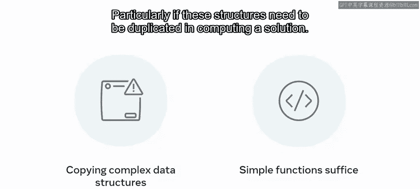

# 144：空间复杂度 📊

在本节课中，我们将学习算法分析中的另一个重要概念——空间复杂度。我们将了解如何衡量算法对内存的使用情况，以及它与时间复杂度的权衡关系。

## 空间复杂度概述

上一节我们介绍了时间复杂度，它衡量算法执行所需的时间。本节中我们来看看另一个评估算法适用性的关键因素——空间复杂度，即一个给定解决方案会占用多少内存。这通常与时间复杂度存在权衡关系。

选择数据结构时，你的优先级（速度或紧凑性）将决定最终的选择。例如，本课程后面将学到的哈希表算法，能在 **O(1)** 时间内提供非常快速的查找。然而，为了高效工作，它必须为存储的每个元素预留查找空间，这导致了 **O(N)** 的空间复杂度。

## 空间复杂度的大O表示法

空间复杂度的大O表示法与时间复杂度的相同，包括 **O(1)**、**O(log N)**、**O(N)** 等。在这些表示法中，**N** 都指输入数据的大小，通常以字节为单位衡量。

不同编程语言有不同的内存开销。例如，在Java中，一个整数需要4字节内存。一个空数组会消耗12字节用于头对象，外加4字节用于填充。因此，如果 **n** 指的是一个大小为4的整数数组，那么总内存需求是32字节。

讨论空间复杂度时，必须考虑输入大小的增加对整体内存使用的影响。

## 空间复杂度的构成

问题的空间复杂度可以分为两个部分：辅助空间和输入空间。

*   **辅助空间** 是解决该问题所需的所有数据占用的空间。它指的是计算给定解决方案时所需的临时空间。
*   **输入空间** 指的是向你正在评估的函数、算法、应用或系统添加数据所需的空间。

空间复杂度等于输入空间加上辅助空间，即计算一个结果所需的总空间。

## 空间复杂度计算示例

还记得我们之前计算一个整数数组空间复杂度的例子吗？我们计算了整数内存（4字节）、头对象（12字节）和填充（4字节），总数为32字节。

现在，考虑数组大小加倍到8个整数。用同样的方式计算空间复杂度，总数将是48字节。空间复杂度变高了。由于增加输入并没有增加辅助空间的大小，所以在计算大O表示法时，如果辅助空间不受输入大小增加的影响，可以忽略它。

## 影响内存使用的常见操作

了解在计算解决方案时所做的每个决策都需要内存，因此值得注意那些会增加内存使用的方面。

以下是可能增加内存使用的一些常见操作：

*   **变量赋值**：计算解决方案时可能会创建临时变量，就像之前长除法的类比一样。
*   **创建新的数据结构**：某些解决方案需要创建一个新数组来容纳值，或者一个保留索引位置的重复数组。创建一个新的数据结构实例会产生 **O(N)** 的辅助内存成本。
*   **函数调用和分配**：函数调用和内存分配也会产生额外的内存开销。

在设计应用程序时，值得牢记空间是如何被使用的。创建一个新变量来容纳一个值，而不是覆盖现有的变量，会影响你的空间效率。

## 空间使用效率的注意事项

如果你不必要地复制数组或具有高数据开销的复杂数据结构，这种影响会大大增加。

此外，在更简单、开销更小的结构就足够的情况下，编写使用复杂结构的函数可能会招致性能损失，特别是在计算解决方案时需要复制这些结构时。

## 总结

本节课中，我们将大O的概念从专注于时间考量扩展到了包含空间复杂度。我们强调了在速度和内存效率之间通常存在的权衡关系。此外，还提出了一些在设计解决方案时值得牢记的空间高效使用建议。