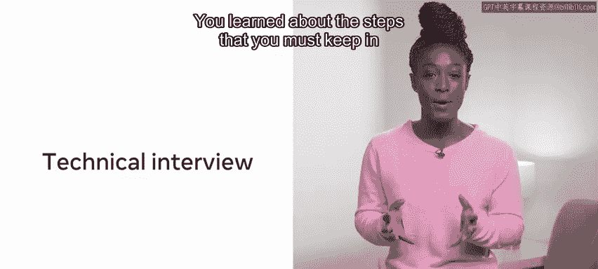
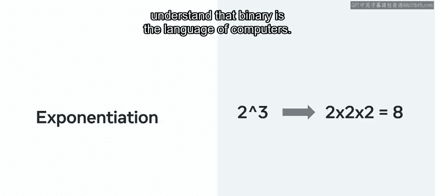
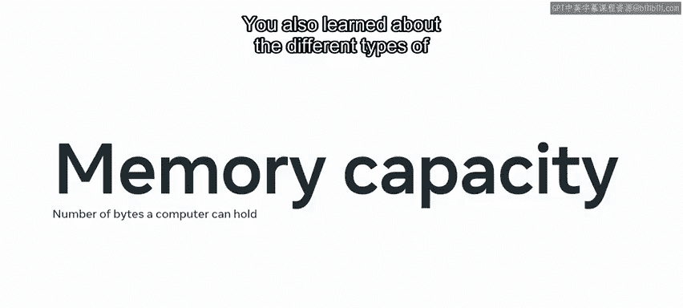
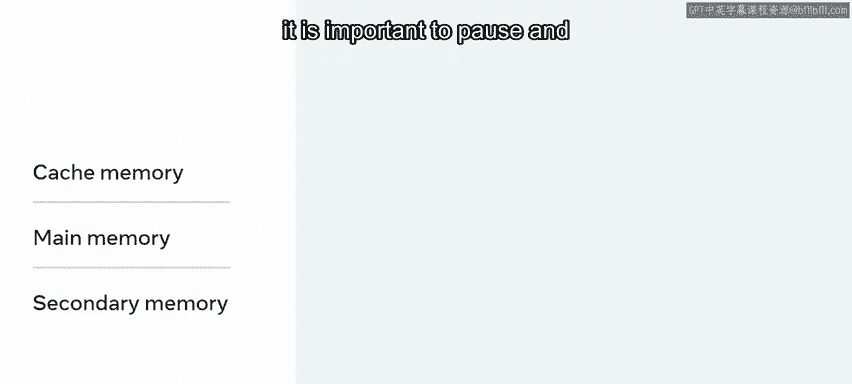
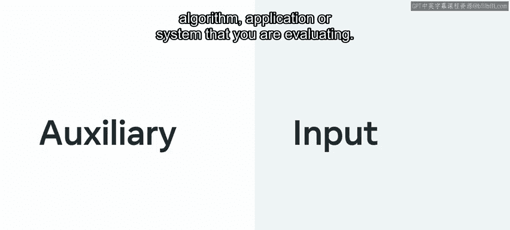

# 145：编码面试简介模块总结 🎯

在本节课中，我们将回顾“编码面试简介”模块的核心内容。我们将总结技术面试准备、沟通技巧、计算机科学基础（如二进制和内存）以及算法效率（时间与空间复杂度）等关键知识点。

## 技术编码面试 💻

上一节我们介绍了课程概述，本节中我们来看看技术编码面试的具体要求。技术面试主要用于评估你是否具备承担职位职责的技术能力。

以下是面试过程中必须牢记的步骤：
*   使用合适的工具始终很重要。
*   必须将时间限制考虑在内。

接着，我们学习了代码优化。你应该能够编写或重写代码，使程序使用尽可能少的内存或磁盘空间，并最小化CPU时间或网络带宽。

总而言之，你学习了一些无论面对何种挑战都可以使用的方法。即使你不熟悉问题或在规定时间内未能得出结果，也应始终努力展示你的推理过程和最佳实践方法。

通过练习解决在线问题来准备技术面试，并在可能的情况下，对每个挑战采用相似的方法论。这将有助于你在未来无论面对何种挑战时，都能在一个熟悉的框架下工作。

## 沟通与第一印象 🗣️

在了解了技术准备后，沟通的重要性同样不容忽视。我们介绍了言语和非言语沟通及其重要性。

你学习了STAR方法，以及如何在面试官沟通时利用它为你带来好处。你现在应该能够分析情境背景、面临的挑战、相关任务的责任、为应对挑战所需的行动，以及最终需要达成的结果。

总而言之，你现在应该能够在面试中清晰地传达一个概念。
*   以言语和非言语的方式沟通你为何适合该职位。
*   最后，使用STAR方法来应对面试过程中将出现的各种技术问题。

## 计算机科学基础：二进制与内存 💾

接下来，我们进入了计算机科学基础的学习。我们从二进制开始，了解了十进制（base 10）和二进制（base 2）的区别。

然后我们发现了**位置记数法**。这是利用数字的位置来表示数值的递增。

接着，我们介绍了计算机如何将数据存储为字节，以及每个字节由8个比特（bit）组成，每个比特可以是1或0。我们也给出了一些例子。你研究了**指数运算**的概念，即计算一个数的幂。

随后用了一个不同位数密码锁的例子来解释这个概念。你现在应该能够应用这些知识，并理解二进制是计算机的语言。

接下来，我们探讨了内存。你学到的第一个概念是**内存容量**，它指的是计算机可以容纳的字节数。你还学习了需要考虑的不同类型的内存，即**缓存内存**、**主内存**和**辅助内存**。

你现在应该知道，为了更好地理解内存的各个层级，停下来思考计算机的工作原理很重要。你学习了**传输速率**，即计算机将内存传输到缓存中进行处理的速度。

然后我们探讨了缓存和辅助内存，你应该能够描述它们之间的区别。接着，我们介绍了计算机主内存由**随机存取存储器（RAM）**和**只读存储器（ROM）**组成的概念。你应该能够描述主内存的作用，并区分RAM和ROM。你现在应该能更好地处理内存相关的问题了。

## 算法效率：时间与空间复杂度 ⚙️

在掌握了计算机基础后，我们转向评估代码性能。我们探索了**时间复杂度**，学习了如何通过完成任务所需的时间来评估时间效率或衡量性能。

我们发现了**大O表示法**，这是一种用于确定算法效率的度量标准。因此，它可以估算你的代码在不同输入集上运行所需的时间，或者说它考虑了算法将花费的时间量。

我们给出了一些例子，你现在应该对如何衡量时间复杂度有了扎实的理解。

接着，我们学习了**空间复杂度**。重要的不仅仅是算法的速度，还有给定解决方案需要占用多少内存。为了理解空间复杂度，我们引入了**辅助空间**的概念，即保存解决方案所需的所有数据所需的空间，也称为计算给定解决方案所需的临时空间。

另一个概念是**输入空间**，它指的是向你所评估的函数、算法、应用程序或系统添加数据所需的空间。

总而言之，**空间复杂度 = 输入空间 + 辅助空间**；这就是计算结果所需的空间。

## 总结 📝

本节课中我们一起学习了“编码面试简介”模块的全部内容。你对上述所有主题都进行了一些测验，这是你本课程学习之旅的良好开端。所有这些内容都将使你在未来的编码面试中表现出色。