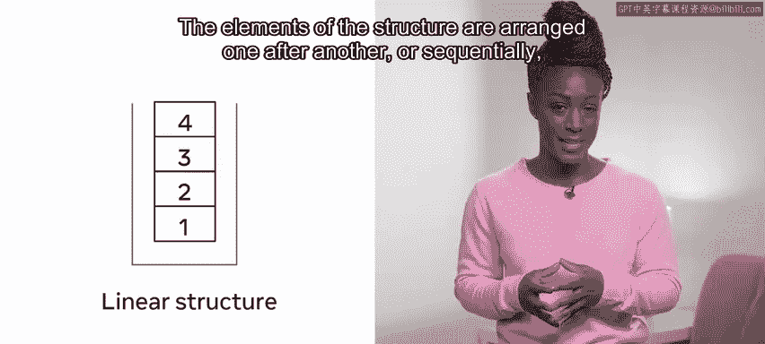
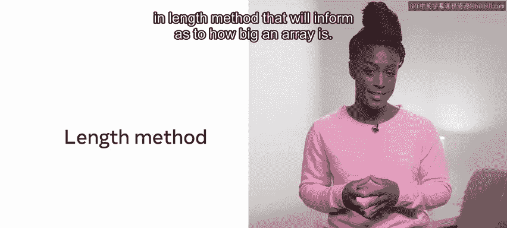
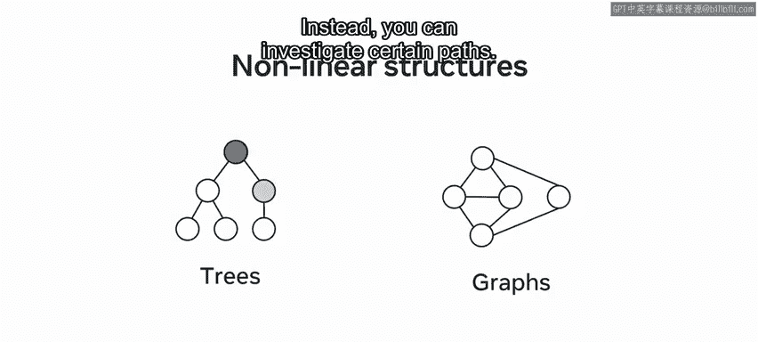

# 146：基本数据结构 📚

在本节课中，我们将要学习数据结构的基础知识。数据结构是组织和存储数据的方式，对于任何编码面试和实际应用开发都至关重要。我们将了解数据结构的基本概念、主要类型以及在实际应用中选择合适结构时需要考虑的因素。

## 数据结构简介

数据结构是对现实世界中对象的建模，以便于在计算机内存中存储和组织。理解你正在处理的数据以及最适合使用的数据结构，会带来非常大的好处。

数据结构可以是简单的、创建后不再改变的**不可变结构**，也可以是便于对其内容执行操作的**可变结构**。这些操作可能包括对结构内容的更新和查询。

## 可变与不可变结构

表面上看，似乎应该始终使用可变结构。然而，可变结构需要时间和精力来建模，并且有些对象非常复杂，不易建模。其他因素，例如空间占用，也可能是一个考虑因素。

理解数据结构的底层机制是一个巨大的优势，因为使用特定数据结构的决定可能会对项目进展产生深远的影响。

## 数据结构的分类

虽然数据结构的实现和功能可能因编程语言而异，但总体架构通常遵循相似的模式。

以下是数据结构的通用分类，将不同类型的数据结构分为两个主要分支：**线性**和**非线性**。这关系到元素在数据结构中的存储方式。

### 线性结构

线性结构与信息的存储方式有关。结构的元素一个接一个地排列，或者说**顺序**排列，反映了它们被输入的顺序。

以下是线性结构的例子：
*   **数组**
*   **队列**
*   **栈**
*   **列表**

线性结构意味着每个元素都连接到它前面的元素。有些语言要求在同一结构中只能存储相似类型的数据，因此会有整数数组或字符串数组。其他语言则允许混合数组，这意味着在同一数组中存储整数和字符串并不被禁止。但这种简便的方法可能会在后续的错误处理中付出代价。

一旦创建了简单的结构（如列表或数组），它将包含一个**索引**。索引是一种访问元素的方式，这些元素不一定是第一个或最后一个实例。通常，索引的使用是通过附加方括号和项目的位置（整数）来完成的。

例如，`array[4]` 表示所需的元素是数组的第四项。然而，编程语言主要是**0基**的，这意味着计数从0开始。因此，`array[4]` 实际上是数组中的第五项。

如果请求索引位置8，但数组中只有7个元素，则通过索引访问数组可能会引发错误。这些结构的一个常见特性是，大多数语言都有一个内置的 `length` 方法，可以告知数组有多大。

### 数组与列表的特性

数组和列表通常是**一等对象**。这意味着所有可用于其他变量的功能也可用于它们。这个定义通常表明数据结构可以作为参数传递给函数、作为结果返回或赋值给变量。

将列表或数组传递给函数时，应注意传递的是结构本身，而不仅仅是结构的**引用**。这可以作为一种节省内存的机制，用于防止复制信息。然而，如果对结构的更改无意中影响了调用环境中的数组，这种情况可能会导致错误。

在这个例子中，一个字符串被添加到了一个整数列表中，因为新列表指向初始列表，所以初始列表也被更改了。因此，最好制作数组的副本，并将副本传递给函数。

另一个需要注意的内存相关问题是**内存泄漏**。如前所述，内存可以被任意分配。如果这块内存不再使用，那么良好的做法是释放该内存位置。由于粗心的编程或其他问题，程序可能会重复调用，导致分配了过多的内存而没有随后释放。随着时间的推移或通过重复调用，这可能导致应用程序内存耗尽并崩溃。大多数编译器都有复杂的算法来检测和释放内存，以避免此问题。

## 非线性结构

上一节我们介绍了线性结构，本节中我们来看看非线性结构。与线性结构相反，存在非线性实例，例如**树**或**图**。这些结构不允许你一次性平滑地遍历所有数据。相反，你可以探索特定的路径。这些结构的构成意味着它们可以包含自然排序，这使得查询特定数据非常快速。

你将在课程后面学习不同类型的排序。

## 总结

本节课中我们一起学习了数据结构。在本视频中，你对数据结构有了一个概括性的了解，包括它们的两种主要类型：线性和非线性。你还学习了在决定应使用的数据结构类型时应考虑的一些因素。随着你在这个模块中的深入学习，你将进一步探索这些结构，并了解它们各自的优点和缺点。