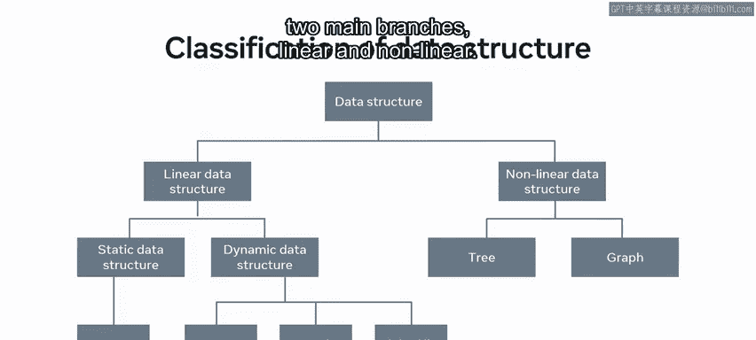
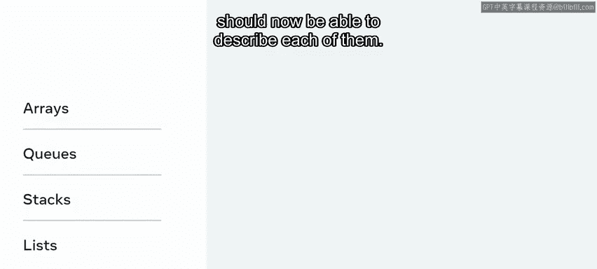
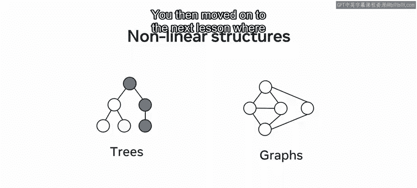
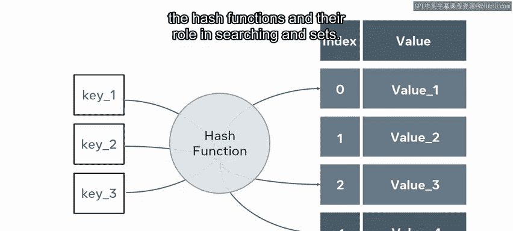
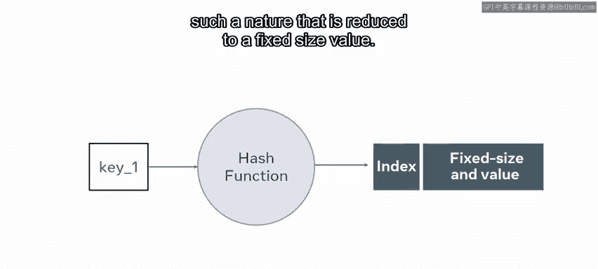
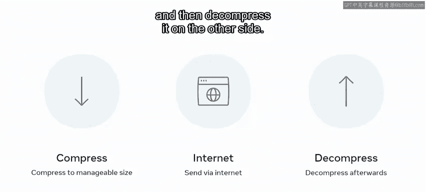
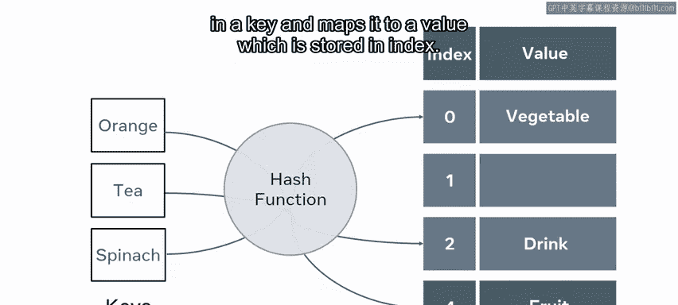
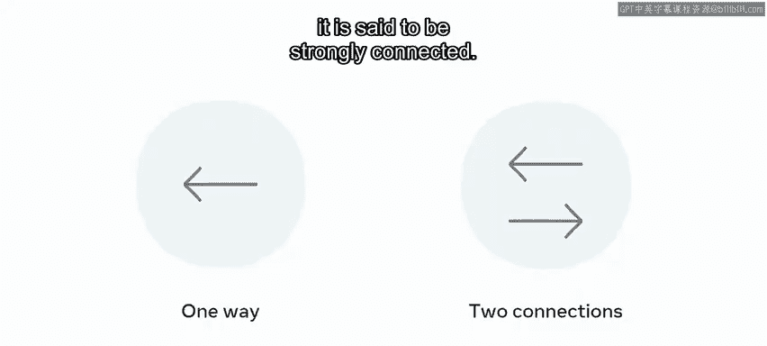

# 153：模块总结 🎯

在本模块中，我们学习了数据结构的基础知识。从简单的字符串、布尔值到复杂的集合、图与堆，我们探讨了如何根据数据特性选择最合适的结构。理解数据结构是高效编程和问题解决的关键。

## 模块回顾 📚

上一节我们完成了数据结构入门模块的学习。本节中，我们来回顾一下本模块涵盖的核心内容。

你从一节关于基础数据结构的课程开始本模块。课程范围从字符串、布尔值或数组等基础结构，延伸到集合、图和堆等更高级的数据结构。理解你正在处理的数据以及最适合使用的结构非常有益。


你学习了简单的**不可变结构**（创建后不改变）和**可变结构**（便于对其内容执行操作）。




## 数据结构分类 🔍

接着，你深入研究了所有类型的数据结构以刷新记忆。以下是数据结构的通用分类，将不同类型分为两个主要分支：**线性**和**非线性**。




以下是线性结构的例子：
*   数组
*   队列
*   栈
*   列表

线性结构意味着每个元素都与其前一个元素相连。你详细学习了这些结构，现在应该能够描述它们中的每一个。




## 非线性结构 🌳

然后，你开始关注非线性数据结构。与线性结构相反，非线性结构的例子有树或图。这些结构不允许你以单一流畅的动作遍历数据，而是可以探索特定的路径。

接着，你进入了下一课，介绍了列表和集合。


你了解到，与数组类似，在某些编程语言中，列表通常被声明为字符串、整数或浮点数类型，而在另一些语言中，列表可以包含混合元素类型。你还了解到，有些语言要求你最初确定结构的大小，而另一些语言则允许动态增长的结构。


## 链表与集合 🔗



随后是关于链表及其工作原理的部分。记住，链表包含两条信息：**数据**和**指向下一个列表项的指针**。

```python
# 链表节点示例
class Node:
    def __init__(self, data):
        self.data = data
        self.next = None
```


接着，你学习了集合及其工作原理。集合与列表非常相似，但集合会以**无序**的方式存储其元素。


在集合之后，你了解了哈希函数及其在集合搜索中的作用。集合的搜索速度异常快。


## 栈与队列 📚

然后，你在同一课中进入了下一个关于栈和队列的视频。为了刷新记忆，栈和队列是抽象数据结构，根据编程语言有许多不同的实现。两者共有的独特原则是元素的添加和移除方式。

你学习了栈和队列采用**顺序访问**，并使用空栈、压入和弹出方法来移动和/或添加和移除项。你还了解了**后进先出**和**先进先出**原则。


> **LIFO**：Last In, First Out（后进先出）
> **FIFO**：First In, First Out（先进先出）

当你学习队列时，你了解到队列与栈非常相似，因为它往往具有相同的方法：创建、插入、移除和检查队列状态。与栈不同，队列基于**先进先出**的原则工作。同样，名称很好地指示了结构的工作原理。

## 树结构 🌲

本课的最后一个视频重点介绍了树。树是一种强大的数据结构，为添加和搜索值提供了极大的灵活性。树的固有结构可以让你理解存储数据之间的大量关系，这在从数据中提取信息时可以节省大量时间和代码。




你学习了树结构以及数据如何在树中移动。

## 高级数据结构 ⚙️



在下一课中，你被介绍了高级数据结构。首先，你学习了哈希表是什么、它的结构和固有特性以及它如何工作。你还探讨了使用哈希表的一些优点，并发现了哈希中“冲突”的含义。

让我们快速回顾一下这涉及的内容。你被介绍了哈希函数，并了解到获取键，并以将其减少为固定大小值的方式对其应用哈希函数。




你通过我们经验领域的一个例子学习了压缩。当你想通过互联网发送信息时，你可能首先将其大小压缩到可管理的字节数，通过互联网发送，然后在另一端解压缩。


随后解释了哈希表如何通过使用索引提供存储和搜索数据的替代方法。为了实现这一点，你必须实现一种算法，该算法接收一个键并将其映射到存储在索引中的值。


## 堆结构 📊

本课的下一个视频重点介绍了堆的结构和特性。你还发现了堆如何用于将元素从最不重要组织到最重要，以及如何通过限制堆的功能来提高生产力。

你了解到，堆可以优先处理值最小的键，然后称为**最小堆**；而将优先级放在最大值上的堆称为**最大堆**。堆可以执行一些选定的核心操作，即插入、查找和删除项。

随后，你了解到删除树中的项需要重新构建树，这会导致性能下降。总结关于堆的视频，你对堆以及如何使用它们将元素从最不重要组织到最重要有了更深入的理解。你已经了解到，通过限制功能，可以提高生产力。

与选择任何数据结构一样，重要的是为正确的工作找到合适的工具。

## 图结构 🗺️

最后，你重点学习了图，并设定了如下场景。在考虑计算机科学中的给定问题时，始终重要的是考虑解决你的问题可能需要什么执行，并通过这种反思选择适当的数据结构来保存你的数据。

假设你可能为一家大型互联网公司工作，该公司希望存储位置目录及其相互之间的连接性。使用了一个城市相对位置图来说明所有权重图、无向图等概念，并且与有向图相反，无向图没有优先顺序。

之后，你了解到，如果边只是单向的，则有向图中的连接被认为是**弱连接**。然而，如果两个节点之间有双向的两个连接，则称其为**强连接**。




## 总结 🏁

在本视频中，你学习了本模块涵盖的关键概念和主题。你已经对所有提到的主题进行了一些测验。你正为未来做好更充分的准备。祝你在下一个模块中好运。