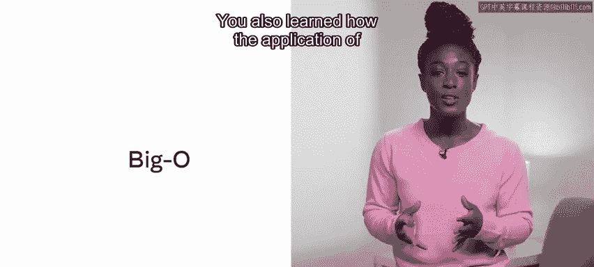

# 155：搜索算法

在本节课中，我们将要学习计算机科学中的两种基础搜索算法：线性搜索和二分搜索。我们将了解它们的工作原理、实现步骤以及如何用大O表示法分析其效率。

## 概述

上一节我们介绍了排序算法，本节中我们来看看如何在一个已排序或未排序的数据集中查找特定元素。搜索是数据处理中的一项基本操作，理解不同的搜索方法及其适用场景至关重要。

## 什么是搜索？

在计算机科学中，当面对一个数据集合时，经常需要识别其中的特定元素。然而，对“特定元素”的定义可能存在不同的解读。

例如，给定一个哈希表，你可能需要查找是否存在一个键值对与给定的键匹配。这是一个简单的、一对一的比较操作，结果要么是返回唯一的键，要么是表示键不存在。

进行搜索时，还需要考虑一些其他情况，例如在数组中查找最大值、最小值或中位数。如果查找的值不存在，应该返回什么？返回一个空值可能会影响应用程序的后续运行能力。

因此，设计搜索时需要考虑：当没有返回值时应设置哪些安全措施？搜索是应该返回该值的第一个实例还是最后一个实例？

在本课末尾的补充阅读材料中，有一个链接指向空值发明者托尼·霍尔的一次演讲，他称空值为自己“价值十亿美元的错误”。

## 线性搜索

最简单的搜索实现是线性搜索。如果你有一个元素数组，线性搜索从索引起点开始，逐个遍历数组，直到找到目标元素或检查完所有元素。

在这种方法中，最好的情况是**O(1)**（目标元素正好在第一个位置），最坏的情况是**O(n)**（目标元素在最后一个位置或不存在，需要检查每个元素）。

以下是线性搜索的伪代码示例：

```
function linearSearch(array, target):
    for i from 0 to length(array)-1:
        if array[i] == target:
            return i  // 找到目标，返回索引
    return -1         // 未找到目标
```

## 二分搜索

与数据结构相关，有些数据结构本身具有排序特性，例如堆或二叉树。你也可以对任何数据结构先应用排序算法，然后再应用搜索方法。

二分搜索在每次迭代中都会将搜索空间减半。假设有一个已排序的数据列表，二分搜索首先检查中间点，判断中间元素是大于还是小于目标元素。

如果中间元素小于目标值，则丢弃列表的左半部分，将右半部分作为新的搜索焦点。现在，只在列表的右半部分查询中间值。如果它仍然小于目标元素，则再次丢弃左半部分，检查过滤后列表的右半部分。通过这种方式，算法在每次迭代中都将搜索空间减半。

这种方法比线性搜索更快，但要求在开始搜索之前数据必须已排序。虽然这个要求看起来可能不太合理，但如果你的数据读取频率远高于更新频率，那么这种解决方案可能是合适的实现。

与之前介绍的线性搜索一样，这种方法最好的可能结果是第一次就找到元素，即**O(1)**。然而，最坏的情况则不那么乐观。第一次搜索后，列表被减半。如果这次迭代不成功，它再次被减半。第三次分割后，再次减半，依此类推。因此，可以说经过k次迭代后，剩余大小为 **N / 2^k**。换句话说，时间复杂度为 **O(log n)**。

这比线性方法要高效得多。但是，需要记住的是，任何感知到的时间增益都需要与排序列表所花费的时间进行权衡。如果列表经常更新，排序可能成为一个代价高昂的过程。

以下是二分搜索的伪代码示例（假设数组已升序排序）：

```
function binarySearch(array, target):
    left = 0
    right = length(array) - 1
    while left <= right:
        middle = floor((left + right) / 2)
        if array[middle] == target:
            return middle          // 找到目标，返回索引
        else if array[middle] < target:
            left = middle + 1      // 目标在右半部分
        else:
            right = middle - 1     // 目标在左半部分
    return -1                      // 未找到目标
```

## 总结

本节课中我们一起学习了线性和二分搜索算法。我们了解了完成这些搜索的步骤及其工作原理，也学习了如何应用大O表示法来估算两者的效率。我们还认识到，通过对标准方法进行一些巧妙的调整，可以显著提高性能。




在下一课中，你将开始学习如何使用算法。