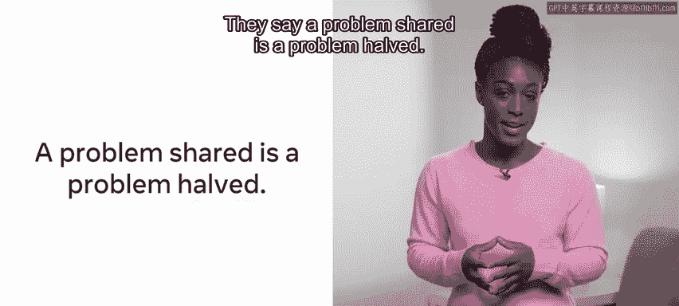

# 156：分治算法范式

## 概述

在本节课中，我们将要学习“分治”算法范式。分治范式为解决特定问题提供了一个有用的思考框架。它包含了本模块中讨论的两个核心原则：递归和将问题分解为更小的问题。我们将了解分治范式如何运作，其涉及的必需与可选步骤，以及它为计算机带来的优势。

## 分治算法如何工作？

分治算法包含两个必需步骤和一个可选步骤，即“分”、“治”和可选的“合”。

在“分”的步骤中，输入被分割成更小的部分并单独处理。

在“治”的步骤中，与每个小部分相关的任务被逐一解决。

可选的最后一步“合”，则是将所有已解决的部分组合起来。这一步并非在所有情况下都会发生，但在我们提供的例子中会出现。

## 分治范式示例：归并排序

上一节我们介绍了分治算法的基本步骤，本节中我们来看看一个具体的应用实例。在讨论排序方法时，我们知道解决问题有多种方式。以排序为例，我们可以讨论另一种能够使用分治方法解决的排序方法。

归并排序是一种对数组进行排序的复杂方法。它首先将数组对半分开，然后将这两个半部分再次对半分，并持续重复这个过程，直到只剩下一个元素为止。接着，这个过程逆转，每个较小的列表在重新合并回其被分开的部分之前，先被排序。

这个解决方案基于一个理念：通过将问题分解为更小的问题，更容易完成整体任务。

为了更直观地理解分治如何应用于归并排序，让我们探讨一个现实世界的例子。

## 现实世界类比

假设你和三位室友决定一起购物。在列出一个长长的购物清单后，你们一同前往超市。

一种解决方案可能是大家一起在超市里走动，从清单上逐一拿取物品。

一个更好的方法可能是将清单分成四部分，每人负责一部分。这将减少在商店里的总耗时。

尽管这可能导致部分物品重复拿取，但任务的进一步优化可能是先对清单进行排序，使所有相似物品归类在一起。例如，所有饮料、所有水果、所有肉类等等，然后为每位成员分配超市的一个特定区域。这将是一种更高效的任务完成方式。

俗话说，问题分担，困难减半。那么这在计算机上是如何运作的呢？

## 分治在计算机上的优势

分治方法为计算机带来了两个直接的优势：并行化和内存管理。

并行化是指让不同的线程或计算机同时处理同一个问题，以更快地完成它。采用分治解决方案的一个好处是，你可以在编码时运用并行化。

现在，让我们探讨内存管理。以归并排序为例，可以考虑将每个数组发送到不同的核心或服务器进行处理（具体取决于你所在组织的架构），然后再返回结果。

有时，要处理的数据可能太大，无法全部装入内存，必须分块处理。此外，管理者可能提供了云计算资源的访问权限，因此解决方案可以涉及访问在线服务器，并将部分问题从公司服务器上分流出去处理。

所有这些都有助于管理你可用的内存资源。

## 总结

本节课中，我们通过归并排序的例子介绍了分治范式，以及它如何为解决问题提供一个框架。我们还学习了与之相关的一些术语，以及这种方法如何适用于现实世界的计算机优化方案。我们也了解了分治范式涉及的必需和可选步骤，以及这种范式为计算机带来的优势。