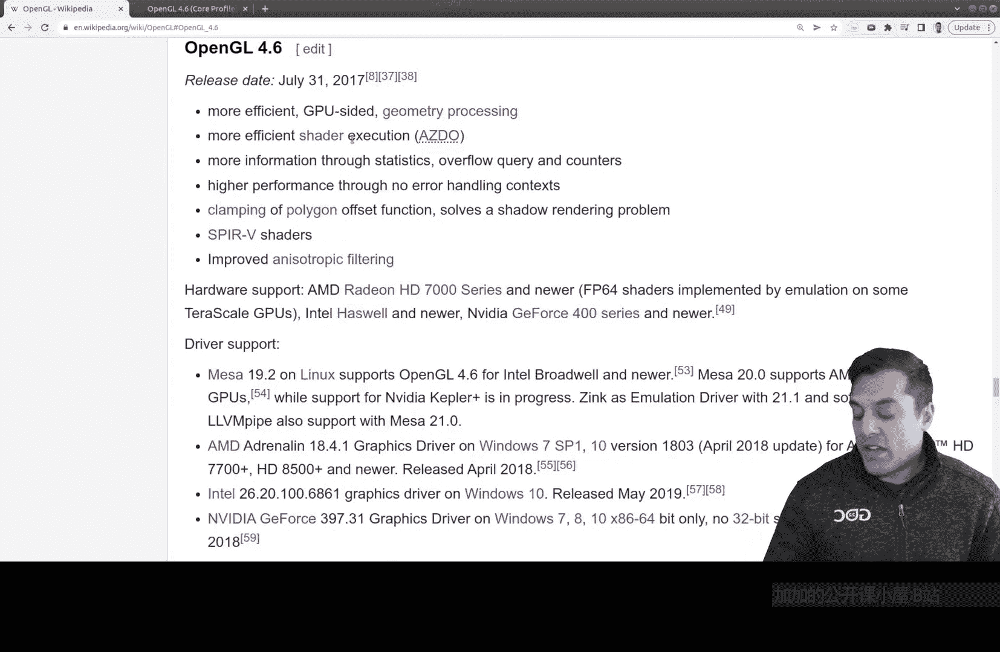

# 002：什么是OpenGL（规范与历史）

在本节课中，我们将要学习OpenGL究竟是什么。我们将了解OpenGL的核心定义——它是一份规范，并简要回顾其发展历史。理解这些背景知识，将为我们后续的实际编程学习打下坚实的基础。

## 什么是OpenGL规范？

上一节我们介绍了课程概述，本节中我们来看看OpenGL的本质。OpenGL并非一个简单的库，其核心是一份详细的**规范**。

如果你搜索“OpenGL specification”，会找到一份长达数百页的官方文档（例如OpenGL 4.6规范约有850页）。这份文档定义了OpenGL API应该如何工作，包括所有可用的函数、参数和行为。

以下是关于这份规范你需要了解的几个要点：

*   **程序员视角**：对于我们程序员而言，OpenGL是一系列图形命令（即函数）的集合。它是一个基于C语言的API，允许我们与GPU交互，将数据发送到GPU并命令其进行高速渲染。其核心优势在于利用GPU进行并行计算，速度远超CPU。公式可以简单理解为：**渲染速度 (GPU) >> 渲染速度 (CPU)**。
*   **实现者视角**：对于硬件厂商或驱动开发者来说，这份规范是他们必须遵循的蓝图。来自不同公司和大学的专家共同制定了这套标准，然后各家厂商根据此标准，确保自己的硬件和驱动程序能够支持规范中定义的所有功能。

简而言之，OpenGL规范是一个标准接口定义，而各家厂商（如NVIDIA、AMD）提供的驱动和库，才是这个规范的具体实现。

## OpenGL的历史与发展

了解了OpenGL是一份规范之后，我们来看看它的历史脉络，这有助于理解其在图形学中的地位。

OpenGL最初发布于1992年6月30日，是一个非常成熟且历史悠久的API。尽管近年来更新速度放缓（例如4.6版本于2017年发布），但它依然被广泛用于商业应用和教学中，并将在未来一段时间内继续得到支持。

学习OpenGL至今仍有重要价值，原因如下：

*   **优秀的学习起点**：OpenGL抽象层次适中，能够帮助我们理解现代图形编程的核心概念（如着色器、管线），而无需过早陷入底层细节。
*   **承上启下**：理解OpenGL后，更容易过渡到Vulkan等更现代、更底层的API。
*   **生态稳定**：它拥有丰富的学习资源、稳定的驱动支持和跨平台特性。

如果你想深入了解其完整历史，包括与其他API的竞争（如DirectX），维基百科的OpenGL页面提供了非常详细的资料。

## 总结

本节课中我们一起学习了OpenGL的基础定义与发展历程。我们明确了OpenGL的核心是一份由行业共同维护的**规范**，而非某个特定的库。从程序员角度看，它提供了一套用于与GPU通信、实现高效图形渲染的函数接口。尽管历史悠久，OpenGL因其教育意义和稳定性，仍然是进入图形编程世界的绝佳起点。

在接下来的课程中，我们将开始接触代码，逐步探索如何使用这套强大的工具。