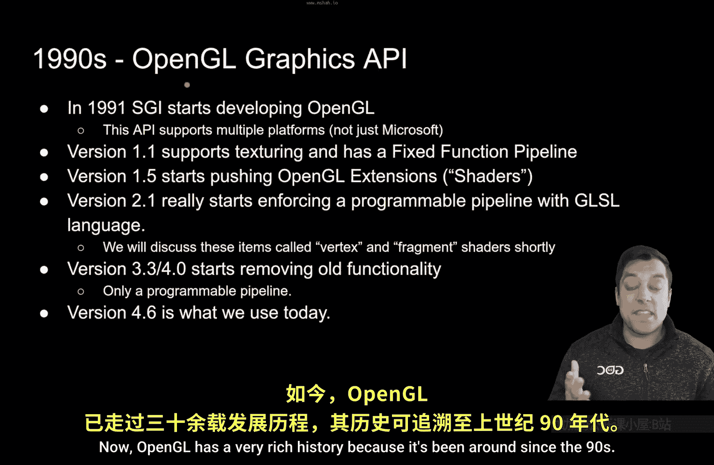

# 003：OpenGL简史与现代OpenGL 🚀

在本节课中，我们将继续学习OpenGL的历史，以帮助你理解我们是如何发展到现代OpenGL的。了解这段历史对于成为一名图形程序员至关重要。

## 起源与多平台特性

上一节我们介绍了OpenGL的诞生背景，本节中我们来看看它的早期发展。OpenGL拥有非常丰富的历史，因为它自20世纪90年代就已存在。大约在1991年，一家名为SGI的公司开始开发OpenGL。

OpenGL最初真正的关键或杀手级特性是它可以在多个平台上运行。这意味着Windows、Linux、Mac机器、游戏机等，OpenGL都能在其上运行。时至今日，这仍然是学习OpenGL和本系列课程的关键原因之一。

## 功能演进与扩展机制

随着OpenGL的发展，其功能不断增强。在1.1和1.2版本期间，开始添加诸如纹理等新功能，这使得我们的图形应用程序变得更加有趣。如果你长期关注电子游戏，你可能会看到这种演变：随着图形API的改进，游戏及其图形效果也随着硬件等的进步而变得更好。

但其中一个重大的飞跃是在大约1.5版本，OpenGL开始支持扩展。这是我们开始接触着色器等概念的起点。基本上，一个名为架构审查委员会的机构允许公司根据其硬件提交扩展，从而能够用OpenGL实现更酷的效果。

## 可编程管线的革命

现在，OpenGL开始变得真正有趣并进入现代阶段是在大约2.1版本，我们获得了一种称为**可编程管线**的东西。这意味着我们作为程序员，实际上可以编写在显卡上编译和执行的程序。

以下是其核心变化：
*   **CPU**：你习惯在其上编译和运行程序。
*   **GPU**：现在也可以编译和运行程序。

这赋予了我们程序员创造出色图形效果的能力，并将大量工作从CPU卸载到GPU上，让GPU处理它更擅长的事情。这就是你在2.1版本左右看到的图形技术飞跃。

## 现代OpenGL：3.3版本及更高

正如我们将在本系列中做的，我们将使用3.3及更高版本。这确实是OpenGL的现代版本，因为我们开始移除一些自90年代以来就存在的旧功能，这些功能涉及我们无法更改或无法真正编程的**固定功能管线**。这就是我们在本系列课程中将要学习的内容，一直到4.6版本。

现代OpenGL引入了许多强大功能，以下是部分关键特性：
*   **计算着色器**：用于通用目的计算。
*   **几何着色器**：用于生成新的几何图形。
*   **曲面细分着色器**：用于添加更多细节。

这些都是过去几年添加到OpenGL中的新功能。因此，OpenGL确实拥有强大的能力，并且作为一个API，它正在为我们程序员持续演进，变得越来越好。

## 总结

本节课中我们一起学习了OpenGL从起源到现代的发展简史。我们了解到OpenGL拥有丰富的历史，并且作为一个持续演进的API，其核心优势在于跨平台能力和强大的可编程性。如果你今天学习OpenGL，应该将重点放在现代版本上。

希望你喜欢这节课，并对OpenGL的文化和历史有了一点了解。我们下节课再见。

