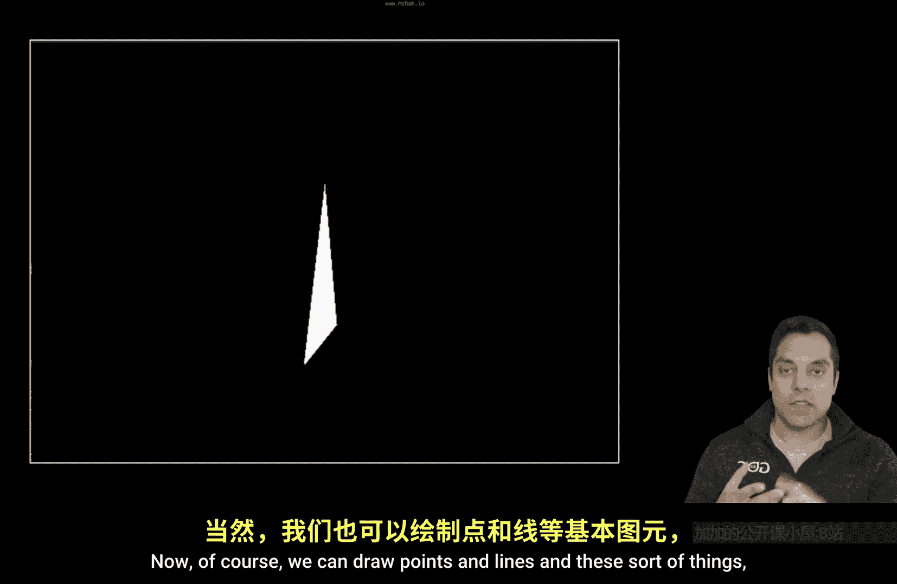
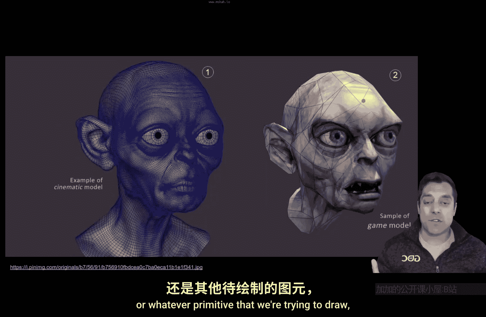

# 004：可编程图形管线（面试题）🎮

在本节课中，我们将学习计算机图形学中一个极其重要的概念——**图形渲染管线**。我们将以OpenGL为例进行讲解，但其中原理同样适用于其他图形API。理解图形管线至关重要，它不仅为我们后续学习OpenGL绘制模型奠定基础，也是面试中经常被问及的问题。掌握了它，你就能清晰地解释图形是如何一步步被绘制到屏幕上的。

## 从三角形到复杂模型 🎨

在计算机图形学中，我们通常通过渲染**三角形**来表示几何形状。当然，我们也可以绘制点和线，但三角形是最常用且最有趣的图元。



例如，使用足够多的三角形，我们可以近似表示任何形状，比如这只兔子。


使用更多的三角形，我们可以获得更精确的模型细节。例如，你可能会认出这是《指环王》中的角色咕噜。你可以看到构成这个角色模型的众多三角形，以及覆盖其上的纹理（我们后续会讨论纹理）。




左侧模型使用了更多几何体（三角形），因此边缘更平滑，细节更丰富。那么，我们如何将这类模型渲染到屏幕上呢？这个过程，即渲染每一个三角形或其他图元，正是通过**图形渲染管线**来完成的。


## 图形渲染管线概览 🔄

让我们来看一下图形管线。下图展示了来自Khronos OpenGL Wiki的渲染管线流程。


本节课的重点就是讲解这个流程图，以便我们理解图形绘制的每一步发生了什么。首先，让我简要总结一下什么是图形渲染管线。

**图形渲染管线**描述了**图元**（例如一个顶点、一条线或一个三角形，还有其他图元）从**3D数据**到最终显示在**2D屏幕**上的完整旅程。请记住，我们正在观看的屏幕是一个2D平面。

这个过程的起点是我们在程序中创建一些顶点数据。例如，我们可能有一个表示点的结构体：

```cpp
struct Point3D {
    float x, y, z;
};
```

我们可以创建一个点：`Point3D p = {1.0f, 0.0f, -5.0f};`。这将在我们的场景中定义一个三维空间点。

但当我们有一个包含X、Y、Z轴的3D坐标系时，这个点如何被投影到我们的2D屏幕上呢？如果我们连接多个点形成一个立方体，又该如何确保这个3D形状能正确投影到2D显示器上呢？

接下来，我们将沿着管线流程，一步步解答这些问题。

## 管线步骤详解 🛠️

### 1. 顶点指定 (Vertex Specification)

正如我们刚才所做的，**顶点指定**就是我们在CPU上设置几何数据。可以想象为：3D艺术家在Blender等软件中创建模型，然后你的CPU程序加载、解析这些数据，最终得到所有顶点信息以及它们的连接方式。

**顶点指定**即：在CPU上设置几何体数据。

### 2. 顶点着色器 (Vertex Shader) ⚙️

现在进入管线的下一部分：**顶点着色器**。“着色器”是现代OpenGL管线中的新术语，你会看到它出现多次。有趣的是，图中有些框是绿色的，有些是蓝色的，这暗示着管线中不同部分的行为可能不同。

让我们来定义一下**着色器**：
*   **着色器**是管线中**可编程**的部分。
*   这是**现代OpenGL**的一个特性，即我们可以在GPU上编写程序来控制图形管线的行为。

在过去，我们只能向GPU发送数据并切换一些固定功能。而现在，作为程序员，我们有责任编写代码来控制从第一步输入的几何体的行为。

顶点着色器的任务相对简单，但它是必需的：
*   顶点着色器在**每个顶点**上执行一次。
*   它的工作是**定位**该顶点。

例如，如果我们有一个点，这个特殊的GPU程序就会在那个点上运行一次。如果我们有一千个点，它就会运行一千次，分别定位每个顶点。

### 3. 曲面细分着色器 (Tessellation Shader) 📐

在顶点着色器定位空间中的点之后，我们可以通过**曲面细分着色器**做更多有趣的事情，比如增加几何细节。


例如，如果我有一个由两个三角形组成的四边形，我可以使用曲面细分着色器进一步细分它，从而在场景中获得更多细节。回顾之前的咕噜模型，左侧细节更丰富的模型就是通过细分或曲面细分实现的。

**注意**：曲面细分着色器是管线中的**可选**部分。

### 4. 几何着色器 (Geometry Shader) 🔺

接下来是**几何着色器**，它也是管线的另一个**可选**部分。

几何着色器的目标是从现有几何体**生成更多几何体**。例如，假设我在程序中只指定了一个点。使用几何着色器，我可以在GPU上从这个点生成更多几何体，比如生成一系列点构成一个四边形。这对于粒子系统等效果非常有用，你只需要一个点，然后动态生成其他数据。另一个例子是创建爆炸效果，你可能想动态生成一些几何体，在场景中添加更多三角形。

### 5. 图元装配 (Primitive Assembly) 🧩

在几何着色器（可选）之后，我们可能希望对生成的数据进行一些额外的后处理。不过，我们更关注下一步：**图元装配**。

这一步是：**组装最终的几何体**。它需要确定我们拥有的所有顶点如何组装在一起——是组装成线、三角形、点，还是其他如三角形扇等图元？尤其在我们生成了新几何体之后，这一步尤为重要。

此外，这个阶段还包括其他操作，例如：
*   **裁剪**：如果三角形在屏幕外，它会被裁剪掉。
*   **剔除**：如果我们不想绘制立方体中不可见的面，它们会被剔除。

本质上，图元装配是说：“嘿，这里是所有在视野内的东西。让我们把这些三角形、线或点组装起来并显示出来。”

### 6. 光栅化 (Rasterization) 🖼️

接下来进入**光栅化**阶段。假设这是我的屏幕，我把它画成一个网格，每个小格子代表一个像素。


光栅化的过程就是根据几何形状，确定并填充哪些像素。如果你仔细观察或眯起眼睛看，你会发现这些被填充的像素在近似地表示一个三角形。

这就是光栅化的思想：**确定哪些像素应该被填充**。

光栅化还涉及其他步骤，例如：
*   **深度测试**：如果两个形状前后重叠，哪个应该被绘制在前面？这涉及到深度缓冲区（或称Z缓冲区），我们后续会讨论。

这个阶段的最终结果是我们得到了一些被填充的像素，它们可能具有不同的颜色。

### 7. 片元着色器 (Fragment Shader) 🎨

光栅化之后，在现代OpenGL管线中，我们迎来了最后一个着色器步骤：**片元着色器**。

片元着色器的任务与顶点着色器类似：
*   它在**每个片元**上执行一次。
*   你可以将“片元”近似理解为**像素**（严格来说，片元是最终可能写入像素的候选数据，但我们可以先这样理解）。
*   它的工作是**确定**在光栅化过程中每个将被填充的“像素”的**最终颜色**。

### 8. 逐样本操作 (Per-Sample Operations) ✅

最后，可能还有一些额外的**逐样本操作**，例如：
*   **深度测试**（再次提及）。
*   **剪裁测试**：如果你不需要屏幕的某一部分，可以将其剪裁掉。
*   这些操作在实现反射、阴影等效果时会发挥作用。

## 总结 📝

本节课我们一起学习了图形渲染管线。让我们回顾一下这个“顶点旅程”：

1.  **顶点指定**：在CPU上设置3D几何数据。
2.  **顶点着色器**（必需）：在每个顶点上执行，负责定位顶点。
3.  **曲面细分着色器**（可选）：细分几何体，增加模型细节。
4.  **几何着色器**（可选）：从现有几何体生成新的几何体。
5.  **图元装配**：组装最终图元，并进行裁剪、剔除等操作。
6.  **光栅化**：将几何图元转换为要填充的像素（片元）。
7.  **片元着色器**（必需）：在每个片元上执行，决定其最终颜色。
8.  **逐样本操作**：进行深度测试、混合等最终处理。

理解这个管线流程非常有益。在OpenGL中，每当我们进行绘制调用（例如 `glDrawArrays`、`glDrawElements`），数据都必须以有序的方式通过这个管线。

这是一个已知的、可理解的过程。随着我们在本系列中深入学习现代OpenGL计算机图形学，我们将能够逐步探索管线的每个阶段。继续学习图形学，你还可以在每个阶段挖掘更多有趣的细节和操作。

请确保不要错过后续课程，并订阅本系列，以便在我们开始实际OpenGL编程时能够跟上进度。我们很快将进入OpenGL实战，但在此之前，我们需要先建立正确的思维框架，真正理解为了将信息从CPU传递到显卡，需要经历一系列怎样的管线步骤。

希望你对本系列即将学习到的图形学知识感到兴奋！如果本节课帮助你揭开了图形管线的某些细节，请为视频点赞。我们下节课再见！