# 005：设置SDL2与OpenGL及首个OpenGL函数


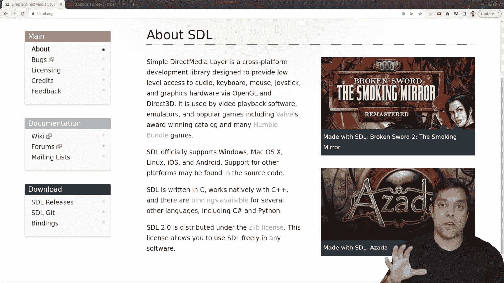

在本节课中，我们将学习如何设置一个基础的OpenGL应用程序。我们将使用SDL2框架来创建窗口并初始化OpenGL上下文，最后调用我们的第一个OpenGL函数来验证环境是否配置成功。

## 概述与准备工作

上一节我们介绍了OpenGL的基本概念。本节中，我们来看看如何搭建一个实际可运行的OpenGL开发环境。

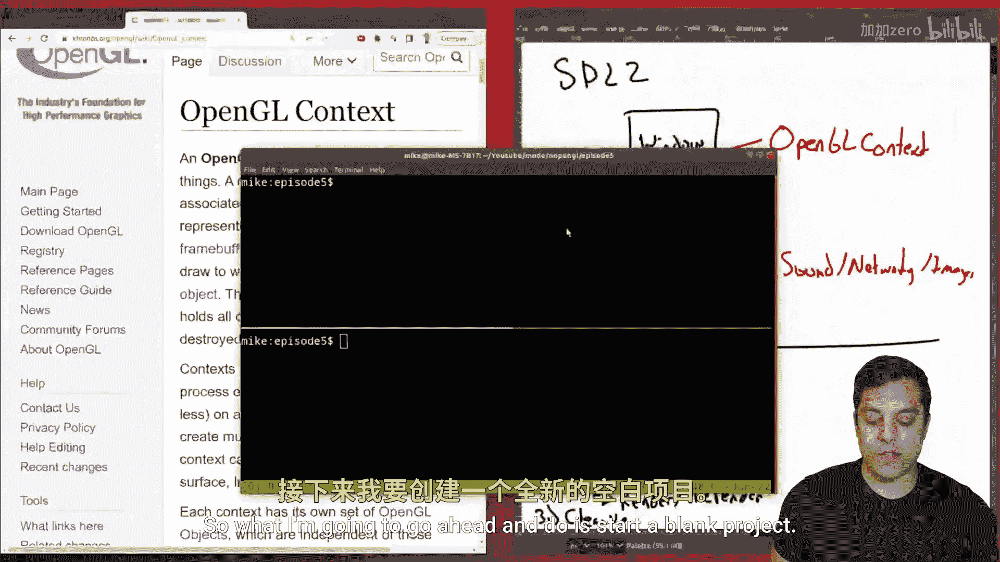

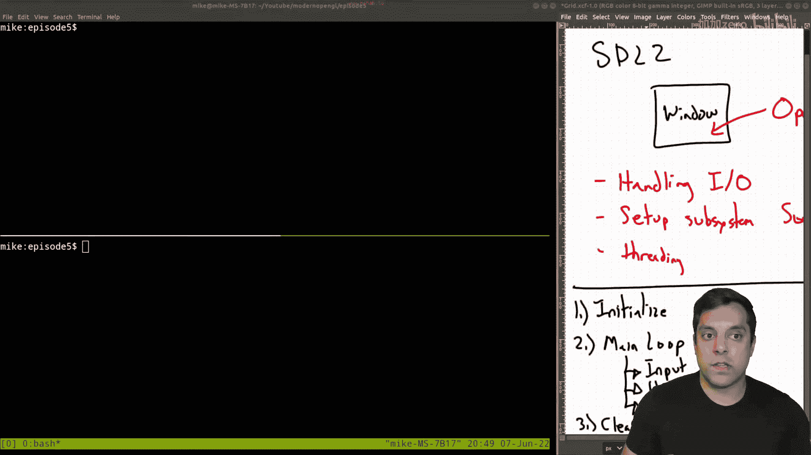

首先，我们需要一个能够创建窗口和处理系统事件的框架。这里我们选择SDL2，因为它跨平台且被许多专业项目使用。SDL2将负责创建窗口、处理输入输出，并为OpenGL渲染提供上下文。

以下是开始前需要完成的步骤：
*   安装SDL2开发库。
*   准备一个C++项目并配置好编译环境。

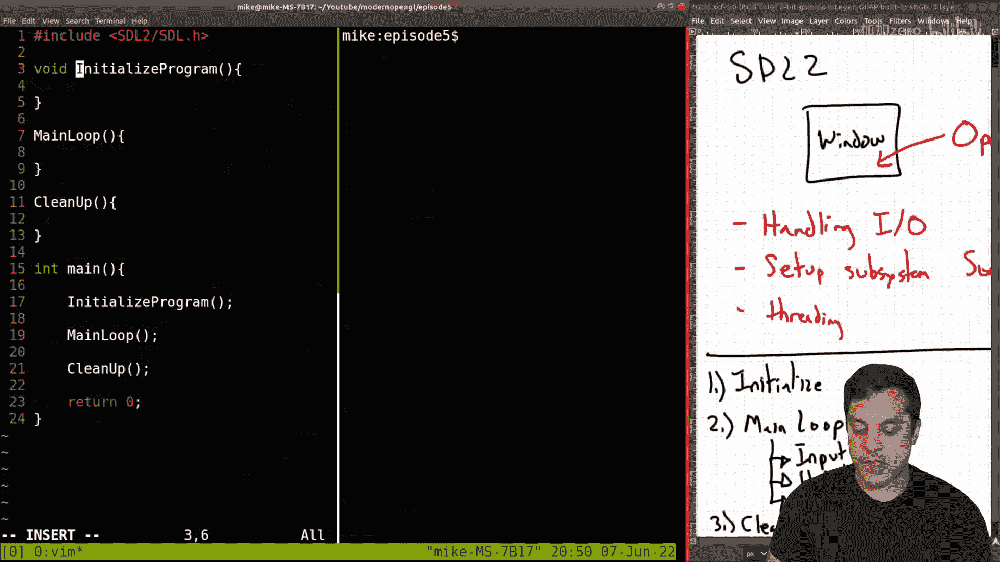

## 初始化程序结构

一个典型的图形应用程序遵循几个基本阶段。我们将代码结构分为初始化、主循环和清理三个部分。

以下是我们的程序框架：
```cpp
#include <SDL2/SDL.h>
#include <iostream>

// 函数声明
void InitializeProgram();
void MainLoop();
void Cleanup();

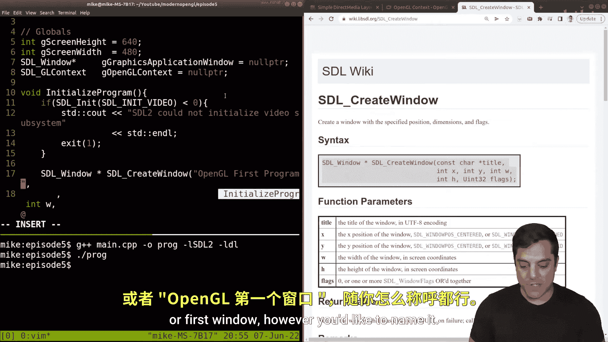

int main() {
    InitializeProgram();
    MainLoop();
    Cleanup();
    return 0;
}

// 函数定义（暂为空）
void InitializeProgram() {}
void MainLoop() {}
void Cleanup() {}
```

## 初始化SDL与创建窗口


初始化阶段的首要任务是启动SDL并创建一个用于OpenGL的窗口。我们还需要定义一些全局变量来管理窗口和OpenGL上下文。


以下是初始化SDL和创建窗口的关键步骤：
1.  使用 `SDL_Init(SDL_INIT_VIDEO)` 初始化SDL视频子系统。
2.  设置OpenGL属性，如版本号和核心模式。
3.  使用 `SDL_CreateWindow` 创建带有 `SDL_WINDOW_OPENGL` 标志的窗口。
4.  使用 `SDL_GL_CreateContext` 为窗口创建OpenGL上下文。

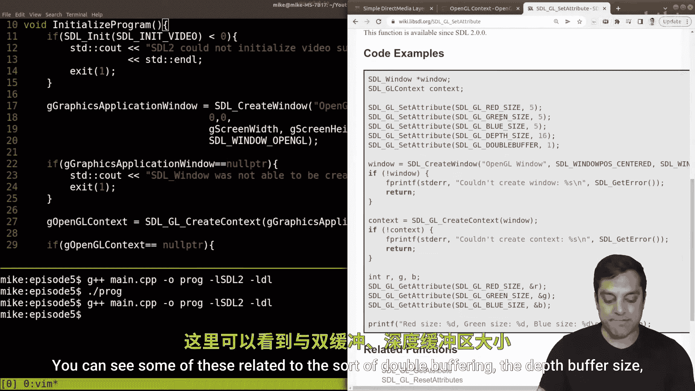

相关代码片段如下：
```cpp
// 全局变量
int gScreenWidth = 640;
int gScreenHeight = 480;
SDL_Window* gGraphicsApplicationWindow = nullptr;
SDL_GLContext gOpenGLContext = nullptr;


void InitializeProgram() {
    // 初始化SDL
    if (SDL_Init(SDL_INIT_VIDEO) < 0) {
        std::cout << "SDL2无法初始化视频子系统。" << std::endl;
        exit(1);
    }

    // 设置OpenGL属性
    SDL_GL_SetAttribute(SDL_GL_CONTEXT_MAJOR_VERSION, 4);
    SDL_GL_SetAttribute(SDL_GL_CONTEXT_MINOR_VERSION, 1);
    SDL_GL_SetAttribute(SDL_GL_CONTEXT_PROFILE_MASK, SDL_GL_CONTEXT_PROFILE_CORE);
    SDL_GL_SetAttribute(SDL_GL_DOUBLEBUFFER, 1);
    SDL_GL_SetAttribute(SDL_GL_DEPTH_SIZE, 24);

    // 创建窗口
    gGraphicsApplicationWindow = SDL_CreateWindow("OpenGL窗口",
                                                  0, 0,
                                                  gScreenWidth, gScreenHeight,
                                                  SDL_WINDOW_OPENGL);
    if (gGraphicsApplicationWindow == nullptr) {
        std::cout << "SDL窗口无法创建。" << std::endl;
        exit(1);
    }

    // 创建OpenGL上下文
    gOpenGLContext = SDL_GL_CreateContext(gGraphicsApplicationWindow);
    if (gOpenGLContext == nullptr) {
        std::cout << "OpenGL上下文不可用。" << std::endl;
        exit(1);
    }
}
```

## 配置OpenGL函数加载器（Glad）


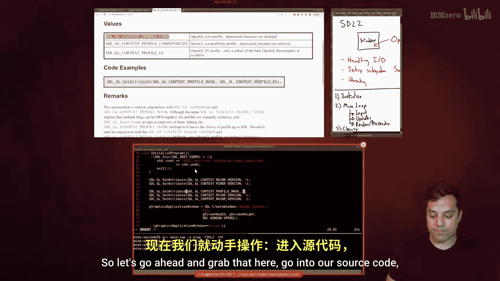

OpenGL的函数指针需要在运行时从显卡驱动中获取。我们将使用Glad库来简化这个过程。

以下是配置Glad的步骤：
1.  访问 [Glad在线生成器](https://glad.dav1d.de/)，选择语言为C/C++，指定OpenGL版本（例如4.1 Core Profile），然后生成并下载文件。
2.  将生成的 `glad.c` 和 `glad/glad.h` 等文件放入项目目录。
3.  在代码中包含 `glad.h` 头文件。
4.  在初始化SDL和OpenGL上下文之后，调用 `gladLoadGLLoader` 来加载所有OpenGL函数。

相关代码和编译命令如下：
```cpp
// 在InitializeProgram函数中，创建上下文之后
#include <glad/glad.h>
...
if (!gladLoadGLLoader((GLADloadproc)SDL_GL_GetProcAddress)) {
    std::cout << "Glad未能初始化。" << std::endl;
    exit(1);
}
```

编译时需要链接Glad源文件并指定头文件路径：
```bash
g++ main.cpp glad.c -I./include -lSDL2 -ldl
```

## 实现应用程序主循环

主循环是程序的核心，它持续运行以处理用户输入、更新状态和渲染画面。我们采用一个由布尔变量控制的 `while` 循环。


以下是主循环的基本结构：
```cpp
bool gQuit = false; // 全局控制变量

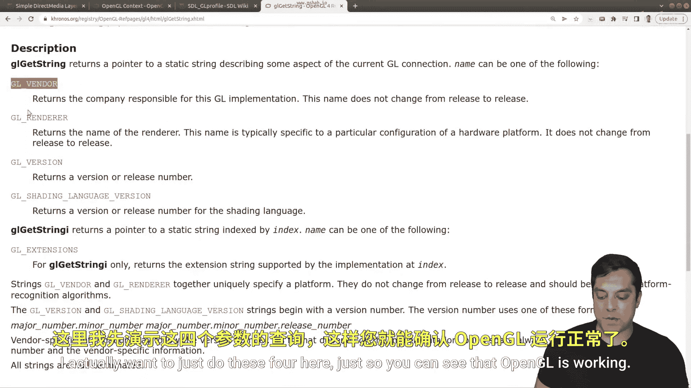

void MainLoop() {
    while (!gQuit) {
        Input();      // 处理输入
        PreDraw();    // 渲染前准备（暂空）
        Draw();       // 执行渲染（暂空）
        // 交换前后缓冲区，更新屏幕显示
        SDL_GL_SwapWindow(gGraphicsApplicationWindow);
    }
}


void Input() {
    SDL_Event e;
    // 持续轮询事件
    while (SDL_PollEvent(&e) != 0) {
        if (e.type == SDL_QUIT) {
            gQuit = true; // 用户点击关闭窗口时退出循环
        }
    }
}
void PreDraw() {}
void Draw() {}
```

## 调用首个OpenGL函数

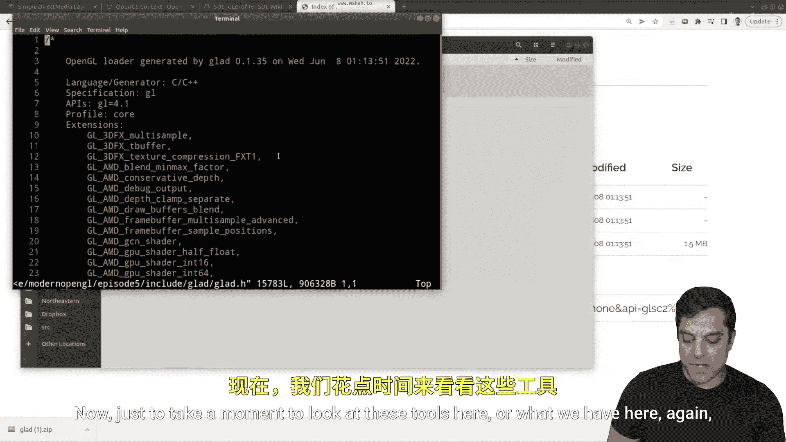


为了验证OpenGL已正确设置，我们可以在初始化后调用 `glGetString` 函数来查询显卡和驱动信息。

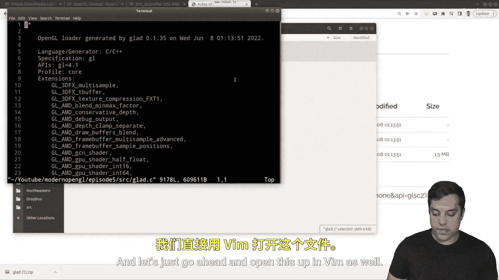


以下是查询并打印OpenGL信息的函数：
```cpp
void GetOpenGLVersionInfo() {
    std::cout << "OpenGL厂商: " << glGetString(GL_VENDOR) << std::endl;
    std::cout << "OpenGL渲染器: " << glGetString(GL_RENDERER) << std::endl;
    std::cout << "OpenGL版本: " << glGetString(GL_VERSION) << std::endl;
    std::cout << "着色语言版本: " << glGetString(GL_SHADING_LANGUAGE_VERSION) << std::endl;
}
```
在 `InitializeProgram` 函数末尾调用此函数，如果能在控制台看到显卡信息输出，则证明OpenGL环境配置成功。

## 程序清理

当主循环退出后，我们需要释放所有分配的资源，包括销毁OpenGL上下文、SDL窗口并退出SDL。

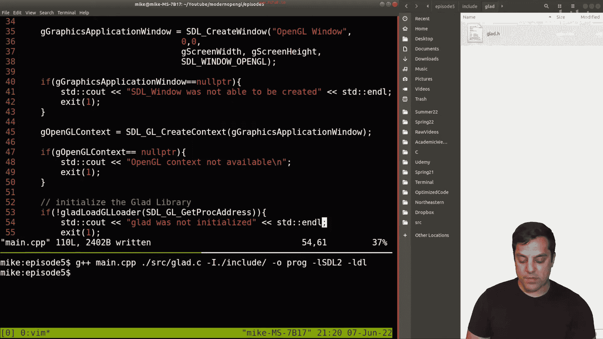


以下是清理函数的实现：
```cpp
void Cleanup() {
    // 销毁OpenGL上下文
    SDL_GL_DeleteContext(gOpenGLContext);
    // 销毁SDL窗口
    SDL_DestroyWindow(gGraphicsApplicationWindow);
    // 退出SDL所有子系统
    SDL_Quit();
}
```


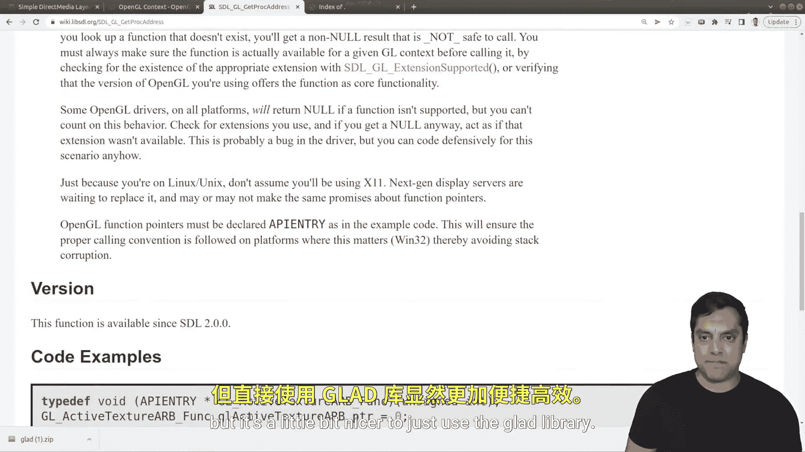

## 总结

本节课中我们一起学习了搭建现代OpenGL开发环境的核心流程。

我们首先使用SDL2创建了一个与OpenGL兼容的应用程序窗口。接着，通过设置属性指定使用OpenGL 4.1核心模式。然后，我们利用Glad库加载了OpenGL的函数指针，这是调用任何OpenGL API的前提。之后，我们构建了包含事件处理的主循环框架。最后，通过成功调用 `glGetString()` 函数并获取到显卡信息，验证了整个开发环境已正确配置。

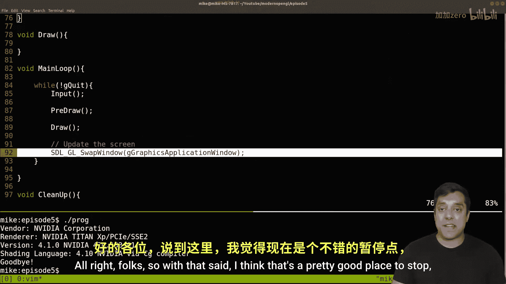


现在，你已经拥有了一个可以运行OpenGL代码的基础程序框架，为后续学习图形渲染打下了坚实的基础。