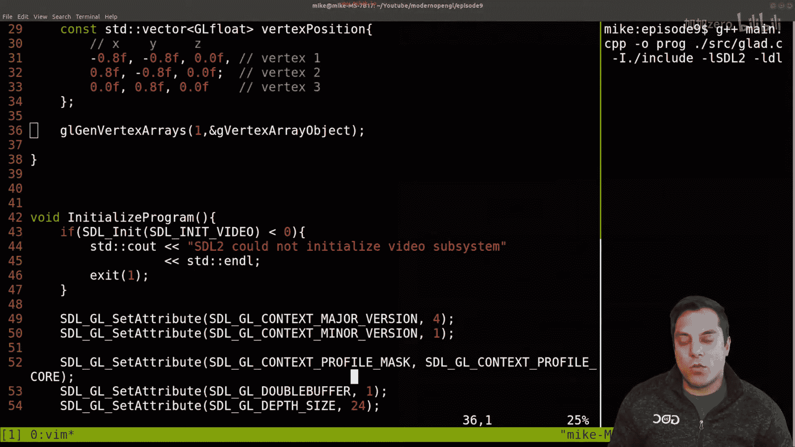
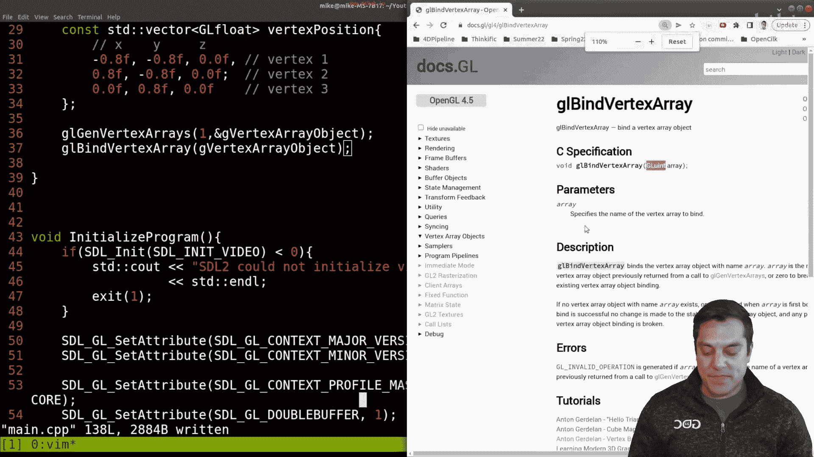
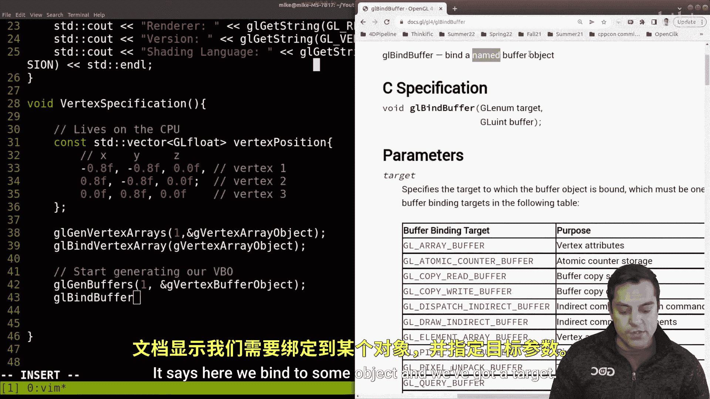
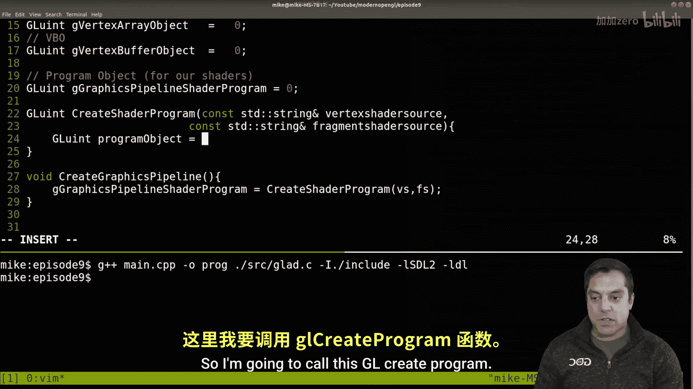
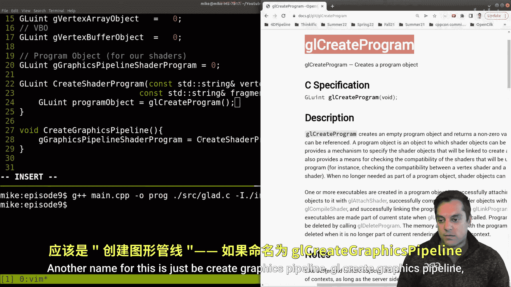
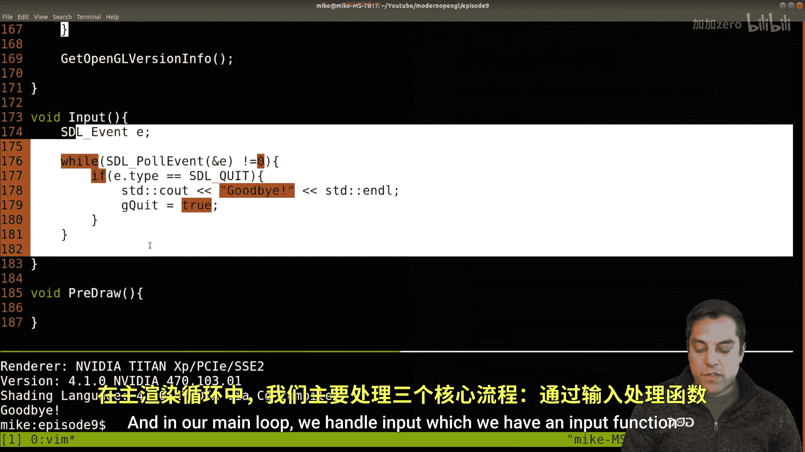
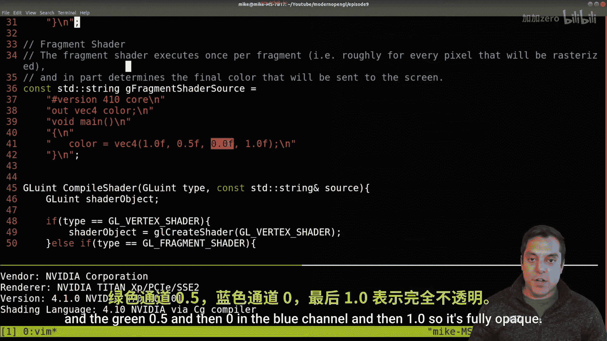
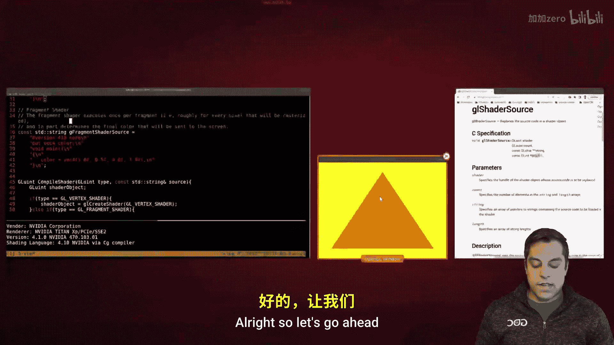

# 009：绘制第一个三角形 🎨


在本节课中，我们将通过编写代码，在屏幕上绘制出第一个三角形。我们将从第5课的代码基础上继续，学习如何指定顶点数据、创建图形管线，并最终发出绘制指令。

---

## 概述

本节课的目标是渲染一个简单的三角形。我们将完成以下核心步骤：
1.  **顶点规格化**：在CPU端定义三角形的顶点数据，并将其传输到GPU。
2.  **创建图形管线**：编写并编译顶点着色器和片段着色器，将它们链接成一个可执行的着色器程序。
3.  **绘制**：在主循环中设置OpenGL状态，绑定所需对象，并发出绘制调用。

---

## 代码回顾与项目结构

上一节我们介绍了如何搭建OpenGL环境。本节中我们来看看具体的代码结构。我们使用GLAD来加载OpenGL函数，并使用SDL2创建窗口和管理输入。



以下是项目的主要文件结构：
*   `main.cpp`：包含程序的主入口和主要逻辑。
*   `glad.c`：GLAD的实现文件。




我们主要在`main.cpp`文件中进行编码。

编译命令示例如下（Linux环境）：
```bash
g++ main.cpp src/glad.c -Iinclude -lSDL2 -ldl -o program
```


编译成功后，运行程序应能显示一个SDL2窗口和OpenGL的版本信息。




---

## 第一步：顶点规格化

在进入主循环绘制之前，我们需要准备要绘制的几何数据。这个过程称为顶点规格化。

我们将创建一个函数 `vertexSpecification()` 来完成这项工作。它的职责是定义顶点数据并将其上传到GPU。

首先，我们在CPU端使用一个数组来存储三个顶点的位置（X, Y, Z坐标）。

```cpp
std::vector<GLfloat> vertexPositions = {
    // 顶点 1
    -0.5f, -0.5f, 0.0f, // X, Y, Z
    // 顶点 2
     0.5f, -0.5f, 0.0f,
    // 顶点 3
     0.0f,  0.5f, 0.0f
};
```
坐标范围通常在-1.0到1.0之间，这是OpenGL标准化设备坐标的范围。

接下来，我们需要在GPU上创建对象来存储和管理这些数据。这涉及两个核心对象：
1.  **顶点数组对象 (Vertex Array Object, VAO)**：记录顶点数据格式和顶点缓冲对象的关联。
2.  **顶点缓冲对象 (Vertex Buffer Object, VBO)**：实际存储顶点数据的内存区域。

以下是创建和设置它们的步骤：


首先，生成并绑定一个VAO。
```cpp
GLuint gVertexArrayObject = 0;
glGenVertexArrays(1, &gVertexArrayObject);
glBindVertexArray(gVertexArrayObject);
```

接着，生成并绑定一个VBO，然后将CPU数据复制到VBO中。
```cpp
GLuint gVertexBufferObject = 0;
glGenBuffers(1, &gVertexBufferObject);
glBindBuffer(GL_ARRAY_BUFFER, gVertexBufferObject);
glBufferData(GL_ARRAY_BUFFER,
             vertexPositions.size() * sizeof(GLfloat),
             vertexPositions.data(),
             GL_STATIC_DRAW);
```
*   `GL_ARRAY_BUFFER` 表示此缓冲区用于存储顶点属性数据。
*   `glBufferData` 的参数依次是：目标、数据大小（字节）、数据指针、使用提示（`GL_STATIC_DRAW`表示数据几乎不变）。

然后，告诉OpenGL如何解析VBO中的数据。我们启用顶点属性数组中的第0个属性（对应位置），并设置其格式。
```cpp
glEnableVertexAttribArray(0);
glVertexAttribPointer(0,        // 属性索引，与`glEnableVertexAttribArray`对应
                      3,        // 每个顶点属性的分量数（X,Y,Z是3个）
                      GL_FLOAT, // 数据类型
                      GL_FALSE, // 是否标准化
                      0,        // 步长（连续顶点属性之间的偏移）
                      (void*)0  // 起始位置的偏移量
                      );
```

最后，进行清理，解绑VAO并禁用属性数组。
```cpp
glBindVertexArray(0);
glDisableVertexAttribArray(0);
```
至此，顶点数据已成功上传至GPU并配置完毕。

---




## 第二步：创建图形管线



顶点数据准备就绪后，我们需要一个“流水线”来处理它们。这个流水线就是图形管线，它由着色器程序控制。

我们创建一个函数 `createGraphicsPipeline()` 来构建这个管线。管线的核心是**着色器程序**，它由顶点着色器和片段着色器链接而成。

首先，我们定义两个字符串，分别包含顶点着色器和片段着色器的GLSL源代码。

顶点着色器负责处理顶点位置：
```cpp
std::string vertexShaderSource = R"(
    #version 460 core
    layout(location = 0) in vec3 position;
    void main()
    {
        gl_Position = vec4(position, 1.0);
    }
)";
```

片段着色器负责决定像素的颜色：
```cpp
std::string fragmentShaderSource = R"(
    #version 460 core
    out vec4 fragColor;
    void main()
    {
        fragColor = vec4(1.0, 0.5, 0.0, 1.0); // 橙色
    }
)";
```


为了模块化，我们创建两个辅助函数：
1.  `createShaderProgram`：接收着色器源代码字符串，返回链接好的程序对象。
2.  `compileShader`：编译单个着色器（顶点或片段）。

`compileShader`函数的主要流程如下：
```cpp
GLuint compileShader(GLenum type, const std::string& source) {
    GLuint shaderObject;
    if (type == GL_VERTEX_SHADER) {
        shaderObject = glCreateShader(GL_VERTEX_SHADER);
    } else if (type == GL_FRAGMENT_SHADER) {
        shaderObject = glCreateShader(GL_FRAGMENT_SHADER);
    }
    const char* src = source.c_str();
    glShaderSource(shaderObject, 1, &src, nullptr);
    glCompileShader(shaderObject);
    // 此处应添加错误检查（下节课详述）
    return shaderObject;
}
```

`createShaderProgram`函数的主要流程如下：
```cpp
GLuint createShaderProgram(const std::string& vsSource, const std::string& fsSource) {
    GLuint programObject = glCreateProgram();
    GLuint vertexShader = compileShader(GL_VERTEX_SHADER, vsSource);
    GLuint fragmentShader = compileShader(GL_FRAGMENT_SHADER, fsSource);
    glAttachShader(programObject, vertexShader);
    glAttachShader(programObject, fragmentShader);
    glLinkProgram(programObject);
    // 链接后可以删除着色器对象
    glDeleteShader(vertexShader);
    glDeleteShader(fragmentShader);
    return programObject;
}
```
在`createGraphicsPipeline`函数中，我们调用`createShaderProgram`，并将返回的程序句柄存储在一个全局变量`gGraphicsPipelineShaderProgram`中，以备后续使用。

---

## 第三步：绘制三角形

所有准备工作完成后，我们进入主循环进行绘制。主循环通常包含处理输入、预绘制设置和正式绘制。



在预绘制函数 `preDraw()` 中，我们设置每一帧的OpenGL状态：
```cpp
void preDraw() {
    glDisable(GL_DEPTH_TEST); // 本例简单，先禁用深度测试
    glViewport(0, 0, screenWidth, screenHeight);
    glClearColor(0.0f, 0.0f, 1.0f, 1.0f); // 设置清屏颜色为蓝色
    glClear(GL_COLOR_BUFFER_BIT); // 清除颜色缓冲区
}
```
**注意**：必须调用`glClear`才能将清屏颜色应用到窗口。

在绘制函数 `draw()` 中，我们执行实际的绘制命令：
1.  使用我们创建好的着色器程序。
2.  绑定我们配置好的顶点数组对象（VAO）。
3.  发出绘制指令。
```cpp
void draw() {
    glUseProgram(gGraphicsPipelineShaderProgram); // 激活着色器程序
    glBindVertexArray(gVertexArrayObject);        // 绑定VAO
    glDrawArrays(GL_TRIANGLES, 0, 3);             // 绘制三角形，从第0个顶点开始，共3个顶点
    glBindVertexArray(0); // 绘制完成后解绑
}
```
`glDrawArrays` 命令指示OpenGL使用当前绑定的VAO和激活的着色器程序，以三角形图元方式绘制3个顶点。

---

## 运行结果与总结

将以上所有步骤整合到程序中并运行，你将看到一个蓝色背景的窗口中央，绘制着一个橙色的三角形。





本节课中我们一起学习了现代OpenGL渲染一个三角形的完整流程：
1.  **顶点规格化**：在CPU定义数据，创建并配置VAO和VBO，将数据上传至GPU。
2.  **创建图形管线**：编写GLSL着色器代码，编译并链接成着色器程序。
3.  **绘制**：在主循环中设置帧状态，激活管线，绑定顶点数据，并发出绘制调用。


虽然步骤繁多，但这是所有OpenGL渲染的基础。成功绘制出第一个三角形是一个重要的里程碑。在此基础上，你可以通过添加更多顶点、变换、颜色和纹理属性来创建更复杂的图形。


在接下来的课程中，我们将优化代码结构，增加错误处理，并开始探索3D变换。恭喜你完成了这一关键步骤！