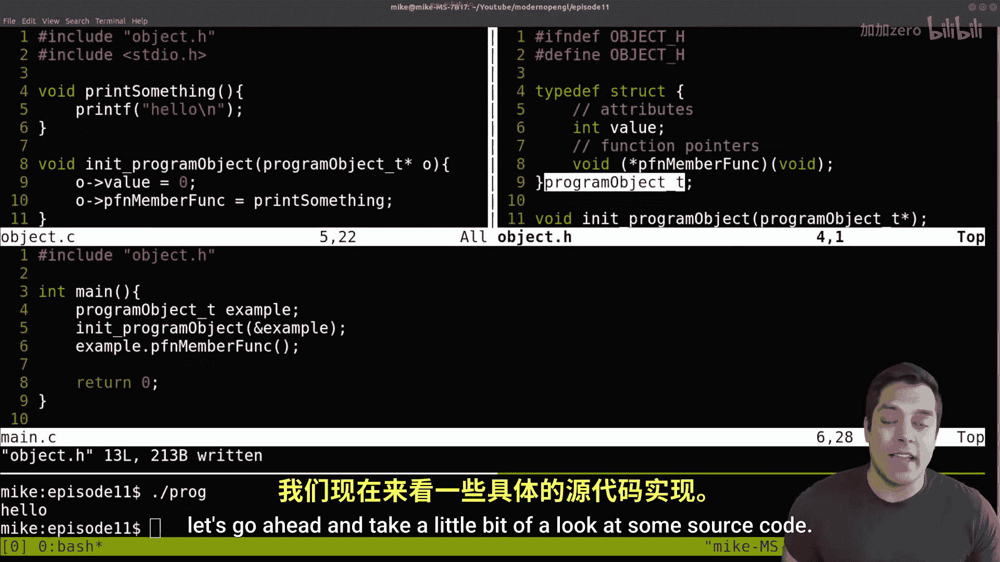
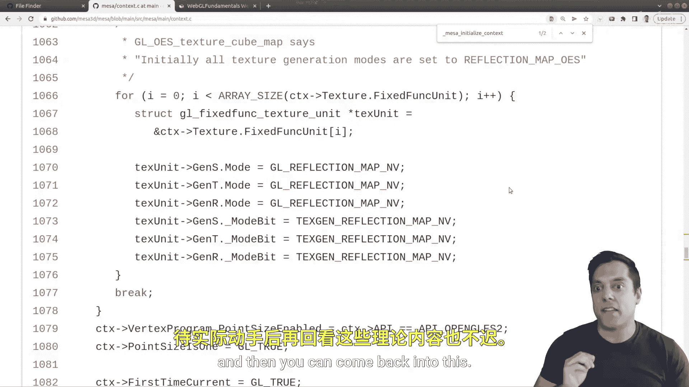

# 011：OpenGL对象、上下文与状态机


在本节课中，我们将深入理解OpenGL的核心工作机制。我们将探讨OpenGL中的“对象”概念、关键的“上下文”以及整个系统如何作为一个“状态机”运行。通过分析C语言风格的代码和Mesa开源实现，你将建立起对OpenGL底层逻辑的清晰直觉，这会让后续的学习和应用变得更加轻松。

## OpenGL对象：C语言视角

上一节我们介绍了OpenGL的基本概念，本节中我们来看看OpenGL中的“对象”到底是什么。它与Java或C++等面向对象语言中的“对象”概念不同。OpenGL是一个基于C语言的API，因此它的“对象”本质上是通过结构体（`struct`）和函数指针来模拟的。

以下是一个简化的C语言示例，展示了如何模拟一个“程序对象”：

```c
// 在头文件 object.h 中定义结构体
typedef struct {
    int id;
    char* name;
    void (*printHello)(void);
} program_object_t;

// 在源文件 object.c 中实现功能
program_object_t* create_program_object(int id, const char* name) {
    program_object_t* obj = malloc(sizeof(program_object_t));
    obj->id = id;
    obj->name = strdup(name);
    obj->printHello = &sayHello; // 指向一个函数
    return obj;
}

void sayHello() {
    printf("Hello from OpenGL object!\n");
}
```

在上面的代码中，`program_object_t` 结构体包含了一些数据成员和一个函数指针。创建和使用这个“对象”需要手动调用类似构造函数的函数（如 `create_program_object`）并管理其生命周期。这就是OpenGL底层操作对象的方式：它通过一系列函数（如 `glGenBuffers`, `glBindBuffer`, `glBufferData`）来创建、配置和操作代表缓冲区、着色器等资源的内部结构体，而不是通过调用某个对象的成员方法。



## 探索OpenGL上下文：Mesa源码实例

理解了对象的概念后，我们来看看OpenGL中一个更全局、更重要的概念——**上下文**。OpenGL上下文是一个包含了所有渲染状态（如当前使用的着色器、绑定的缓冲区、启用的功能等）的大型数据结构。你可以把它想象成一个控制台或仪表盘，上面布满了控制渲染管线的各种开关和旋钮。

为了更具体地理解，我们可以查看**Mesa**的源代码，它是一个开源的OpenGL实现。在Mesa的GitHub仓库中，我们可以找到定义上下文的头文件。



```c
// Mesa源码中 GLcontext 结构体的简化示意
struct __GLcontext {
    // ... 大量成员变量，用于存储所有OpenGL状态 ...
    GLboolean lineSmooth;          // 是否启用线段抗锯齿
    GLint currentProgram;          // 当前使用的着色器程序ID
    struct gl_buffer_object* array_buffer_binding; // 当前绑定的数组缓冲区
    // ... 更多状态，如深度测试、混合模式、视口设置等 ...
};
```

在Mesa的 `context.c` 文件中，可以找到初始化这个上下文的函数，它负责为这个庞大结构体中的所有状态设置默认值。这个上下文对象是全局的，OpenGL的所有函数调用都会读取或修改这个上下文中的状态。这就是为什么在切换渲染目标或配置时，需要小心管理状态。

## OpenGL状态机：可视化理解

我们已经知道OpenGL上下文管理着所有状态，那么整个OpenGL系统就可以被理解为一个**状态机**。状态机是一种行为模型，它根据当前状态和输入（即我们的API调用）来决定下一步做什么并转移到新的状态。


一个极佳的理解方式是使用WebGL Fundamentals网站提供的“状态图”可视化工具。该工具动态展示了调用WebGL（与OpenGL ES概念相同）API时，内部全局状态（即上下文）如何变化。

以下是使用该工具观察一个典型绘制流程时，状态机的变化步骤：

1.  **创建着色器**：调用 `glCreateShader` 和 `glShaderSource` 后，状态机中会创建一个新的着色器对象并存储其源代码。
2.  **编译与链接着色器程序**：调用 `glCompileShader` 和 `glLinkProgram` 后，状态机将着色器编译链接成一个完整的着色器程序对象，并更新“当前使用程序”的状态。
3.  **配置顶点数据**：调用 `glGenBuffers`, `glBindBuffer`, `glBufferData` 后，状态机创建并绑定一个顶点缓冲区对象（VBO），并将数据上传至GPU。
4.  **设置顶点属性指针**：调用 `glVertexAttribPointer` 和 `glEnableVertexAttribArray` 后（通常在VAO内进行），状态机记录了如何从当前绑定的VBO中解析出顶点数据。
5.  **绘制**：调用 `glDrawArrays` 时，状态机检查当前所有状态——当前着色器程序、绑定的缓冲区、启用的顶点属性等——然后命令GPU依据这些状态执行整个渲染管线，最终生成屏幕上的三角形。

通过一步步执行代码并观察状态图中连线的建立与高亮，你可以直观地看到：**OpenGL的绘制结果是由发出绘制命令那一瞬间的整个上下文状态所决定的**。这强调了在正确的时间绑定正确的对象和设置正确的状态至关重要。

## 核心概念总结

本节课中我们一起学习了OpenGL的三个核心底层概念：

1.  **OpenGL对象**：本质上是C语言结构体，通过独立的函数（如 `glGen*`, `glBind*`）进行创建、绑定和操作，而非面向对象语言中的类实例。
2.  **OpenGL上下文**：一个存储所有渲染状态（当前着色器、缓冲区、功能开关等）的全局数据结构。它是OpenGL状态机的具体实现载体。
3.  **OpenGL状态机**：OpenGL的行为模型。绘制命令（如 `glDrawArrays`）会基于**当前上下文中的全部状态**来执行渲染管线。理解“当前状态”是编写正确OpenGL代码的关键。


记住这个比喻：OpenGL上下文就像一个体育场中央的巨型记分牌，它实时追踪并显示着所有重要的比赛信息（状态）。作为程序员，你的任务就是通过API调用来设置这个记分牌，然后发出“开始比赛”（绘制）的指令。希望这节课建立的直觉能帮助你更自信地驾驭后续的OpenGL编程之旅。