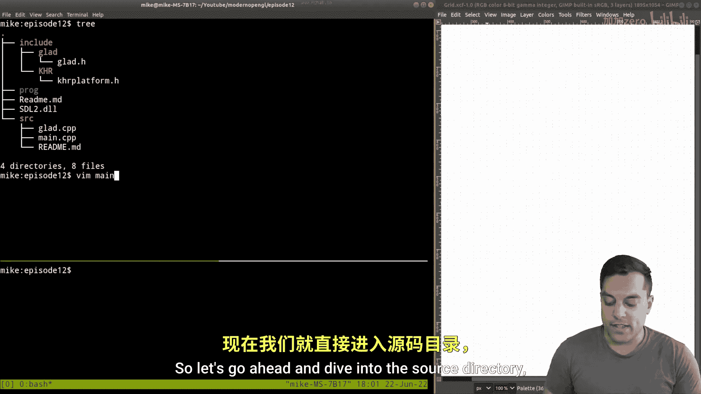
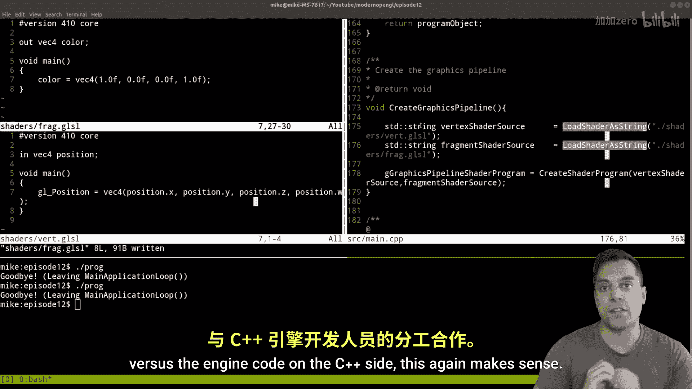

# 012：从文件加载着色器（改进工作流）


在本节课中，我们将学习如何改进OpenGL着色器代码的工作流程。我们将把硬编码在C++程序中的着色器字符串，改为从外部文件动态加载。这样做的好处是，修改着色器代码后，无需重新编译整个C++项目，只需保存文件并重新运行程序即可，从而大大提高开发效率。



## 项目回顾与目标

上一节我们成功渲染了一个三角形，但着色器代码是直接以字符串形式写在C++源文件中的。本节中，我们来看看如何优化这一点。

一个典型的图形应用程序主要包含以下几个步骤：
1.  **初始化**：负责设置窗口、OpenGL版本等。
2.  **顶点规范**：定义顶点数据及其用途。
3.  **创建图形管线**：编译和链接着色器程序，这是本节课的重点。
4.  **主应用循环**：负责持续绘制、处理用户输入等。

目前，我们的着色器代码（顶点着色器和片段着色器）是作为字符串常量嵌入在`main.cpp`文件顶部的。这意味着每次修改着色器，哪怕只是一个颜色值，都需要重新编译整个C++项目。我们的目标是改为在程序**运行时**从文件中加载这些着色器代码。

## 实现文件加载函数

为了实现从文件加载着色器，我们需要编写一个辅助函数。以下是该函数的具体实现步骤。

我们将创建一个名为`loadShaderAsString`的自由函数，它接收一个文件名（字符串），并返回该文件的内容（字符串）。

```cpp
#include <string>
#include <fstream>

std::string loadShaderAsString(const std::string& filename) {
    std::string result; // 存储最终文件内容的字符串
    std::string line;   // 用于读取每一行的缓冲区
    std::ifstream myFile(filename); // 创建输入文件流

    // 检查文件是否成功打开
    if (myFile.is_open()) {
        // 逐行读取文件内容
        while (std::getline(myFile, line)) {
            result += line + "\n"; // 将每一行拼接到结果字符串中，并添加换行符
        }
        myFile.close(); // 读取完成后关闭文件
    }
    return result; // 返回文件内容字符串
}
```

这个函数使用C++标准库中的`<fstream>`和`<string>`来读取文件。它逐行读取指定文件，并将所有内容拼接成一个完整的字符串返回。如果文件无法打开，函数将返回一个空字符串。

## 重构图形管线创建代码

有了加载函数后，我们现在可以修改创建图形管线的代码，用从文件加载的字符串替换之前硬编码的字符串。

首先，我们需要将着色器代码从`main.cpp`中移出，保存为独立的文件。建议在项目目录中创建一个`shaders`文件夹来管理它们。

例如，创建两个文件：
*   `shaders/vert.glsl`：用于存放顶点着色器代码。
*   `shaders/frag.glsl`：用于存放片段着色器代码。

接着，在原来调用`createShaderProgram`函数的地方进行修改：

```cpp
// 从文件加载着色器代码
std::string vertexShaderSource = loadShaderAsString("shaders/vert.glsl");
std::string fragmentShaderSource = loadShaderAsString("shaders/frag.glsl");

// 使用加载的代码创建着色器程序
unsigned int shaderProgram = createShaderProgram(vertexShaderSource, fragmentShaderSource);
```

这样，`createShaderProgram`函数接收的参数就不再是硬编码的字符串，而是从外部文件动态读取的内容。

## 验证与工作流优势

完成代码修改并编译运行后，程序应该能像之前一样正确渲染出三角形。此时，工作流的改进就体现出来了。

例如，如果你想将三角形的颜色从橙色改为红色，只需打开`shaders/frag.glsl`文件，修改颜色值：

```glsl
#version 330 core
out vec4 FragColor;
void main() {
    FragColor = vec4(1.0f, 0.0f, 0.0f, 1.0f); // 改为红色
}
```

保存文件后，**无需重新编译C++项目**，直接重新运行程序，就能立即看到三角形变成了红色。

这种分离带来了显著优势：
*   **提升效率**：着色器艺术家或技术美术可以独立修改和调试着色器代码，无需等待冗长的C++项目编译。
*   **职责清晰**：引擎程序员负责C++端的逻辑，着色器编写者负责GPU端的着色逻辑，两者通过文件接口协作。
*   **易于管理**：着色器代码作为独立的资源文件，更容易进行版本控制和资源管理。

## 总结



本节课中我们一起学习了如何优化OpenGL着色器开发的工作流程。核心内容是将着色器代码从C++源代码中分离出来，保存为独立的`.glsl`文件，并通过一个`loadShaderAsString`函数在运行时动态加载。这样做之后，修改着色器代码只需保存文件并重新运行程序，无需重新编译整个C++项目，极大地提高了迭代效率。这种模式也为团队协作提供了清晰的分工界面。