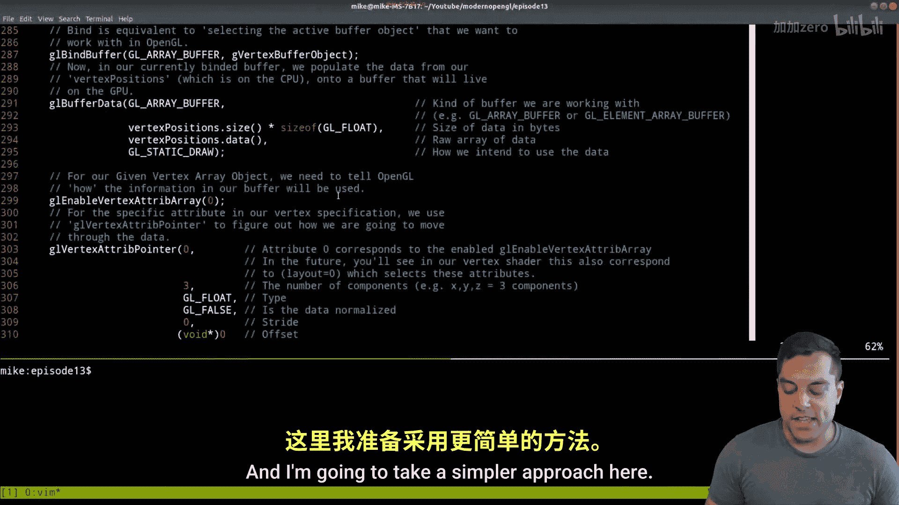
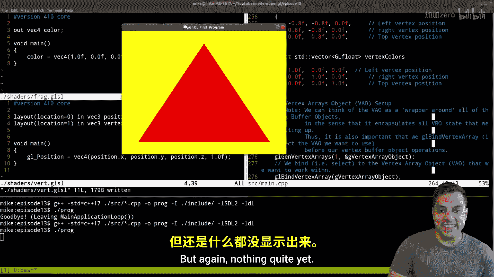
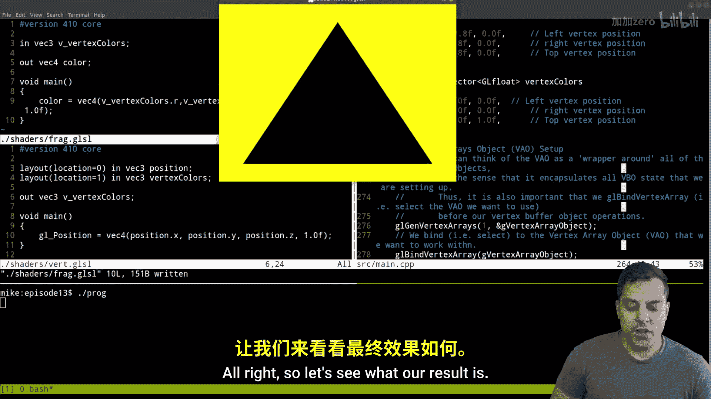
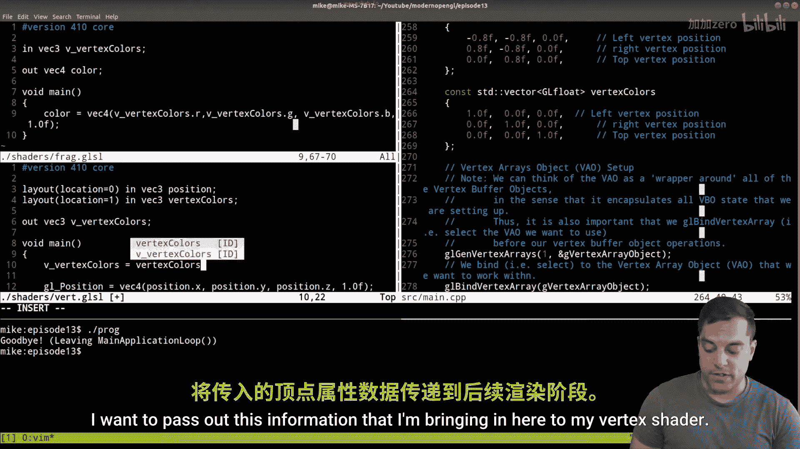
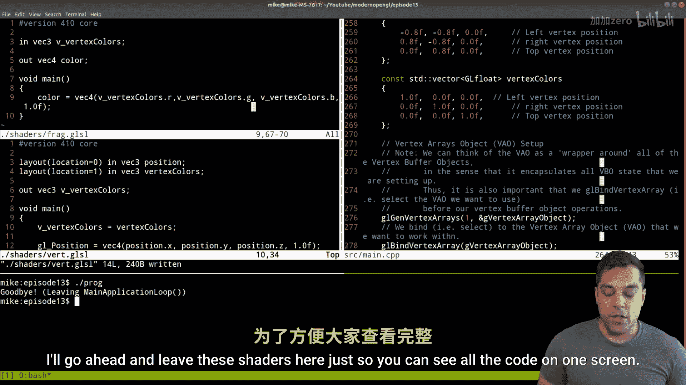
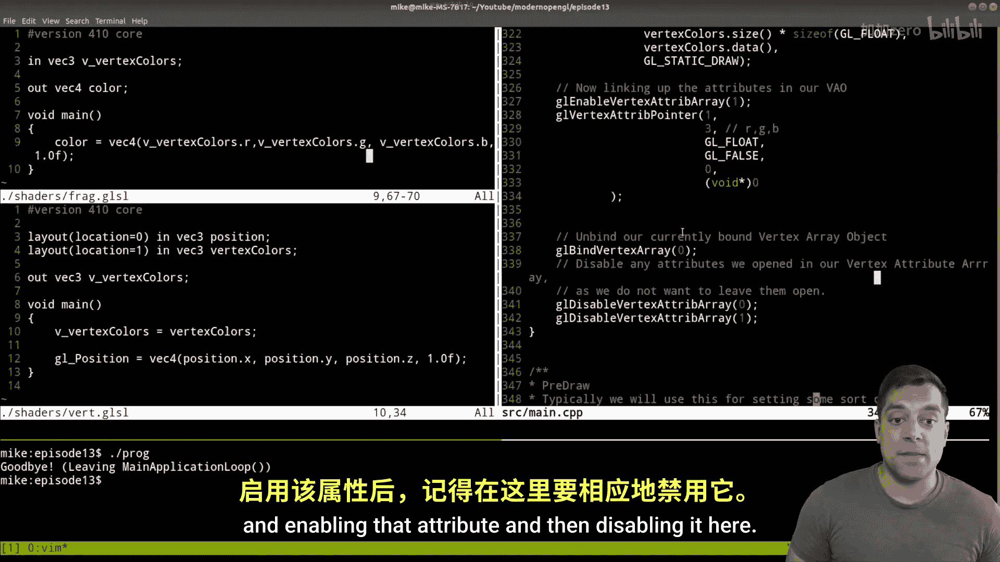

# 013：绘制彩色三角形（使用多个顶点缓冲对象）


在本节课中，我们将学习如何为三角形添加颜色属性。我们将使用多个顶点缓冲对象，为三角形的每个顶点指定不同的颜色，最终得到一个颜色平滑过渡的彩色三角形。

## 项目结构概述


首先，我们快速回顾一下项目结构。我们的程序主要包含几个部分：初始化窗口（如SDL2）、顶点规范（定义几何体）、创建图形管线（定义渲染流程）以及主应用循环。本节课的重点将放在修改**顶点规范**和**着色器**上，以支持多个顶点属性。

## 修改顶点规范

上一节我们介绍了如何定义顶点的位置数据。本节中，我们来看看如何为顶点添加颜色数据。

### 1. 准备颜色数据

我们需要创建一个新的向量来存储每个顶点的颜色值（R, G, B）。颜色值范围应在0.0到1.0之间。

```cpp
std::vector<GLfloat> vertexColors = {
    1.0f, 0.0f, 0.0f, // 第一个顶点：红色
    0.0f, 0.0f, 1.0f, // 第二个顶点：蓝色
    0.0f, 1.0f, 0.0f  // 第三个顶点：绿色
};
```

### 2. 创建第二个顶点缓冲对象

接下来，我们需要创建第二个顶点缓冲对象来存储颜色数据。这个过程与创建位置缓冲对象类似。

以下是创建和设置颜色顶点缓冲对象的关键步骤：

```cpp
// 生成缓冲对象
glGenBuffers(1, &vertexColorBufferObject);

// 绑定到当前上下文
glBindBuffer(GL_ARRAY_BUFFER, vertexColorBufferObject);

// 将颜色数据复制到缓冲中
glBufferData(GL_ARRAY_BUFFER,
             vertexColors.size() * sizeof(GLfloat),
             vertexColors.data(),
             GL_STATIC_DRAW);
```



### 3. 在顶点数组对象中链接颜色属性

创建好缓冲后，我们需要在顶点数组对象中启用并链接这个新的颜色属性。

以下是链接颜色属性的步骤：

```cpp
// 启用顶点属性数组的索引1（用于颜色）
glEnableVertexAttribArray(1);

// 指定索引1处属性数据的格式
glVertexAttribPointer(1,        // 属性索引
                      3,        // 每个顶点包含3个分量（R, G, B）
                      GL_FLOAT, // 数据类型
                      GL_FALSE, // 是否标准化
                      0,        // 步长（紧密排列）
                      nullptr); // 偏移量
```


完成设置后，记得在适当的时候禁用属性数组。

## 修改着色器

顶点数据准备就绪后，我们需要修改着色器来接收和使用这些新的颜色数据。

### 1. 修改顶点着色器

在顶点着色器中，我们需要使用 `layout` 限定符明确指定输入变量的位置。

以下是修改后的顶点着色器核心部分：


```glsl
#version 330 core

// 指定位置0的属性是顶点位置
layout (location = 0) in vec3 position;
// 指定位置1的属性是顶点颜色
layout (location = 1) in vec3 vertexColor;


// 输出到片段着色器的颜色变量
out vec3 v_vertexColor;

void main() {
    gl_Position = vec4(position, 1.0);
    // 将输入的颜色传递给下一阶段
    v_vertexColor = vertexColor;
}
```

### 2. 修改片段着色器




片段着色器需要接收从顶点着色器传递过来的颜色值，并将其作为最终输出。

以下是修改后的片段着色器：

```glsl
#version 330 core

// 从顶点着色器输入的颜色值
in vec3 v_vertexColor;

// 最终输出的颜色
out vec4 fragColor;



void main() {
    // 使用传入的颜色值设置输出
    fragColor = vec4(v_vertexColor.r, v_vertexColor.g, v_vertexColor.b, 1.0);
}
```

## 运行结果



完成以上所有修改并编译运行程序后，你将看到一个顶点分别为红、蓝、绿色的三角形，并且颜色在三角形表面平滑地插值过渡。

## 总结






本节课中我们一起学习了如何为OpenGL图形添加多个顶点属性。我们主要完成了以下工作：
1.  在C++程序中创建了第二个顶点缓冲对象来存储颜色数据。
2.  在顶点数组对象中链接了这个新的颜色属性。
3.  修改了顶点着色器和片段着色器，使其能够接收、传递并应用颜色数据。

通过这次实践，我们掌握了为顶点附加额外信息（如颜色、法线、纹理坐标）的基本方法，这是构建复杂且视觉效果丰富的图形场景的重要基础。